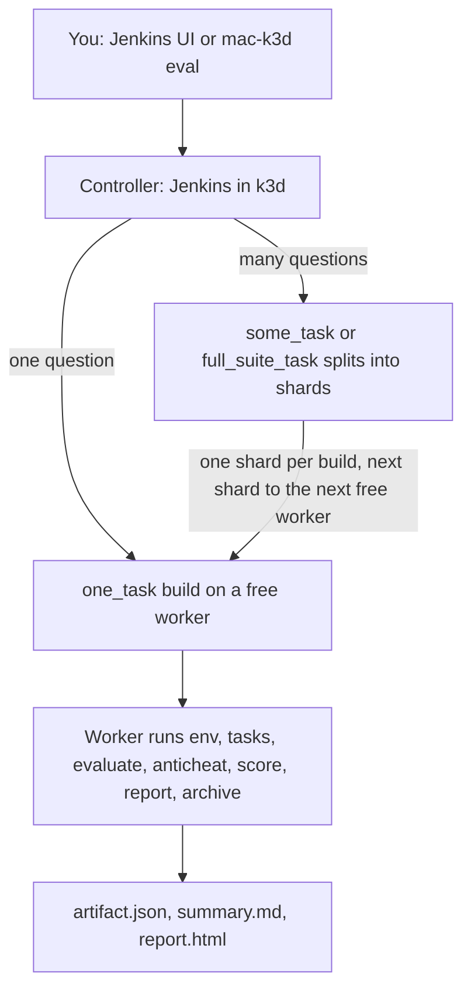

# mac-k3d

mac-k3d is evaluation infrastructure for AI coding harnesses. It turns a **new Linux or Mac** into a **Jenkins controller or worker**, and it ships the pipeline every worker runs, so one controller can send evaluation jobs for DeepSWE, LoLBench or SWE-bench Pro to many workers and get one report back. Download a GitHub Release binary; it installs Docker and the rest.

## How it works



- **Controller:** Jenkins inside a k3d cluster (`http://localhost:17070`). It holds the nine eval jobs (three shapes for each benchmark), the DeepSeek key and the queue. It never runs Harbor.
- **Worker:** Docker, Java, git, the pinned Harbor and a Jenkins inbound agent with one executor. More workers run more shards at once; nothing in the pipeline changes when you add one.
- **A build** lands on one worker, holds all of that worker's cores while Harbor runs, and runs the seven phases from the `pipeline/` built into that worker's `mac-k3d`, so the result names the commit that produced it. `some_task` and `full_suite_task` queue one `one_task` build per shard and merge them into one report.
- **Harbor** (pinned in `pipeline/config/toolchain.env`) runs the trials: containers, each task's declared limits, retries and grading. The agent can reach only the hosts in `pipeline/config/network-allowlist-v1.json`, the DeepSeek API.
- **mac-k3d** does everything around Harbor: machine setup, the benchmark checkout and per-task checks, the isolation canary, anti-cheat, scoring, the report and the archive.

Not shipped yet: a short-lived k3d cluster per build with a default-deny NetworkPolicy and a registry cache. Today trials run as Harbor containers on the worker's own Docker.

## Where to read next

| You want | Read |
|----------|------|
| Set up a controller and a worker, then run an eval | [docs/user-guide.md](docs/user-guide.md) |
| The path from a blank machine to a report | [docs/workflow.md](docs/workflow.md) |
| The seven phases, the benchmark checkout, and where question images come from | [docs/pipeline.md](docs/pipeline.md) |
| How builds are placed on several workers | [docs/architecture.md](docs/architecture.md#evaluation-architecture) |
| Every command and flag | [docs/commands.md](docs/commands.md) |
| Config files, secrets, and iCode inputs | [docs/configuration.md](docs/configuration.md), [docs/secrets.md](docs/secrets.md), [docs/icode-harness-inputs.md](docs/icode-harness-inputs.md) |
| This lab's controller IP, checklists and per-question run log | [docs/testing/README.md](docs/testing/README.md) |
| Every doc by audience, and what each release shipped | [docs/README.md](docs/README.md) |

Users do **not** need Rust. Developers who build from source do.

## Requirements

The binary installs Docker, k3d, kubectl, helm, and Java when you choose **Install** in the wizard (`apt` on Ubuntu/Debian, Homebrew on macOS).

Leftovers it cannot hide:

- **Linux:** one logout after the `docker` group is added, then re-run `mac-k3d setup`
- **macOS:** first Docker Desktop window (and Homebrew if missing)
- **sudo** / brew for package install (without sudo, setup saves your answers and prints the root commands for an administrator)
- **Worker:** paste a Jenkins API token from the UI into `worker.yaml` (`api_user` / `api_token` are always there, empty until filled in)

If auto-install fails, install Docker yourself and re-run setup ([docs/new-machine.md](docs/new-machine.md)).

## Install (users)

1. Download the asset for your OS/arch from this repo’s GitHub **Releases** page (`mac-k3d-linux-x86_64`, `mac-k3d-linux-aarch64`, `mac-k3d-darwin-aarch64`, or Intel `mac-k3d-darwin-x86_64`).
2. `chmod +x` (macOS: also `xattr -d com.apple.quarantine`).
3. Run `./mac-k3d` or `./mac-k3d setup -c ~/.config/mac-k3d/config.yaml` (controller) / `worker.yaml` (worker).
4. Choose the role; let it **Install** Docker if asked.
5. Controller: open `http://localhost:17070`. Worker: paste API token, then `mac-k3d config -c worker.yaml` if needed.

```bash
chmod +x mac-k3d-linux-x86_64
# macOS (unsigned GitHub binary):
#   xattr -d com.apple.quarantine ./mac-k3d-darwin-aarch64
./mac-k3d-linux-x86_64          # TTY → setup wizard (controller or worker)
# optional:
mkdir -p ~/.local/bin
cp mac-k3d-linux-x86_64 ~/.local/bin/mac-k3d
```

Open **Terminal** (do not rely on double-click). **Start here (controller + worker + eval):** [docs/user-guide.md](docs/user-guide.md). Extra walkthrough: [docs/new-machine.md](docs/new-machine.md).

## Install (developers)

```bash
cargo install --path .
```

Or build locally:

```bash
cargo build --release
./target/release/mac-k3d --help
```

## Quick start

```bash
# First-run wizard, then start (controller) or config (worker)
mac-k3d setup

# Power-user split (same as before)
mac-k3d prepare
mac-k3d start
mac-k3d config --show-jenkins
mac-k3d status
mac-k3d teardown
mac-k3d clean --yes
```

### Worker (eval box) only

```bash
mac-k3d setup -c ~/.config/mac-k3d/worker.yaml
# Role: CI worker — Docker, Java, git, Jenkins agent; Harbor is installed at the pinned version
# Jenkins URL: press Enter for the wizard default, or type http://localhost:17070 for a controller on this PC
mac-k3d prepare --non-interactive -c ~/.config/mac-k3d/worker.yaml
```

## Configuration

Default config path: `~/.config/mac-k3d/config.yaml`

See [docs/configuration.md](docs/configuration.md) for the full schema.

## License

MIT
