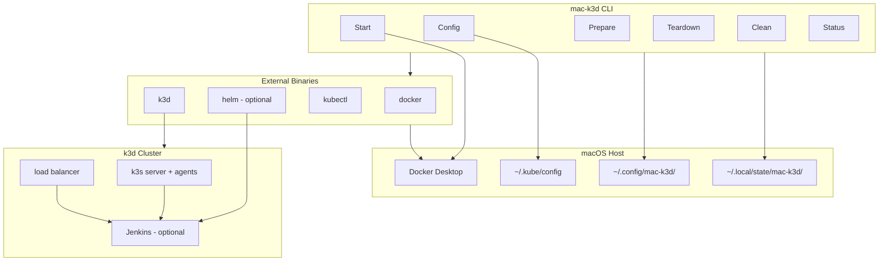

# Architecture

## Overview

`mac-k3d` is a Rust CLI that orchestrates external tools on **macOS and Linux** to provide a local Kubernetes / LoLBench eval environment. It does not embed Docker, k3s, or Jenkins — it shells out to installed binaries and manages configuration/state.

Platform-specific behavior lives in `src/platform/{macos,linux}.rs` (Docker Desktop vs Engine, Homebrew vs apt, LaunchAgent vs systemd --user).



## Components

### 1. CLI layer (`src/cli.rs`, `src/main.rs`)

- Parses global flags (`--config`, `-v`) and subcommands via **clap**.
- Loads config once per invocation.
- Dispatches to async command handlers.

### 2. Configuration (`src/config.rs`)

- YAML file at `~/.config/mac-k3d/config.yaml`.
- Deserialized with **serde**; missing file → built-in defaults.
- `prepare --init-config` writes defaults without overwriting.

### 3. Command handlers (`src/commands/`)

Each subcommand is a module with:
- `*Args` — clap argument struct
- `run(args, &MacK3dConfig) -> Result<()>` — async entry point

Commands shell out to external tools via a shared `runtime` module (planned).

### 4. Platform adapters (`src/platform/`)

- `ensure_supported_os()` — allows macOS and Linux.
- Facades for volume roots, package install, Docker ensure/quit, agent daemon, labels, PATH extras.

### 5. External dependencies

| Tool | Purpose | Required |
|------|---------|----------|
| Docker Desktop | Container runtime (macOS) | Yes (macOS) |
| Docker Engine | Container runtime (Linux) | Yes (Linux) |
| docker CLI | Health checks, image pulls | Yes |
| k3d | Create/manage k3s cluster | Yes |
| kubectl | Cluster interaction | Yes |
| helm | Jenkins Helm chart | Only if Jenkins enabled |

## State model

```text
~/.config/mac-k3d/
  config.yaml          # user configuration

~/.local/state/mac-k3d/
  cluster.json         # last-known cluster metadata (planned)
  jenkins.json         # Jenkins install info, admin password ref (planned)
```

State is written after successful `start` and updated by `config`. `clean --purge-config` removes config; `clean` removes cluster and state dir.

## Lifecycle

```text
┌─────────┐    ┌───────┐    ┌────────┐    ┌──────────┐    ┌───────┐
│ prepare │───▶│ start │───▶│ config │───▶│ teardown │───▶│ clean │
└─────────┘    └───────┘    └────────┘    └──────────┘    └───────┘
     │              │             │              │
     ▼              ▼             ▼              ▼
  check deps    k3d create    kubeconfig     k3d stop      k3d delete
  init config   docker wait   jenkins info   (optional)    purge state
```

- **prepare** — Read-only checks; optional config bootstrap.
- **start** — Mutates Docker/k3d cluster; idempotent create-or-start.
- **config** — Merges kubeconfig; prints URLs/credentials.
- **teardown** — Stops cluster; preserves volumes and config.
- **clean** — Destructive; requires `--yes`.

## Jenkins deployment (optional)

When `--jenkins in-cluster` (or `jenkins.enabled: true` in config):

1. Ensure Helm repo `jenkins` is added.
2. Install chart `jenkins/jenkins` into namespace `jenkins`, including **lockable-resources** via `controller.additionalPlugins`.
3. Map `jenkins.host_port` → Service port 8080 via k3d `--port`.

Jenkins runs inside the cluster; access is via `http://localhost:<host_port>`.

## Intended deployment topologies

### Single Mac (default)

- One Mac hosts one k3d cluster.
- Docker Desktop and k3d are local to that Mac.
- Optional Jenkins runs in-cluster and acts as the CI controller for that local environment.

### Multiple Macs with independent local clusters

- Each Mac runs its own independent k3d cluster.
- A Mac with Jenkins enabled is the "controller" role for CI orchestration.
- Macs without Jenkins are "worker" role machines (local execution targets), but they are not Kubernetes worker nodes of the controller's k3d cluster.
- This is the recommended model for v1 because it avoids cross-host k3d networking complexity.
- When several Mac Minis share one Internet Ethernet drop, put them on a switched LAN (router + switch). See [deployment.md](deployment.md#physical-lan-co-located-mac-minis).

### Multiple Macs as one Kubernetes cluster (not supported in v1)

- k3d is optimized for local, single-host Docker networking.
- Spanning a single k3d cluster across multiple Macs is not a primary design target and is fragile over routed/WAN links.
- For true multi-host worker nodes, use a different Kubernetes distribution designed for multi-node networking (for example k3s across hosts, kubeadm, or managed Kubernetes).

## Controller/worker role clarification

In this project, "controller" and "worker" mean CI roles, not Kubernetes node roles:

- **CI controller**: Mac that runs Jenkins (inside its local k3d cluster).
- **CI workers**: other Macs that run agent processes/tools and execute jobs.

Kubernetes node roles remain internal to each Mac's own local k3d cluster (`server` and optional `agents` configured by `cluster.agents`).

## Cross-network operation (not necessarily LAN)

- Co-located Mac Minis should use a shared switched LAN; see [deployment.md](deployment.md#physical-lan-co-located-mac-minis).
- Connectivity over VPN, routed corporate networks, or public internet can work if endpoints are reachable and secured.
- Remote workers only need network access to Jenkins controller endpoints (HTTPS + agent transport), not direct membership in the controller's k3d Docker network.
- Latency and intermittent links are expected; Jenkins agents should be configured for reconnect and retry behavior.

### Practical network requirements

1. Jenkins controller endpoint reachable from worker Macs.
2. TLS termination and authentication enabled for controller access.
3. Firewall/NAT rules permit outbound agent-to-controller traffic.
4. Stable DNS name for the Jenkins controller.

### Security baseline

- Do not expose an unsecured Jenkins endpoint publicly.
- Prefer a shared switched LAN when Macs are co-located; otherwise prefer VPN or a private overlay.
- Use per-agent credentials/tokens and rotate regularly.
- Restrict inbound ports to Jenkins and required management access only.

## Error handling

- `Error` enum in `src/error.rs` for typed failures.
- External command failures wrap stderr in `CommandFailed`.
- Non-zero exit from `main` on any `Err`.

## Runtime modules

| Module | Responsibility |
|--------|----------------|
| `src/runtime/docker.rs` | Docker Desktop start/wait/quit, `docker info` |
| `src/runtime/k3d.rs` | Cluster create/start/stop/delete and kubeconfig merge |
| `src/runtime/kubectl.rs` | Context switch, API readiness, secret reads |
| `src/runtime/jenkins.rs` | Helm install/upgrade, UI URL, admin password |
| `src/runtime/exec.rs` | Shared `tokio::process::Command` wrapper |
| `src/runtime/state.rs` | Write/remove `~/.local/state/mac-k3d/` |

## Security considerations

- No secrets in repo or default config.
- Jenkins initial admin password read from cluster secret at `config` time only.
- **CI secrets (LLM API keys, forge PATs):** store once in the Jenkins Credentials store on the controller; inject into builds on any agent — see [secrets.md](secrets.md). Do not copy these onto workers.
- `jenkins_agent.api_token` in YAML is transitional plaintext for CLI registration; prefer Keychain later.
- `clean` requires explicit `--yes` to prevent accidental data loss.

## Testing strategy (planned)

- Unit tests for config load/save/defaults.
- Integration tests with `assert_cmd` for CLI parsing.
- Optional CI job on macOS runner with k3d (manual/nightly).
