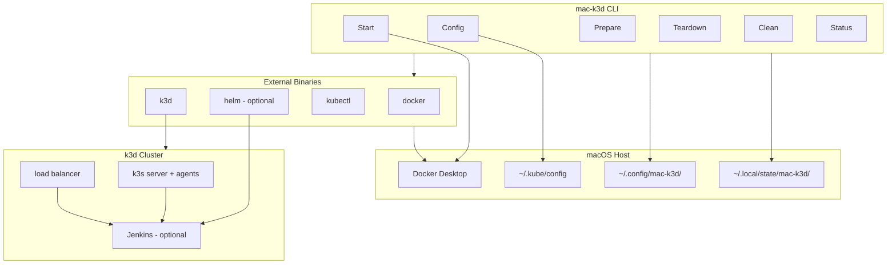
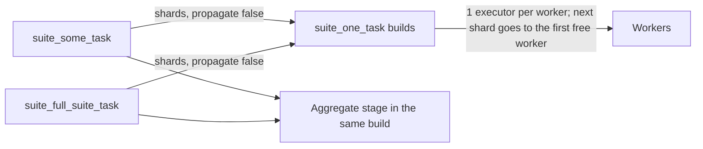

# Architecture

## Overview

`mac-k3d` is a Rust CLI that orchestrates external tools on **macOS and Linux** to provide a local Kubernetes / LoLBench eval environment. It does not embed Docker, k3s, or Jenkins — it shells out to installed binaries and manages configuration/state.

Platform-specific behavior lives in `src/platform/{macos,linux}.rs` (Docker Desktop vs Engine, Homebrew vs apt, LaunchAgent vs systemd --user).


```mermaid
flowchart TB
    subgraph CLI["mac-k3d CLI"]
        Prepare
        Start
        Config
        Teardown
        Clean
        Status
    end

    subgraph Host["macOS Host"]
        DD[Docker Desktop]
        KC[~/.kube/config]
        CFG[~/.config/mac-k3d/]
        STATE[~/.local/state/mac-k3d/]
    end

    subgraph Tools["External Binaries"]
        docker[docker]
        k3d[k3d]
        kubectl[kubectl]
        helm[helm - optional]
    end

    subgraph Cluster["k3d Cluster"]
        k3s[k3s server + agents]
        LB[load balancer]
        JENKINS[Jenkins - optional]
    end

    CLI --> Tools
    Tools --> DD
    k3d --> Cluster
    Start --> DD
    Config --> KC
    CLI --> CFG
    CLI --> STATE
    helm --> JENKINS
    k3s --> JENKINS
    LB --> JENKINS
```

## Components

### 1. CLI layer (`src/cli.rs`, `src/main.rs`)

- Parses global flags (`--config`, `-v`) and subcommands via **clap**.
- Loads config once per invocation.
- Dispatches to async command handlers.

### 2. Configuration (`src/config.rs`)

- YAML file at `~/.config/mac-k3d/config.yaml`.
- Deserialized with **serde**; missing file → built-in defaults.
- `prepare --init-config` writes defaults without overwriting.

### 3. Command handlers (`src/commands/`)

Each subcommand is a module with:
- `*Args` — clap argument struct
- `run(args, &MacK3dConfig) -> Result<()>` — async entry point

Commands shell out to external tools via a shared `runtime` module (planned).

### 4. Platform adapters (`src/platform/`)

- `ensure_supported_os()` — allows macOS and Linux.
- Facades for volume roots, package install, Docker ensure/quit, agent daemon, labels, PATH extras.

### 5. External dependencies

| Tool | Purpose | Required |
|------|---------|----------|
| Docker Desktop | Container runtime (macOS) | Yes (macOS) |
| Docker Engine | Container runtime (Linux) | Yes (Linux) |
| docker CLI | Health checks, image pulls | Yes |
| k3d | Create/manage k3s cluster | Yes |
| kubectl | Cluster interaction | Yes |
| helm | Jenkins Helm chart | Only if Jenkins enabled |

## State model

```text
~/.config/mac-k3d/
  config.yaml          # user configuration

~/.local/state/mac-k3d/
  cluster.json         # last-known cluster metadata (planned)
  jenkins.json         # Jenkins install info, admin password ref (planned)
```

State is written after successful `start` and updated by `config`. `clean --purge-config` removes config; `clean` removes cluster and state dir.

## Lifecycle

```text
┌─────────┐    ┌───────┐    ┌────────┐    ┌──────────┐    ┌───────┐
│ prepare │───▶│ start │───▶│ config │───▶│ teardown │───▶│ clean │
└─────────┘    └───────┘    └────────┘    └──────────┘    └───────┘
     │              │             │              │
     ▼              ▼             ▼              ▼
  check deps    k3d create    kubeconfig     k3d stop      k3d delete
  init config   docker wait   jenkins info   (optional)    purge state
```

- **prepare** — Read-only checks; optional config bootstrap.
- **start** — Mutates Docker/k3d cluster; idempotent create-or-start.
- **config** — Merges kubeconfig; prints URLs/credentials.
- **teardown** — Stops cluster; preserves volumes and config.
- **clean** — Destructive; requires `--yes`.

## Jenkins deployment (optional)

When `--jenkins in-cluster` (or `jenkins.enabled: true` in config):

1. Ensure Helm repo `jenkins` is added.
2. Install chart `jenkins/jenkins` into namespace `jenkins`. Extra plugins come from `controller.additionalPlugins` on **controller `mac-k3d start`** (Helm `upgrade --install`, `overwritePlugins: true`): `lockable-resources`, `plain-credentials`, `file-parameters`, `copyartifact`, `pipeline-utility-steps`, `hidden-parameter`. Chart defaults already include Pipeline, Git, and Configuration as Code. `config` rewrites jobs only; it does not install plugins. Do not add plugins in the Jenkins UI.
3. Map `jenkins.host_port` → Service port 8080 via k3d `--port`.

Jenkins runs inside the cluster; access is via `http://localhost:<host_port>`.

## Intended deployment topologies

### Single Mac (default)

- One Mac hosts one k3d cluster.
- Docker Desktop and k3d are local to that Mac.
- Optional Jenkins runs in-cluster and acts as the CI controller for that local environment.

### Multiple Macs with independent local clusters

- Each Mac runs its own independent k3d cluster.
- A Mac with Jenkins enabled is the "controller" role for CI orchestration.
- Macs without Jenkins are "worker" role machines (local execution targets), but they are not Kubernetes worker nodes of the controller's k3d cluster.
- This is the recommended model for v1 because it avoids cross-host k3d networking complexity.
- When several Mac Minis share one Internet Ethernet drop, put them on a switched LAN (router + switch). See [deployment.md](deployment.md#physical-lan-co-located-mac-minis).

### Multiple Macs as one Kubernetes cluster (not supported in v1)

- k3d is optimized for local, single-host Docker networking.
- Spanning a single k3d cluster across multiple Macs is not a primary design target and is fragile over routed/WAN links.
- For true multi-host worker nodes, use a different Kubernetes distribution designed for multi-node networking (for example k3s across hosts, kubeadm, or managed Kubernetes).

## Controller/worker role clarification

In this project, "controller" and "worker" mean CI roles, not Kubernetes node roles:

- **CI controller**: Mac that runs Jenkins (inside its local k3d cluster).
- **CI workers**: other Macs that run agent processes/tools and execute jobs.

Kubernetes node roles remain internal to each Mac's own local k3d cluster (`server` and optional `agents` configured by `cluster.agents`).

## Evaluation architecture

mac-k3d is the **environment and scheduling manager**. It does not run containers for the benchmark, apply per-task resource limits, retry trials, or compute rewards — [Harbor](https://github.com/laude-institute/harbor) does all of that. The boundary:

| Layer | Owner |
|---|---|
| Bare-machine prep: Docker, k3d, the pinned Harbor, Jenkins agent, base images | mac-k3d (`setup`, `start`, `config`), re-checked per build by the `env` phase |
| Per-build prep and checks: benchmark checkout, task selection, iCode checkout and sandbox, read-only mount, network allowlist, leak scan | mac-k3d (pipeline `tasks` phase). The checkout holds each question's image address, not the image ([pipeline.md](pipeline.md#benchmark-checkout-and-question-images)) |
| Question image pull, container lifecycle, per-task cpus/memory, retries, rollout fan-out, verifier, reward | **Harbor** (one `harbor run`; LoLBench images are built for this CPU by `tasks/images` first) |
| Job placement across workers and resource admission | Jenkins + lockable-resources |
| Isolation canary, capture receipts, anti-cheat verdicts, score, report, archive | mac-k3d (pipeline `evaluate/canary`, then the `anticheat`, `score`, `report` and `archive` phases) |

The integrity layer stays here because Harbor has no equivalent: `harbor job summarize` is a removed shim and `harbor analyze` is rubric-only, so neither inspects a transcript for solution leakage or can reject a trial.

### One Harbor run per build

`evaluate/harbor_run` issues a single command and lets Harbor expand it. Every flag is explained in [pipeline.md](pipeline.md#how-harbor-is-called):

```text
harbor run -p <dataset dir> -i <task id> ... -k <N_ROLLOUTS> -n <slots> -r <retries>
```

Harbor's own plan is `n_attempts x tasks x agents`, so `-k 4` over 10 selected ids is 40 trials with `-n` of them in flight. The per-task `cpus` / `memory_mb` / `storage_mb` come from each `task.toml` and are **not** overridden; `pipeline/lib/task_resources.py` reads them, plans how many fit on this worker, and fails the build before any container starts if even one task does not fit.

### Job topology

Nine evaluation jobs — three shapes for each of `deepswe`, `lolbench`, `swebenchpro`:

| Job | Shape | Purpose |
|---|---|---|
| `<suite>_one_task` | 1 question, 1 rollout by default | smoke test after a code change; also runs every shard |
| `<suite>_some_task` | dispatcher, `agent none` | a `TASKS` list or the first `N_TASKS`, at full rollouts |
| `<suite>_full_suite_task` | dispatcher, `agent none` | the whole suite at full rollouts |


```mermaid
flowchart LR
  someTask["suite_some_task"] -->|"shards, propagate false"| shardBuilds["suite_one_task builds"]
  fullSuite["suite_full_suite_task"] -->|"shards, propagate false"| shardBuilds
  shardBuilds -->|"1 executor per worker; next shard goes to the first free worker"| workers["Workers"]
  someTask --> mergeStage["Aggregate stage in the same build"]
  fullSuite --> mergeStage
```

A dispatcher does **not** queue one build per rollout. It splits the sorted question list into contiguous shards of `SHARD_SIZE` (at least one per online worker, counted with `nodesByLabel`; a label no online worker carries fails the build before any shard is queued), queues each as a `<suite>_one_task` build with its own `TASKS` or `TASK_OFFSET` and a shared `RUN_GROUP`, and waits. Its final `Aggregate` stage runs on a worker, copies each shard's archived trials by build number (`copyArtifacts selector: specific(n)`; `one_task` grants the two dispatchers `copyArtifactPermission`), and merges them with `aggregate_runs.py` into one `artifact.json` archived on the dispatcher build. The dispatcher holds no executor while its shards queue, so it cannot starve them.

### One build per worker, every core

Each registered node has **one executor**. Jenkins' default load balancer hashes the job name to a preferred node, so with several executors per node every shard of one dispatcher would pile onto the same worker while it had a free executor. With one executor, a worker that is busy is skipped, and when it finishes it takes the next queued shard: bigger or faster workers simply run more shards.

Each `<suite>_one_task` build is seven stages, one per pipeline phase — Environment, Tasks, Evaluate, Anti-cheat, Score, Report, Archive — each running `run_all.sh` with its `MAC_K3D_PHASE`. Only `Evaluate` takes the lock:

```groovy
lock(label: env.NODE_NAME, resource: null, variable: 'HELD_CORES')
```

With no quantity, lockable-resources locks **every** matching resource, so the build holds all of its worker's cores; their count becomes `CPU_LOCK_QTY`, which `task_resources.py` turns into Harbor's `-n`. The label is the **node name**, not a shared `CPU_CORES` label, because `mac-k3d setup` on a worker creates resources named `<agent>-core-1..N` labelled with both the shared label and the agent name, and the agent name is the Jenkins node name. Benchmark checkout, iCode build and image checks (Tasks), and everything after Harbor run unlocked.

### Adding a worker

`mac-k3d setup -c worker.yaml` registers the node (one executor) and its core resources. Nothing in the pipeline is edited: the dispatcher counts online workers when it plans shards, Jenkins hands each queued shard to the first free worker, and `lock(label: env.NODE_NAME)` resolves per build.

Scale workers, not controllers. Lockable-resources state is per-controller, so a second controller would hand out tokens for cores the first one already lent out.

### The pipeline under test ships in the binary

`include_dir!` embeds `pipeline/` in `mac-k3d`, and `build.rs` bakes in the commit, a dirty flag (uncommitted changes under `src/` or `pipeline/`) and an FNV-64 hash of the embedded files. A build's first stage (Environment) runs `mac-k3d pipeline --extract-to $WORKSPACE/mac-k3d-pipeline`; the other six stages reuse that extract, so a redeploy during a build cannot change the scripts under it.

| Where | What records the pipeline |
|---|---|
| Worker binary | `mac-k3d --version` → `mac-k3d 0.5.2 (<commit>[, dirty])` |
| The build's extract | `pipeline/BUILD.json` → `version`, `commit`, `dirty`, `pipeline_hash`, `binary` |
| `artifact.json` | `eval_protocol.pipeline` → `source: binary` plus the same four fields |
| Aggregate of shards | `pipeline_status: same`, or `mixed` with each commit/hash when a worker missed a redeploy |

`OFFICIAL=1` extracts with `--require-clean`, which refuses a dirty build or an unknown commit, and `check_report.py` rejects a dirty or mixed pipeline. A commit reaches every host through `scripts/redeploy.sh` — see [workflow.md](workflow.md#development-loop-commit-push-redeploy). There is no GitHub clone on the worker and no pipeline URL or ref parameter.

## Cross-network operation (not necessarily LAN)

- Co-located Mac Minis should use a shared switched LAN; see [deployment.md](deployment.md#physical-lan-co-located-mac-minis).
- Connectivity over VPN, routed corporate networks, or public internet can work if endpoints are reachable and secured.
- Remote workers only need network access to Jenkins controller endpoints (HTTPS + agent transport), not direct membership in the controller's k3d Docker network.
- Latency and intermittent links are expected; Jenkins agents should be configured for reconnect and retry behavior.

### Practical network requirements

1. Jenkins controller endpoint reachable from worker Macs.
2. TLS termination and authentication enabled for controller access.
3. Firewall/NAT rules permit outbound agent-to-controller traffic.
4. Stable DNS name for the Jenkins controller.

### Security baseline

- Do not expose an unsecured Jenkins endpoint publicly.
- Prefer a shared switched LAN when Macs are co-located; otherwise prefer VPN or a private overlay.
- Use per-agent credentials/tokens and rotate regularly.
- Restrict inbound ports to Jenkins and required management access only.

## Error handling

- `Error` enum in `src/error.rs` for typed failures.
- External command failures wrap stderr in `CommandFailed`.
- Non-zero exit from `main` on any `Err`.

## Runtime modules

| Module | Responsibility |
|--------|----------------|
| `src/runtime/docker.rs` | Docker Desktop start/wait/quit, `docker info` |
| `src/runtime/k3d.rs` | Cluster create/start/stop/delete and kubeconfig merge |
| `src/runtime/kubectl.rs` | Context switch, API readiness, secret reads |
| `src/runtime/jenkins.rs` | Helm install/upgrade, UI URL, admin password |
| `src/runtime/exec.rs` | Shared `tokio::process::Command` wrapper |
| `src/runtime/state.rs` | Write/remove `~/.local/state/mac-k3d/` |

## Security considerations

- No secrets in repo or default config.
- Jenkins initial admin password read from cluster secret at `config` time only.
- **CI secrets (LLM API keys, forge PATs):** store once in the Jenkins Credentials store on the controller; inject into builds on any agent — see [secrets.md](secrets.md). Do not copy these onto workers.
- `jenkins_agent.api_token` in YAML is transitional plaintext for CLI registration; prefer Keychain later.
- `clean` requires explicit `--yes` to prevent accidental data loss.

## Testing strategy (planned)

- Unit tests for config load/save/defaults.
- Integration tests with `assert_cmd` for CLI parsing.
- Optional CI job on macOS runner with k3d (manual/nightly).
