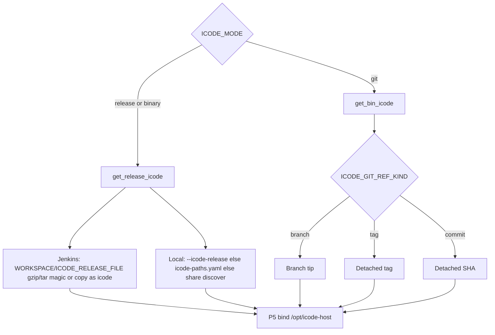

# Two ways to provide iCode for eval

Workers are CI agents. Developers push iCode to GitHub or GitCode; eval never uses a developer checkout on the worker.

DeepSWE (Pier) and LoLBench (Harbor) both accept the same two **iCode inputs**. P3 calls exactly one function:

| `ICODE_MODE` | Function | What you provide |
|--------------|----------|------------------|
| `release` (`binary` is an alias) | `get_release_icode` | Jenkins: **upload** `ICODE_RELEASE_FILE`. Local `--stage` / `--local`: `--icode-release PATH` or persist/discover |
| `git` | `get_bin_icode` | Allow-listed `https://` URL + **branch / tag / commit** |

A GitHub/GitCode **Release page** is not a git clone. Do **not** clone the iCode repo and then hunt for zip assets. `ICODE_MODE=git` with `ICODE_GIT_REF_KIND=tag` checks out that **tag in git**. `ICODE_MODE=release` uses the binary drop you upload (Jenkins) or already downloaded (local).



Both Jenkins jobs (`deepswe_one_task` and `lolbench_one_task`) offer both modes.

## Persist file (local `--stage` / `--local` only)

After you **type and confirm** a release drop path, mac-k3d stores it in:

`~/.config/mac-k3d/icode-paths.yaml`

```yaml
release: /abs/path/to/icode-linux-x86_64-full-v0.1.41
```

Write it with:

```bash
mac-k3d set --icode-release /path/to/icode-linux-x86_64-full-v0.1.41
```

TTY `mac-k3d eval --local` (no `--yes`) also saves the path you confirm. `--icode-release` / env vars **override** the file for that local run and do **not** rewrite it.

Git URL, ref, and kind stay in Jenkins parameters / `jenkins_job` YAML — not this file. Jenkins **does not** take a worker filesystem path for the release drop. Product path: upload `ICODE_RELEASE_FILE` in the UI.

## 1. Release binary (`ICODE_MODE=release`)

Download the official `icode-<os>-<arch>-full-vX.Y.Z` (`.tar.gz`, same name with no suffix, unpacked `*-full-*` folder, or a file named `icode`).

**Jenkins:** Build with Parameters → `ICODE_MODE=release` → upload that file as `ICODE_RELEASE_FILE`. Jenkins names it after the parameter, so P3 treats it by **content**: gzip/tar magic unpacks an archive; otherwise it copies the file as `icode`. An empty upload fails the job (`upload ICODE_RELEASE_FILE on Jenkins Build with Parameters`).

**Local:**

```bash
mac-k3d set --icode-release /path/to/icode-linux-x86_64-full-v0.1.41
# or copy into the discover dir:
cp /path/to/icode-linux-x86_64-full-v0.1.41 "$HOME/.local/share/mac-k3d/"
mac-k3d eval --local --stage p3 --icode-mode release --yes
```

Named-path rules stay for local CLI (`icode` or `*-full-*`). P3: `resolving iCode (release)`. Harbor keeps the real binary (no git wrapper). There is **no** `icode_git` object on the report.

`mac-k3d eval --yes` (no `--local`) **cannot** queue a release build: GET `buildWithParameters` cannot attach a file. Open the Jenkins UI instead.

## 2. Git clone (`ICODE_MODE=git`)

Clone `https://github.com/…` or `https://gitcode.com/…` (no tokens in the URL). Checkout uses `ICODE_GIT_REF_KIND`:

| Kind | Meaning |
|------|---------|
| `branch` | Tip of that branch (Jenkins/CLI default) |
| `tag` | Detached tag (this is a “git release”, not GitHub Release assets) |
| `commit` | Detached SHA, including a PR commit before merge |

Leftover `auto` (old queued builds) still maps: 7–40 hex → commit, else branch. Do not pick it on the Jenkins form.

```bash
mac-k3d eval --local --stage p3 --icode-mode git \
  --icode-git-url https://github.com/ORG/icode.git \
  --icode-git-ref main --icode-git-ref-kind branch
```

P3 writes `icode_git.json` (`url`, `kind`, `ref`, resolved `sha`, `subject`). P7/P8 copy it into the report as `icode_git`. Console: `OK iCode git kind=…`. Private repos: gitignored `.env` (`GITCODE_TOKEN` / `GITHUB_TOKEN`) or Jenkins credentials `gitcode-pat` / `github-pat`.

The clone lives under the eval workdir (`eval-runs/icode-src`), not a permanent developer tree on the worker. A later git eval wipes that tree first. If Pier/Harbor left root/nobody files in `.venv`, P3 deletes it with Docker (`removing leftover … via docker`) — do not `sudo rm` by hand. Git-mode Jenkins also deletes a leftover `ICODE_RELEASE_FILE` and does not treat it as an upload.

## Jenkins Build with Parameters

Same fields on **both** jobs. Unused fields stay on the form: leave those controls as they are (do not clear them).

| Field | Release | Git |
|-------|---------|-----|
| `ICODE_MODE` | `release` | `git` |
| `ICODE_RELEASE_FILE` | **required upload** | leave this control as it is |
| `ICODE_GIT_URL` / `REF` / `KIND` | leave these controls as they are | required (`KIND` is `branch`, `tag`, or `commit`) |

Vice versa: if you chose git, ignore the file picker; if you chose release, ignore URL / ref / kind.

After changing job XML, run `mac-k3d config --skip-secrets` on the **controller** so the UI shows `ICODE_RELEASE_FILE` (no worker-path `ICODE_RELEASE` string). Extract pipeline on the worker (`mac-k3d eval --stage p0` or `config`).

CLI from the worker (queues Jenkins **git** only):

```bash
mac-k3d eval --benchmark deepswe --n-tasks 1 --icode-mode git \
  --icode-git-url https://github.com/ORG/icode.git --icode-git-ref v0.1.41 \
  --icode-git-ref-kind tag --yes
mac-k3d eval --benchmark lolbench --task ruff_1 --icode-mode git \
  --icode-git-url https://github.com/ORG/icode.git --icode-git-ref v0.1.41 \
  --icode-git-ref-kind tag --yes
```
