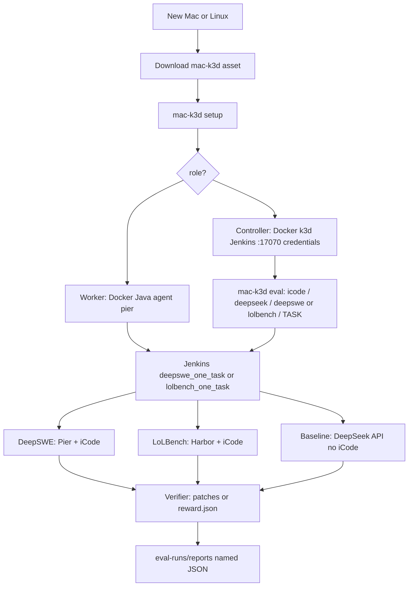

# Binary-initializer workflow

Full path from a **new Mac or Linux** machine through Jenkins roles to an **iCode vs DeepSeek** DeepSWE evaluation and named JSON output.

This is the **binary-initializer** story. The older **v0.3.0** cargo/`prepare` path stays in [../initializer-new-machine.md](../initializer-new-machine.md).

## Why two processes

| Process | Goal | Why |
|---------|------|-----|
| **1. Machine bootstrap** | Download one `mac-k3d` binary; become a Jenkins **controller** or **worker** | A blank PC has no Rust. The binary installs Docker and the rest. |
| **2. Eval pipeline** | Run DeepSWE with harness=iCode and LLM=DeepSeek; compare to raw DeepSeek API; write JSON | Measure whether iCode improves patches (f2p / p2p) vs calling the model without a harness. |

```text
New Mac/Linux
  → download mac-k3d Release asset
  → setup: controller (k3d+Jenkins :17070) or worker (agent.jar)
  → mac-k3d eval (harness=icode, llm=deepseek, benchmark=deepswe, N)
  → Jenkins job deepswe_one_task (Pier) or lolbench_one_task (Harbor)
       DeepSWE: clone DeepSWE, install pier, bind-mount worker iCode drop
       LoLBench: clone LoLBench-Preview, install harbor; adapter clones iCode in-sandbox
       arm A: iCode + DeepSeek (Pier or Harbor)
       arm B: DeepSeek chat API only (no iCode)
       grade (Pier artifacts or Harbor reward.json)
  → eval-runs/reports/eval-icode-deepseek-{deepswe|lolbench}-n{N}-{utc}.json
```



---

## Process 1 — prepare the machine

**User steps:** [binary-initializer-new-machine.md](testing/binary-initializer-new-machine.md) · clean-machine walkthrough: [clean-machine-binary-test.md](testing/clean-machine-binary-test.md)  
**Pass/fail:** [testing-binary-initializer.md](testing/testing-binary-initializer.md) (Task 0–5 + Task 7 on Linux; Task 6 macOS later) · automated checks: [`scripts/env_set_up/`](../../scripts/env_set_up/README.md)

| Step | What | Why |
|------|------|-----|
| Download `mac-k3d-{os}-{arch}` | Prebuilt CLI from a GitHub **pre-release** (or Latest after a final tag) | No Rust on a new laptop |
| `chmod +x` / quarantine strip | Make the asset executable | Unsigned downloads are blocked on macOS |
| `mac-k3d setup` | Wizard: role, Install Docker / k3d / Java | One entry point for controller or worker |
| Controller: `start` + `config` | k3d cluster + Jenkins UI `:17070` + credentials | Job queue and `deepseek-api-key` live here |
| Worker: token + `config` | Inbound agent + `CPU_CORES` locks | Workloads run on the worker’s Docker, not inside the controller’s k3d nodes |

Honest leftovers: Linux **logout** after docker group; macOS first **Docker Desktop** window; worker **API token**; DeepSeek key on the **controller** credentials store.

Workers must **not** run `mac-k3d start -c worker.yaml` (rejected on purpose).

---

## Process 2 — evaluation pipeline

**Pass/fail per stage:** [testing-eval-pipeline.md](testing/testing-eval-pipeline.md) (E0–E8 tracking; P0–P8 stage detail)

| Stage | What | Why |
|-------|------|-----|
| Choose harness / LLM / model / benchmark | v1: **icode** / **deepseek** / **deepseek-v4-pro** (or **deepseek-flash**) / **deepswe** | Catalog ids; unknown `--model` is rejected |
| Choose N and iCode binary vs source | Limit cost; users drop a binary at `~/.local/share/mac-k3d/icode` | Same machine that runs Pier must see iCode |
| Install Pier | `uv tool install datacurve-pier` | DeepSWE is Harbor/Pier-format tasks |
| Clone DeepSWE | `git clone https://github.com/datacurve-ai/deep-swe` | Not vendored in this repo |
| Pier agent `icode` | Install script + DeepSeek allowlist inside the sandbox | Puts iCode **inside** the task Docker image Pier builds |
| Arm A | `pier run … --agent-import-path icode_pier_agent:ICodeAgent --model $DEEPSEEK_MODEL` | Harness under test (Jenkins credential; developer `.env`). Catalog default `deepseek-v4-pro` |
| Arm B | Baseline DeepSeek chat (`$DEEPSEEK_MODEL`, default `deepseek-v4-pro`) on the same `instruction.md` | Compare without iCode scaffolding |
| Grade | Verifier → f2p / p2p / `resolved` / pass@1, tokens, time, model | DeepSWE’s held-out tests plus API usage |
| JSON | `eval-runs/reports/eval-icode-deepseek-deepswe-n{N}-{utc}.json` | Clear naming for which eval ran |

Trigger:

```bash
mac-k3d eval                  # interactive → Jenkins deepswe_one_task (or --local)
mac-k3d eval --stage p5 --n-tasks 1   # isolated stage test
```

Jenkins job names: **`deepswe_one_task`** (Pier) and **`lolbench_one_task`** (Harbor). Shared `run_all.sh`; each job pins `BENCHMARK`. One `TASK` per build. Logs print `PROGRESS n% …`. Agent label `lolbench`; builds take a `CPU_CORES` lock.

---

## Where output lives

Workdir is **`eval-runs/`** (`MAC_K3D_EVAL_WORKDIR`). Jenkins sets it to `$WORKSPACE/eval-runs`.

| What | Path |
|------|------|
| Official report (P8) | `eval-runs/reports/eval-icode-deepseek-deepswe-n{N}-{utc}.json` |
| On the worker (Jenkins) | `$HOME/jenkins-agent/workspace/deepswe_one_task/eval-runs/reports/` |
| Jenkins artifact | same glob on the build |
| P7 scratch | `eval-runs/results/score-temp.json` |
| Last report path | `eval-runs/last_output.txt` |
| Arm A logs/patches | `eval-runs/harness/` |
| Arm B logs/patches | `eval-runs/baseline/` |
| DeepSWE clone | `eval-runs/deep-swe/` |
| Copied iCode for the run | `eval-runs/icode-bin/icode` |

If `jenkins_agent.remote_fs` in `worker.yaml` is not the default, reports are at `{remote_fs}/workspace/deepswe_one_task/eval-runs/reports/`. Repo-root `output/` and `eval-work/` are leftovers (removed); do not look there. Share `~/.local/share/mac-k3d/eval-runs` is not the Jenkins report dir.

---

## Release assets (all machines)

One tag publishes **four** assets (see [`.github/workflows/release-binaries.yml`](../../.github/workflows/release-binaries.yml)):

| Asset | Runner | How it is built |
|-------|--------|-----------------|
| `mac-k3d-linux-x86_64` | `ubuntu-latest` | native |
| `mac-k3d-linux-aarch64` | `ubuntu-24.04-arm` | native |
| `mac-k3d-darwin-aarch64` | `macos-latest` (Apple Silicon) | native |
| `mac-k3d-darwin-x86_64` | `macos-latest` (Apple Silicon) | **cross-compile** `--target x86_64-apple-darwin` |

CI checks `file` + `lipo -info` so the Intel asset is **x86_64**, not arm64. There is no `macos-13` job.

---

## Related docs

| Doc | Role |
|-----|------|
| [binary-initializer-new-machine.md](testing/binary-initializer-new-machine.md) | User bootstrap commands |
| [clean-machine-binary-test.md](testing/clean-machine-binary-test.md) | Clean PC → binary → controller/worker → eval-ready |
| [`scripts/env_set_up/`](../../scripts/env_set_up/README.md) | Automated controller/worker/eval-ready checks |
| [testing-binary-initializer.md](testing/testing-binary-initializer.md) | Bootstrap sign-off |
| [cloud-eval-runbook.md](testing/cloud-eval-runbook.md) | Operator runbook: cloud root controller → local worker → JSON |
| [testing-eval-pipeline.md](testing/testing-eval-pipeline.md) | Pipeline stage CLI tests |
| [../secrets.md](../secrets.md) | Controller credentials (`deepseek-api-key`) |
| [../lolbench-jenkins.md](../lolbench-jenkins.md) | `lolbench_one_task` is Harbor + iCode; `deepswe_one_task` is Pier + iCode |
