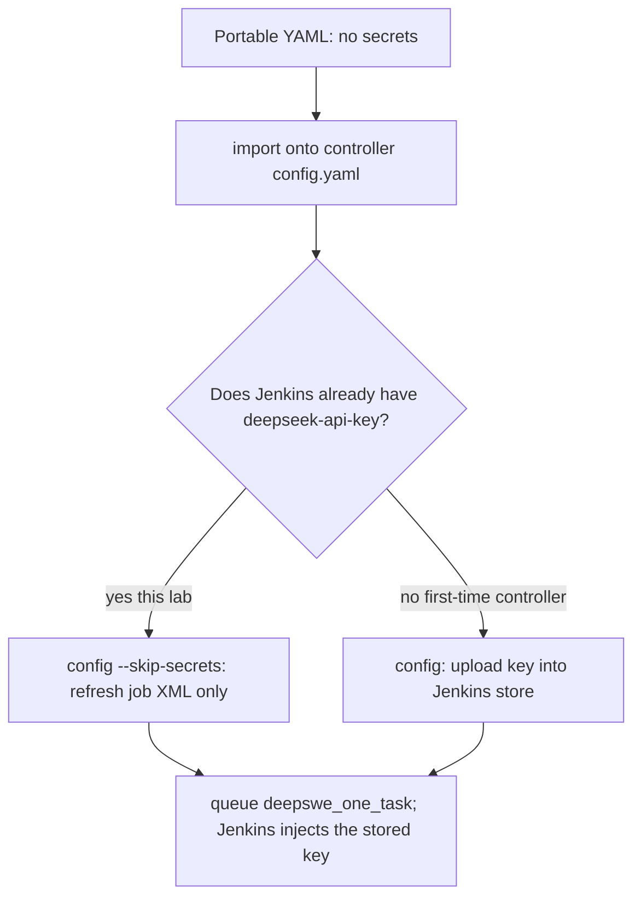

# Export and import lab YAML

Copy **one** live config (controller **or** worker) onto another machine or a scratch file. Import is **write only**: it does not start Docker, k3d, or Jenkins. You do **not** export two files unless you want both jobs (change Jenkins question defaults **and** clone a worker).

This lab is split: controller YAML on the **cloud**, worker YAML on **this PC**. Export on the machine that owns the live file, then scp the YAML if the dest is another host.

Need the `export` / `import` subcommands: build this branch (`feat/config-export-import`) or a later Release. GitHub **v0.5.2** does not have them.

```bash
export PATH="$HOME/Documents/Toby/mac-k3d/target/release:$PATH"   # this checkout
# or on cloud after scp: /tmp/mac-k3d-export
mac-k3d export --help
mac-k3d import --help
```

Operator bootstrap (roles, iCode drop, first eval): [binary-initializer/user-guide.md](binary-initializer/user-guide.md). CLI flags: [commands.md](commands.md). Secrets stores: [secrets.md](secrets.md).

---

## Function

Controller and worker use the same schema. **Export this host’s live file** — not a two-file bundle.

| Live file | Where in this lab | Typical role | What you copy |
|-----------|-------------------|--------------|----------------|
| `~/.config/mac-k3d/config.yaml` | **Cloud** | controller | Cluster name, Jenkins port, `jenkins_job.*` (TASK / harness / LLM / model defaults) |
| `~/.config/mac-k3d/worker.yaml` | **This PC** | worker | `controller_url`, labels, agent name, Harbor skip/install intent |

This PC has only `worker.yaml`. The cloud has `config.yaml`. Job defaults (`default_task`) are on the **controller** file. `set` on worker YAML does not change Jenkins TASK.

**Kept** in the portable YAML: `role`, Jenkins ports, `jenkins_job.*` (harness / LLM / DeepSeek model / benchmark / question defaults), labels, `controller_url`, `api_user`, dependency `source` (`install` / `skip` / `existing`).

**Stripped:** `jenkins_agent.api_token`, host storage paths, tool `binary`/`app`, `lolbench.path`, `platform`, `cpu_cores`, `remote_fs`. **Never** read or copied: `credentials.pending.yaml`.

Lockable Resources (`CPU_CORES`) live in **Jenkins on the controller**. Worker YAML only stores the label name (`resources.cpu_cores_label`) and this machine’s core count. Export sets `cpu_cores` to 0; prepare/config on the dest measures cores again and creates `{agent}-core-N` locks via the Jenkins API.

---

## One file, one purpose (controller vs worker)

Each `export` / `import` handles **one YAML**. Import the file that matches what you are doing on **this** machine. Omitting `-c` on import: `role: worker` → `~/.config/mac-k3d/worker.yaml`, otherwise `config.yaml`. Do not import a controller file onto a worker path (or the reverse).

| Situation | Export where | Import where | Then |
|-----------|--------------|--------------|------|
| Change which question / harness Jenkins runs | Cloud: `config.yaml` | Cloud live `config.yaml` (`--force` if it already exists) | `mac-k3d set` on that YAML, then `config --skip-secrets`. Worker YAML is unused. |
| Add another eval PC to the same Jenkins | Existing worker: `worker.yaml` | **New** PC `~/.config/mac-k3d/worker.yaml` | Paste `api_user` / `api_token` into the **live** dest; `config -c worker.yaml`. Do **not** `--force` onto a working worker (that wipes the token). |
| File-only check (no Jenkins) | Either host | Scratch `-c /tmp/imported-….yaml` | Confirm no `api_token`. Do not `config` against `/tmp`. |

Optional: export **both** only if you want a lab pack (controller settings **and** a worker template). They stay two files; import them separately, on the matching machines.

```bash
# cloud (controller / eval job defaults) — this PC cannot export this file
mac-k3d export -c ~/.config/mac-k3d/config.yaml -o /tmp/controller-lab.yaml

# this PC (worker / agent join template) — the cloud cannot export this file
mac-k3d export -c ~/.config/mac-k3d/worker.yaml -o /tmp/worker-lab.yaml
```

Copy the YAML with scp if dest is the other host. GitHub **v0.5.2** has no `export` / `import` / `set`; use this branch binary (`target/release/mac-k3d` or `/tmp/mac-k3d-export`).

---

## How to use

```bash
# Source host — dest must not be the live source path. Run only the line for the file on *this* machine.
mac-k3d export -c ~/.config/mac-k3d/config.yaml -o /tmp/controller-lab.yaml
mac-k3d export -c ~/.config/mac-k3d/worker.yaml -o /tmp/worker-lab.yaml

# Optional (controller YAML only): mac-k3d set -c /tmp/controller-lab.yaml --benchmark deepswe --task YOUR_ID

# Dest — scratch file (does not touch the live lab)
mac-k3d import /tmp/controller-lab.yaml -c /tmp/imported-config.yaml
mac-k3d import /tmp/worker-lab.yaml -c /tmp/imported-worker.yaml

# Dest — live file that already exists needs --force (controller job defaults)
# mac-k3d import /tmp/controller-lab.yaml -c ~/.config/mac-k3d/config.yaml --force
```

Cheap file check (no Jenkins, no LLM). Automated keep/strip for **worker.yaml** is `cargo test` (`export_then_scratch_import_keeps_worker_template`, `export_import_worker_yaml_scratch_dest`). The script below is the live-file smoke: export this host’s YAML to a **scratch** dest only (never `--force` onto `~/.config/mac-k3d/*`).

```bash
MAC_K3D_BIN="$HOME/Documents/Toby/mac-k3d/target/release/mac-k3d" \
  ./scripts/env_set_up/05_check_export_import.sh
```

On a worker-only machine the script uses `worker.yaml`. Import prints next steps (`setup` / `config`). Do **not** run `start` / `config` against a `/tmp` scratch YAML unless you intend to register a second agent or a second cluster.

---

## Credentials: portable YAML vs live Jenkins (no contradiction)

Export/import YAML **never** contains credentials. Eval on **this lab** can still run without typing the DeepSeek key because that key was stored **earlier** in Jenkins, not in the portable file.

These are **two stores**:

| Store | What it holds | In export/import YAML? |
|-------|----------------|-------------------------|
| Portable file (`/tmp/controller-lab.yaml`) | Role, ports, `default_task`, labels, URL | **Never** `api_token`, never `deepseek-api-key`, never `credentials.pending.yaml` |
| Live worker `~/.config/mac-k3d/worker.yaml` | Agent register token (`api_token`) | **Not** written by a sanitized import. Left as-is unless you `import --force` onto that path (that **wipes** the token — do not do that on this PC) |
| Jenkins Credentials on the **controller** | `deepseek-api-key` (LLM). Jobs bind it per build | **Not** in YAML. Survives import. `config --skip-secrets` **keeps** this store |

**`--skip-secrets` does not mean “the imported YAML contains credentials.”** It means: rewrite Pipeline job XML from the YAML’s **non-secret** fields (`jenkins_job.default_task`, `default_harness`, `default_llm`, `default_deepseek_model`, `default_benchmark`, `default_n_tasks`, `default_tasks`, …) and **do not** create/update Jenkins Credentials from `credentials.pending.yaml`. The YAML still has **no** secrets. The flag exists so a **second** `config` on an already-set-up controller does not prompt for the DeepSeek key again. The line `Keeping existing Jenkins credential binds (1 id(s))` means Jenkins already has the id; the build injects it at runtime.

**First-time computer** (no Jenkins credential, no live worker token): the import file still has no secrets. Enter them **once** into the live stores:

- Controller: `mac-k3d config -c ~/.config/mac-k3d/config.yaml` **without** `--skip-secrets` (or `--update-secrets`) so `deepseek-api-key` is uploaded.
- Worker: paste `api_user` / `api_token` into the **live** `worker.yaml`, then `mac-k3d config -c ~/.config/mac-k3d/worker.yaml`.

After that, later imports of sanitized YAML use `--skip-secrets` and do not ask again.



The “true situation” that live files / Jenkins hold credentials is **first-time setup leftover** (E0 on the controller, worker `setup` on this PC), not a property of the import file. This lab already has `deepseek-api-key` and a live worker token. Import only changes non-secret fields such as `default_task`; `--skip-secrets` is the matching apply step.

---

## Modify eval parameters, then start a task

Use **`mac-k3d set`** on the **controller** YAML (not `sed`). Worker YAML does not set Jenkins question defaults.

Question modes are mutually exclusive:

| Mode | YAML | Pipeline |
|------|------|----------|
| `--task ID` | `default_task` | one id |
| `--n-tasks N` | empty TASK, `default_n_tasks` | first N directories after `sort` under the benchmark tasks dir. `N>1` is slower and costs more LLM calls |
| `--tasks a,b` | `default_tasks` | those ids, in that order |

Empty `TASK` + empty `TASKS` + `N_TASKS=1` selects the **first** DeepSWE directory after `sort`. The “second question” is the **second** sorted directory name, not “question 2” in a paper. `*_one_task` jobs may still run `N_TASKS>1` when TASK is empty.

`default_benchmark` selects which job (`deepswe_one_task` vs `lolbench_one_task`) receives TASK / N_TASKS / TASKS defaults. Both jobs still get catalog HARNESS / LLM / `DEEPSEEK_MODEL` choices (`deepseek-v4-pro` default, or `deepseek-flash`).

### 1. List first and second ids (this PC)

After a prior P2, the tree is often `eval-runs-deepswe/deep-swe/tasks` or `eval-runs/deep-swe/tasks`:

```bash
cd ~/Documents/Toby/mac-k3d
export PATH="$HOME/Documents/Toby/mac-k3d/target/release:$PATH"
./scripts/list_deepswe_tasks.sh
# record FIRST= line 1, SECOND= line 2
# this lab (2026-09): FIRST=abs-module-cache-flags  SECOND=abs-stepped-slices
```

If the script exits 2, run `mac-k3d eval --stage p2 --local --benchmark deepswe --n-tasks 2` once (no LLM) so the task dirs exist.

### 2. Export, edit, import on the **cloud** controller

Use the branch binary (`/tmp/mac-k3d-export` if you scp’d it). GitHub v0.5.2 has no `export`.

```bash
# on cloud
export PATH="$HOME/.local/bin:$PATH"
MAC=/tmp/mac-k3d-export   # or mac-k3d if PATH is the branch binary
$MAC export -c ~/.config/mac-k3d/config.yaml -o /tmp/controller-lab.yaml
$MAC set --list
$MAC set -c /tmp/controller-lab.yaml --harness icode --llm deepseek --benchmark deepswe --task YOUR_SECOND_ID
# optional model:  $MAC set -c /tmp/controller-lab.yaml --model deepseek-flash
# or first N:  $MAC set -c /tmp/controller-lab.yaml --benchmark deepswe --n-tasks 2
# or a list:   $MAC set -c /tmp/controller-lab.yaml --benchmark deepswe --tasks abs-module-cache-flags,abs-stepped-slices
$MAC import /tmp/controller-lab.yaml -c ~/.config/mac-k3d/config.yaml --force
$MAC config -c ~/.config/mac-k3d/config.yaml --skip-secrets
```

`--skip-secrets` refreshes `deepswe_one_task` / `lolbench_one_task` XML. It does **not** re-enter the API key. Confirm in Jenkins: **deepswe_one_task** → Build with Parameters → **TASK** default is `SECOND`. **DEEPSEEK_MODEL** is a choice (`deepseek-v4-pro` first unless `set --model` changed it).

Do **not** `import --force` onto this PC’s live `worker.yaml` (that strips `api_token`).

### Combined test: model flash + `deepswe_one_task`

Keep the current `default_task`. Only change the Chat Completions id. Catalog: `deepseek-v4-pro` (usual default) or **`deepseek-flash`**. Same Jenkins credential `deepseek-api-key`. N=1 is paid.

Do **not** send `deepseek-v4.1-flash`. That is the product name, not the API id. Chat Completions returns HTTP 400: supported names are `deepseek-flash` and `deepseek-v4-pro`. P6 failed the first flash lab for that reason; P5 can still print `NonZeroAgentExitCodeError` (score, not the 400).

On a worker / local machine that has `.env`, confirm the id before a paid run:

```bash
# this PC (has DEEPSEEK_API_KEY in .env)
mac-k3d set --check-models
# or: python3 pipeline/lib/openai_compat.py --check-model deepseek-flash
```

Cloud `set` on YAML often has **no** key, so do not make live `GET /models` a hard step of controller `set`. P0 on this worker already checks when the Jenkins credential is injected.

Cloud binary must be this branch (`/tmp/mac-k3d-export` after `scp` from `target/release/mac-k3d`). GitHub v0.5.2 has no `set --model` and still stores `DEEPSEEK_MODEL` as a string.

```bash
# on cloud
MAC=/tmp/mac-k3d-export
$MAC set --list
$MAC export -c ~/.config/mac-k3d/config.yaml -o /tmp/controller-lab.yaml
$MAC set -c /tmp/controller-lab.yaml --model deepseek-flash
grep default_deepseek_model /tmp/controller-lab.yaml
$MAC import /tmp/controller-lab.yaml -c ~/.config/mac-k3d/config.yaml --force
$MAC config -c ~/.config/mac-k3d/config.yaml --skip-secrets
```

**Prove the import** in Jenkins UI: `deepswe_one_task` → Build with Parameters → **DEEPSEEK_MODEL** is a choice, **first item `deepseek-flash`**. Leave it and **TASK** as the imported defaults → Build. Do **not** flip the model in the UI if you are checking the default.

CLI `eval --yes` **posts** `DEEPSEEK_MODEL` (same pitfall as empty `--task`). Use it only as a backup, and pass `--task` plus `--model deepseek-flash`:

```bash
export PATH="$HOME/Documents/Toby/mac-k3d/target/release:$PATH"
mac-k3d eval -c ~/.config/mac-k3d/worker.yaml \
  --benchmark deepswe --task "$EXISTING_TASK" --icode-mode binary --n-tasks 1 \
  --model deepseek-flash --yes
```

Pass: build on **this** node; archived JSON `model` is `deepseek-flash` (`model_served` may differ if the API routes). `pass_at_1` may be 0.0.

Restore the catalog default on the cloud:

```bash
$MAC set -c /tmp/controller-lab.yaml --model deepseek-v4-pro
$MAC import /tmp/controller-lab.yaml -c ~/.config/mac-k3d/config.yaml --force
$MAC config -c ~/.config/mac-k3d/config.yaml --skip-secrets
```

UI first choice should be `deepseek-v4-pro` again.

### 3. Queue eval from this computer

Jenkins UI: open `deepswe_one_task` → Build with Parameters → leave **TASK** as the imported default → Build. That is the check that import changed the job default.

CLI (this PC). `--yes` with `--benchmark` and **empty** `--task` posts `TASK=` and Jenkins then picks the **first** alphabetical task, **ignoring** the imported default for that build. Pass `--task` explicitly:

```bash
export PATH="$HOME/Documents/Toby/mac-k3d/target/release:$PATH"
mac-k3d eval -c ~/.config/mac-k3d/worker.yaml \
  --benchmark deepswe --task "$SECOND" --icode-mode binary --n-tasks 1 --yes
```

Pass: build runs on **this** node; the report / `selected_tasks` id is `SECOND`, not `FIRST`. This is a paid DeepSeek run.

### 4. Optional restore

On the cloud, `set` `default_task` back to `$FIRST` (or `--n-tasks 1` with empty task), import `--force`, `config --skip-secrets`.

---

## Add a DeepSeek model (API id, not product name)

LLM family stays `deepseek`. Jenkins still offers only the static catalog in `src/eval_catalog.rs` (`MODELS`), not every id the provider ever returns. Chat Completions is already OpenAI-shaped (`POST /chat/completions`); you do not switch SDKs.

1. Copy an **id** from `GET https://api.deepseek.com/models` (`data[].id`) or from DeepSeek “Models & Pricing”. Example: product “V4.1 Flash” is `deepseek-flash`.
2. Append that exact string to `MODELS`.
3. Rebuild. On a machine with `.env`, `mac-k3d set --check-models` (and worker P0) must see it in `GET /models`.
4. `mac-k3d set --model <id>` then controller `config --skip-secrets`.

Never use marketing names. P6 already prints the API error body if a bad id reaches Chat Completions.

```bash
curl -sS https://api.deepseek.com/models -H "Authorization: Bearer $DEEPSEEK_API_KEY"
mac-k3d set --list
mac-k3d set -c /tmp/controller-lab.yaml --model THE_ID --check-models
```

---

## File-only test (already done on this lab)

Worker (this PC): export `worker.yaml` → no `api_token` in the copy → import to `/tmp/imported-worker.yaml` → `controller_url` kept.

Controller (cloud): export `config.yaml` → `default_task: ruff_1` → edit to `ruff_2` → import `--force` to `/tmp/imported-config.yaml` → `default_task: ruff_2`. Live Jenkins TASK was unchanged until you import onto live `config.yaml` and `config --skip-secrets`.

---

## Failures

| Symptom | What to do |
|---------|------------|
| `config not found: …/config.yaml` | This PC is a worker. Export `-c ~/.config/mac-k3d/worker.yaml`, or export **on the cloud** (`config.yaml` is not on this PC). |
| Imported worker file onto `config.yaml` (or the reverse) | Dest `-c` must match `role`. Controller YAML → controller `config.yaml`; worker YAML → worker `worker.yaml`. |
| `already exists; pass --force` | Scratch dest leftover, or you targeted a live file on purpose. |
| `export -o would overwrite the source` | Pick another `-o` path. |
| Job TASK still the old id | Import was only `/tmp`; or you skipped `config --skip-secrets` on the live controller. |
| CLI eval ran the first DeepSWE id | You omitted `--task`; empty TASK overrides the job default for that build. |
| `Jenkins API token missing` | Live `worker.yaml` has no token (or you imported `--force` onto it). Paste token, then `config -c worker.yaml`. |
| `DEEPSEEK_API_KEY missing` on Jenkins | First-time controller: `config` **without** `--skip-secrets`. This lab: credential should already exist. |
| `DEEPSEEK_API_KEY missing` on `--check-models` | Cloud YAML `set` has no key. Run `--check-models` on this worker / local machine with `.env`. |
| `model '…' is not returned by GET /models` | Catalog / YAML used a product name. Copy `data[].id` from `GET /models` (see **Add a DeepSeek model**). |
| `export: command not found` / no subcommand | PATH is GitHub v0.5.2. Use `target/release/mac-k3d` or `/tmp/mac-k3d-export`. |
