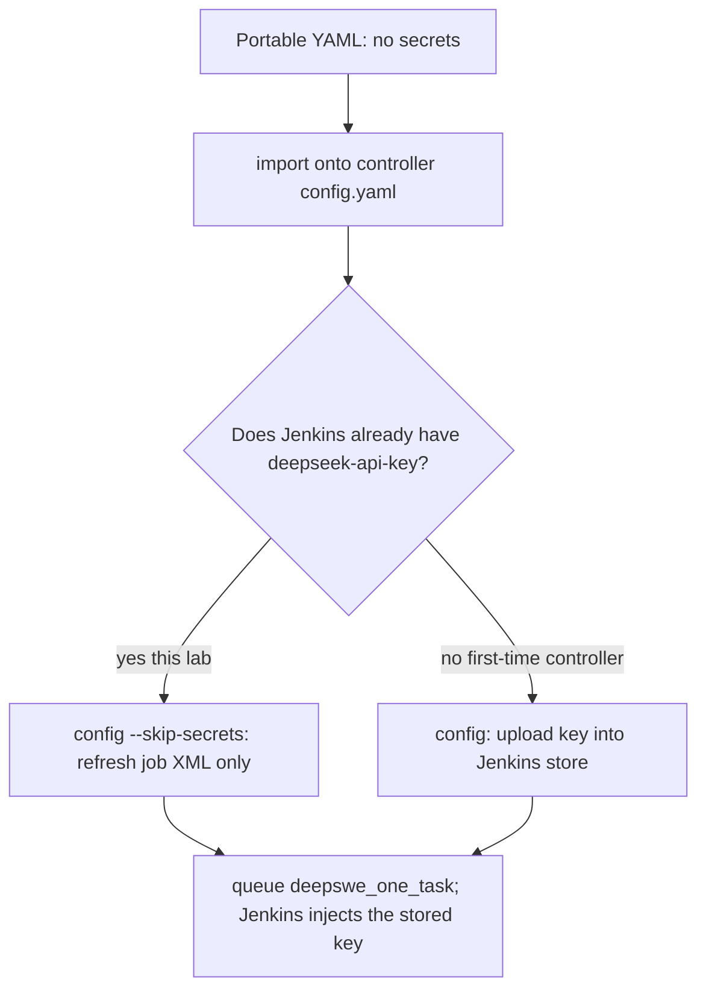

# Export and import lab YAML

Copy **one** live config (controller **or** worker) onto another machine or a scratch file. Import is **write only**: it does not start Docker, k3d, or Jenkins. It does **not** clone a ready machine. It **does** skip re-typing the same lab answers (URL, labels, job defaults).

This lab is split: controller YAML on the **cloud**, worker YAML on **this PC**. Export on the machine that owns the live file, then copy the YAML if the dest is another host.

Need `export` / `import` / `set`: this branch binary (`feat/config-export-import` or later). GitHub **v0.5.2** does not have them.

```bash
export PATH="$HOME/Documents/Toby/mac-k3d/target/release:$PATH"   # this checkout
# or on cloud after scp: /tmp/mac-k3d-export
mac-k3d export --help
mac-k3d import --help
```

Operator bootstrap (roles, iCode drop, first eval): [binary-initializer/user-guide.md](binary-initializer/user-guide.md). CLI flags: [commands.md](commands.md). Secrets stores: [secrets.md](secrets.md).

---

## Pick one situation — do not mix the lists

Situation 1 and situation 2 use **different machines and different files**. There is no shared “start at step 3.”

| I want to… | Run |
|------------|-----|
| Add another eval PC to **this** Jenkins | **Situation 1** only (`worker.yaml`) |
| Change default model/TASK on **this** Jenkins | **Situation 2a** only (`config.yaml`) |
| Stand up a **new** Jenkins server from YAML | **Situation 2b** only (`config.yaml`) |
| Prove sanitization with no Jenkins | **File-only scratch** (below) |

Do not import a controller file onto `worker.yaml` (or the reverse). Omitting `-c` on import: `role: worker` → `~/.config/mac-k3d/worker.yaml`, otherwise `config.yaml`.

This PC has only `worker.yaml`. The cloud has `config.yaml`. Job defaults (`default_task`, `default_deepseek_model`) are on the **controller** file. `set` on worker YAML does not change Jenkins TASK or model.

```bash
# cloud (controller / eval job defaults) — this PC cannot export this file
mac-k3d export -c ~/.config/mac-k3d/config.yaml -o /tmp/controller-lab.yaml

# this PC (worker / agent join template) — the cloud cannot export this file
mac-k3d export -c ~/.config/mac-k3d/worker.yaml -o /tmp/worker-lab.yaml
```

Lockable Resources (`CPU_CORES`) live in **Jenkins on the controller**. Worker YAML only stores the label name (`resources.cpu_cores_label`). Export sets `cpu_cores` to 0; prepare/config on the dest measures cores again.

---

## Why not `import --force` onto a live worker that already has a token?

The working agent’s Jenkins token lives **in** `~/.config/mac-k3d/worker.yaml` (`jenkins_agent.api_token`). `config` uses it to register the node; the agent process uses it to connect.

`import` **always** sanitizes. With `--force` it **overwrites the whole dest file** and sets `api_token` empty. Then:

- `mac-k3d config -c worker.yaml` fails with **Jenkins API token missing**
- You must mint a **new** token in the UI and paste it back

`--force` is **OK** on:

- Scratch files (`/tmp/imported-worker.yaml`) — leftover dest from an earlier lab
- Live **controller** `~/.config/mac-k3d/config.yaml` — eval secrets are in **Jenkins Credentials**, not in that YAML

`--force` is **not OK** on a live `worker.yaml` that already has a token (this PC’s working agent).

| Dest | `--force`? |
|------|------------|
| `/tmp/imported-….yaml` | Yes, if the file already exists |
| New PC, `worker.yaml` does **not** exist | Do **not** need `--force` |
| New PC, empty/broken `worker.yaml` (no token) | `--force` OK |
| This PC’s working `~/.config/mac-k3d/worker.yaml` | **Never** |
| Cloud live `config.yaml` (situation 2a) | Yes — intended |

---

## What is saved (time saved vs full setup)

Export/import still requires: OS, mac-k3d CLI, Docker (worker) or Docker+k3d+Jenkins (controller), and secrets once.

### Worker YAML — time saved

| Parameter | Meaning |
|-----------|---------|
| `role: worker` | This machine is an agent, not a controller |
| `jenkins_agent.controller_url` | e.g. `http://43.107.42.252:17070` |
| `jenkins_agent.labels` | e.g. `lolbench` (job `agent { label }`) |
| `jenkins_agent.name` | Node name — **change it** on the second PC or it collides |
| `jenkins_agent.api_user` | usually `admin` |
| `dependencies.*.source` | `install` / `skip` / `existing` (not host binary paths) |
| `lolbench.source` | skip vs install Harbor/LoLBench |
| `resources.cpu_cores_label` | `CPU_CORES` |

**Not saved:** `api_token`, disk paths, `cpu_cores`, `remote_fs`, DeepSeek key, pipeline extract, Docker images. Workers do not store which DeepSWE **task** to run; they join the same Jenkins and pick up the same jobs.

### Controller YAML — time saved

| Parameter | Meaning |
|-----------|---------|
| `role: controller` | This host runs k3d Jenkins |
| `jenkins.host_port` | UI port, this lab **17070** |
| `cluster.name` / `cluster.ports` | k3d cluster + host port remap |
| `jenkins_job.default_task` | Jenkins **TASK** default |
| `jenkins_job.default_n_tasks` / `default_tasks` | first-N or explicit ids |
| `jenkins_job.default_benchmark` | which job gets question defaults (`deepswe` / `lolbench`) |
| `jenkins_job.default_harness` | `icode` |
| `jenkins_job.default_llm` | family `deepseek` |
| `jenkins_job.default_deepseek_model` | **DEEPSEEK_MODEL** first choice (`deepseek-v4-pro` / `deepseek-flash`) |
| `jenkins_job.default_eval_mode` | `release` / `git` |
| `jenkins_job.default_icode_git_url` / `default_icode_git_ref` | git-mode defaults on the form |
| `dependencies.*.source` | install vs existing for docker/k3d/helm |

**Not saved:** DeepSeek/git credentials, Jenkins admin password, agents, build history, storage paths, tool `binary`/`app`, `lolbench.path`, `platform`. **Never** copied: `credentials.pending.yaml`.

---

## Situation 1 — New worker joins existing Jenkins

**When:** Jenkins already exists. You add another Linux or Mac that should run the same jobs on **that** Jenkins.

**Machines:** old worker (export) → new PC (import).  
**File:** `worker.yaml` only. Does **not** change TASK or `deepseek-flash`.

### On the old worker (this PC)

```bash
export PATH="$HOME/Documents/Toby/mac-k3d/target/release:$PATH"
mac-k3d export -c ~/.config/mac-k3d/worker.yaml -o /tmp/worker-lab.yaml
grep -E 'role:|controller_url:|api_token' /tmp/worker-lab.yaml
```

Expect `role: worker`, `controller_url: http://43.107.42.252:17070`, **no** `api_token` line. Copy `/tmp/worker-lab.yaml` to the new PC.

### On the new PC (every command below is here)

1. Install the mac-k3d CLI for this OS/arch; put it on `PATH`.

2. Write YAML **only if** `~/.config/mac-k3d/worker.yaml` does **not** exist:

```bash
export PATH="$HOME/.local/bin:$PATH"
mac-k3d import /tmp/worker-lab.yaml -c ~/.config/mac-k3d/worker.yaml
```

If that path already exists **and has no token** (empty/broken file):

```bash
mac-k3d import /tmp/worker-lab.yaml -c ~/.config/mac-k3d/worker.yaml --force
```

If that path is a **working** agent with a token: **stop**. Do not import onto it.

3. Edit live `~/.config/mac-k3d/worker.yaml`:

- `jenkins_agent.name` → **new unique** name (not `mac-Michael-Ubuntu` if that node is still Online)
- `jenkins_agent.api_user: admin`
- `jenkins_agent.api_token:` paste a **new** API token from Jenkins (admin → API Token; the **secret**, not the token name)

4. Apply — pick **one**:

```bash
# A — new PC, Docker not installed yet
mac-k3d setup -c ~/.config/mac-k3d/worker.yaml

# B — Docker already works on this PC
mac-k3d config -c ~/.config/mac-k3d/worker.yaml
```

Never `mac-k3d start -c worker.yaml`.

5. Jenkins → Nodes: new name **Online**, label `lolbench`.

---

## Situation 2 — Controller YAML (Jenkins job defaults)

**File:** cloud `config.yaml` only. Does **not** use `worker.yaml`.  
Pick **2a** or **2b**, not both.

Use `mac-k3d set` on the controller YAML (not `sed`). Question flags are mutually exclusive: `--task` / `--n-tasks` / `--tasks`.

Empty `TASK` + empty `TASKS` + `N_TASKS=1` selects the **first** DeepSWE directory after `sort`. `default_benchmark` selects which job receives TASK defaults. Both jobs still get catalog HARNESS / LLM / `DEEPSEEK_MODEL` choices.

Do **not** send `deepseek-v4.1-flash`. That is the product name. API ids are `deepseek-flash` and `deepseek-v4-pro`.

### 2a — Same controller, change defaults (example: `deepseek-flash`)

All apply commands run on the **cloud VM** except the optional `scp`.

Keep `default_task` unless you also pass `--task`. Same Jenkins credential `deepseek-api-key`.

Optional on this PC (has `.env`; cloud `set` often has no key):

```bash
export PATH="$HOME/Documents/Toby/mac-k3d/target/release:$PATH"
mac-k3d set --list
mac-k3d set --check-models
scp "$HOME/Documents/Toby/mac-k3d/target/release/mac-k3d" root@43.107.42.252:/tmp/mac-k3d-export
```

On the cloud (`ssh root@43.107.42.252`):

```bash
chmod +x /tmp/mac-k3d-export
MAC=/tmp/mac-k3d-export

$MAC export -c ~/.config/mac-k3d/config.yaml -o /tmp/controller-lab.yaml
$MAC set -c /tmp/controller-lab.yaml --model deepseek-flash
# other edits, instead or also:
# $MAC set -c /tmp/controller-lab.yaml --harness icode --llm deepseek --benchmark deepswe --task YOUR_ID
# $MAC set -c /tmp/controller-lab.yaml --benchmark deepswe --n-tasks 2
# $MAC set -c /tmp/controller-lab.yaml --benchmark deepswe --tasks abs-module-cache-flags,abs-stepped-slices
grep default_deepseek_model /tmp/controller-lab.yaml
$MAC import /tmp/controller-lab.yaml -c ~/.config/mac-k3d/config.yaml --force
$MAC config -c ~/.config/mac-k3d/config.yaml --skip-secrets
```

Here `--force` on **controller** `config.yaml` is intended.

**Prove in Jenkins UI:** `deepswe_one_task` → Build with Parameters → **DEEPSEEK_MODEL** first item is `deepseek-flash` (and **TASK** is the imported default if you set `--task`). Leave those choices as they are if you are checking the import. Do **not** flip the model in the UI for that check.

`--skip-secrets` rewrites job XML only. It does **not** mean the YAML contained the DeepSeek key.

CLI `eval --yes` **posts** `TASK` / `DEEPSEEK_MODEL` and can ignore the job default. To queue from this PC and still hit the imported values, pass them explicitly:

```bash
export PATH="$HOME/Documents/Toby/mac-k3d/target/release:$PATH"
mac-k3d eval -c ~/.config/mac-k3d/worker.yaml \
  --benchmark deepswe --task "$EXISTING_TASK" --icode-mode git \
  --n-tasks 1 --model deepseek-flash --yes
```

Product path for eval is still Jenkins **Build with Parameters**.

Restore catalog default on the cloud:

```bash
$MAC set -c /tmp/controller-lab.yaml --model deepseek-v4-pro
$MAC import /tmp/controller-lab.yaml -c ~/.config/mac-k3d/config.yaml --force
$MAC config -c ~/.config/mac-k3d/config.yaml --skip-secrets
```

UI first choice should be `deepseek-v4-pro` again.

### 2b — Brand-new controller server

On the **old** controller:

```bash
export PATH="$HOME/.local/bin:$PATH"
mac-k3d export -c ~/.config/mac-k3d/config.yaml -o /tmp/controller-lab.yaml
```

Copy that file to the **new** VM. Install the mac-k3d CLI there.

On the **new** VM, YAML does not exist yet:

```bash
export PATH="$HOME/.local/bin:$PATH"
mac-k3d import /tmp/controller-lab.yaml -c ~/.config/mac-k3d/config.yaml
mac-k3d setup -c ~/.config/mac-k3d/config.yaml
```

First `setup`: enter DeepSeek (and git PAT if you clone private iCode) into **this** Jenkins.

If Docker/k3d **already** exist on that VM, skip `setup` and instead:

```bash
mac-k3d start -c ~/.config/mac-k3d/config.yaml
mac-k3d config -c ~/.config/mac-k3d/config.yaml --skip-secrets
```

Open security group port **17070**. Workers must use `http://<new-ip>:17070` (`controller_url`). That is a **worker** YAML edit or a new Situation 1 export from a worker already pointing at the new IP — not part of 2b’s import.

---

## Credentials: portable YAML vs live Jenkins

Export/import YAML **never** contains credentials. Eval on this lab can still run without typing the DeepSeek key because that key was stored **earlier** in Jenkins.

| Store | What it holds | In export/import YAML? |
|-------|---------------|------------------------|
| Portable file (`/tmp/controller-lab.yaml`) | Role, ports, `default_task`, labels, URL | **Never** `api_token`, never `deepseek-api-key`, never `credentials.pending.yaml` |
| Live worker `~/.config/mac-k3d/worker.yaml` | Agent register token (`api_token`) | **Not** written by a sanitized import. Left as-is unless you `import --force` onto that path (wipes the token) |
| Jenkins Credentials on the **controller** | `deepseek-api-key` (LLM), `gitcode-pat` / `github-pat` | **Not** in YAML. Survives controller import. `config --skip-secrets` **keeps** this store |

`--skip-secrets` means: rewrite Pipeline job XML from the YAML’s **non-secret** `jenkins_job.*` fields and **do not** create/update Jenkins Credentials from `credentials.pending.yaml`. The line `Keeping existing Jenkins credential binds (1 id(s))` means Jenkins already has the id; the build injects it at runtime.

**First-time computer** (no Jenkins credential, no live worker token): the import file still has no secrets. Enter them **once**:

- Controller: `mac-k3d config -c ~/.config/mac-k3d/config.yaml` **without** `--skip-secrets` (or `--update-secrets`) so `deepseek-api-key` is uploaded.
- Worker: paste `api_user` / `api_token` into the **live** `worker.yaml`, then `mac-k3d config -c ~/.config/mac-k3d/worker.yaml`.



---

## List DeepSWE task ids (this PC)

After a prior P2, the tree is often `eval-runs-deepswe/deep-swe/tasks` or `eval-runs/deep-swe/tasks`:

```bash
cd ~/Documents/Toby/mac-k3d
export PATH="$HOME/Documents/Toby/mac-k3d/target/release:$PATH"
./scripts/list_deepswe_tasks.sh
# record FIRST= line 1, SECOND= line 2
# this lab (2026-09): FIRST=abs-module-cache-flags  SECOND=abs-stepped-slices
```

If the script exits 2, run `mac-k3d eval --stage p2 --local --benchmark deepswe --n-tasks 2` once (no LLM) so the task dirs exist. Then use `--task YOUR_SECOND_ID` in situation 2a `set` if you are changing the Jenkins TASK default.

---

## Add a DeepSeek model (API id, not product name)

LLM family stays `deepseek`. Jenkins still offers only the static catalog in `src/eval_catalog.rs` (`MODELS`).

1. Copy an **id** from `GET https://api.deepseek.com/models` (`data[].id`) or from DeepSeek “Models & Pricing”. Example: product “V4.1 Flash” is `deepseek-flash`.
2. Append that exact string to `MODELS`.
3. Rebuild. On a machine with `.env`, `mac-k3d set --check-models` (and worker P0) must see it in `GET /models`.
4. Situation 2a: `set --model <id>` then controller `config --skip-secrets`.

Never use marketing names. P6 prints the API error body if a bad id reaches Chat Completions.

```bash
# this PC / worker (has .env) — do not export the key in the shell
mac-k3d set --list
mac-k3d set -c /tmp/controller-lab.yaml --model THE_ID --check-models
```

---

## File-only scratch (no Jenkins)

Cheap check: export this host’s YAML to a **scratch** dest only (never `--force` onto a live worker with a token).

```bash
MAC_K3D_BIN="$HOME/Documents/Toby/mac-k3d/target/release/mac-k3d" \
  ./scripts/env_set_up/05_check_export_import.sh
```

On a worker-only machine the script uses `worker.yaml`. Import prints next steps (`setup` / `config`). Do **not** run `start` / `config` against a `/tmp` scratch YAML unless you intend to register a second agent or a second cluster.

If `import … -c /tmp/imported-worker.yaml` says `already exists; pass --force`:

```bash
mac-k3d import /tmp/worker-lab.yaml -c /tmp/imported-worker.yaml --force
```

That `--force` is scratch-only.

Automated keep/strip: `cargo test` (`export_then_scratch_import_keeps_worker_template`, `export_import_worker_yaml_scratch_dest`).

Manual:

```bash
mac-k3d export -c ~/.config/mac-k3d/worker.yaml -o /tmp/worker-lab.yaml
mac-k3d import /tmp/worker-lab.yaml -c /tmp/imported-worker.yaml
# dest leftover: add --force
```

Expect: no `api_token` in the copy; `controller_url` kept. Live Jenkins is unchanged.

---

## Failures

| Symptom | What to do |
|---------|------------|
| `config not found: …/config.yaml` | This PC is a worker. Export `-c ~/.config/mac-k3d/worker.yaml`, or export **on the cloud**. |
| Imported worker file onto `config.yaml` (or the reverse) | Dest `-c` must match `role`. |
| `already exists; pass --force` | Scratch dest leftover, or you targeted a live file. Scratch: add `--force`. Live worker **with token**: do not. Live controller 2a: `--force` is intended. |
| `export -o would overwrite the source` | Pick another `-o` path. |
| Job TASK / model still the old value | Import was only `/tmp`; or you skipped `config --skip-secrets` on the live controller. |
| CLI eval ran the first DeepSWE id / old model | You omitted `--task` / `--model`; empty posts override the job default for that build. |
| `Jenkins API token missing` | Live `worker.yaml` has no token (or you imported `--force` onto it). Paste token, then `config -c worker.yaml`. |
| `DEEPSEEK_API_KEY missing` on Jenkins | First-time controller: `config` **without** `--skip-secrets`. This lab: credential should already exist. |
| `DEEPSEEK_API_KEY missing` on `--check-models` | Cloud YAML `set` has no key. Run `--check-models` on this worker / local machine with `.env`. |
| `model '…' is not returned by GET /models` | Catalog / YAML used a product name. Copy `data[].id` from `GET /models`. |
| `export: command not found` / no subcommand | PATH is GitHub v0.5.2. Use `target/release/mac-k3d` or `/tmp/mac-k3d-export`. |
| Two workers, one Offline / name clash | Second PC must use a unique `jenkins_agent.name`. |
