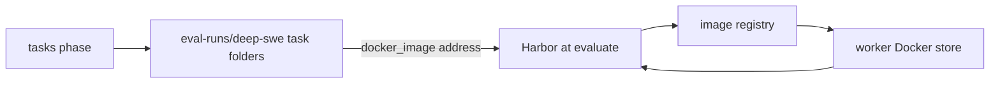

# Evaluation pipeline

One evaluation build runs seven phases in order. mac-k3d prepares the worker and the tasks, Harbor runs the evaluation, and mac-k3d then judges, scores, reports and archives what Harbor left behind. Harbor is treated as a black box: mac-k3d only builds its command line and reads its output folders.

| Phase | Jenkins stage | What it does | CPU lock |
|-------|---------------|--------------|----------|
| `env` | Environment | Bare-metal checks: is this worker fit to run any evaluation? | no |
| `tasks` | Tasks | Per-task setup and checks: benchmark, selection, iCode, isolation, leak scan | no |
| `evaluate` | Evaluate | Trial slots, the isolation canary, then one `harbor run` | **yes** |
| `anticheat` | Anti-cheat | Capture receipts and a verdict per rollout | no |
| `score` | Score | F2P/P2P per rollout from Harbor's `reward.json` files | no |
| `report` | Report | `artifact.json`, `summary.md`, `report.html` | no |
| `archive` | Archive | Cost/token analysis, backup, `tar.gz` | no |

Only Evaluate holds the worker's cores (`lock(label: env.NODE_NAME ...)`), so a second build on the same worker can prepare its tasks or write its report while the first one runs Harbor.

## How it runs

The entry point is `pipeline/stages/run_all.sh`. It loops over `PHASES=(env tasks evaluate anticheat score report archive)`. `MAC_K3D_PHASE=<phase>` runs one phase; `all`, the default, runs every phase.

- **Jenkins** runs each phase as its own stage: `MAC_K3D_PHASE=<phase> bash "$MAC_K3D_ROOT/pipeline/stages/run_all.sh"`. The pipeline is the copy embedded in the worker's `mac-k3d` binary. The Environment stage clears `$WORKSPACE/mac-k3d-pipeline/pipeline` and every stage re-extracts it only if it is missing, so a redeploy in the middle of a build cannot change its scripts. `pipeline/BUILD.json` names the commit for the artifact.
- **Locally**, `mac-k3d eval --stage <phase>` runs one phase from this checkout (or the extracted share copy), `mac-k3d eval --local` runs them all, and `mac-k3d eval --stage baseline` runs the optional LLM-only arm (`pipeline/tools/baseline.sh`). The old names `p0`…`p8` are refused with the phase that replaced them.

Every step starts by sourcing `_common.sh`, which loads the pins in `pipeline/config/toolchain.env` and stops with `brew install bash` when bash is older than `BASH_MIN` (macOS `/bin/bash` is 3.2). The worker itself must have Java at least `JAVA_MAJOR` (the controller image's Java), python3 at least `PYTHON_MIN`, git, Docker with compose and buildx, and Harbor at `HARBOR_VERSION`; [dependencies.md](dependencies.md) lists every version and where it comes from.

Each phase script (`pipeline/stages/<phase>.sh`) is only an ordered `STEPS=(...)` list. Each step (`pipeline/stages/<phase>/<step>.sh`) does one job, runs in its own process and sources `_common.sh`. Steps hand state to each other only through files in `$WORKDIR`: `$WORKSPACE/eval-runs` on Jenkins and `<root>/eval-runs` locally (override with `MAC_K3D_EVAL_WORKDIR`).

With `CANARY=only` the build stops after evaluate: the later phases print `canary only: no rollouts to score` and exit 0.

## Steps

| Step | What it does | Writes under `$WORKDIR` |
|------|--------------|-------------------------|
| `env/host` | Checks `BENCHMARK`, bash ≥ `BASH_MIN`, python3 ≥ `PYTHON_MIN`, git, free RAM and disk (`MIN_RAM_GB`, `WORKER_MIN_DISK_GB`; `MAC_K3D_MIN_RAM_GB` / `MAC_K3D_MIN_DISK_GB` override), `docker info`, a VPN MTU smaller than Docker's bridge, that `mac-k3d` lists `eval`, and the agent unit (systemd) or LaunchAgent (macOS) | — |
| `env/compose` | `docker compose` (v2 plugin) and `docker buildx`: an existing plugin is kept, a missing one is downloaded at the version in `pipeline/config/toolchain.env` (worker `setup` does the same) | — |
| `env/harbor` | Harbor at `HARBOR_VERSION` from `pipeline/config/toolchain.env` (the same pin `mac-k3d setup` installs). Reinstalls with `uv tool install --force` only when the version differs | `harbor_version.txt` |
| `env/egress` | Runs Harbor's egress-control kernel probe visibly (Harbor itself only refuses `--allow-agent-host` and `no-network` when it fails). When Docker cannot run Harbor's probe image, the same script runs in Harbor's egress sidecar image, then in a pinned `alpine:3.19`, and the run uses the first that works (see [How Harbor is called](#how-harbor-is-called)). Also checks Harbor's egress sidecar image | `egress_probe.json` |
| `env/network` | Removes this worker's own stopped trials (compose projects named after a trial folder in this agent's Jenkins workspaces; nothing of another user's), then checks that the trial subnet pool (`10.213.0.0/16`, a `/28` per trial) has a free subnet (see [How Harbor is called](#how-harbor-is-called)) | `trial_network.json` |
| `env/model_api` | `DEEPSEEK_MODEL` is served by `GET /models`. Skipped with a note when no key is set | — |
| `tasks/benchmark` | Checks out the benchmark (see [Where the benchmarks come from](#where-the-benchmarks-come-from)). Question images are fetched later, see [Benchmark checkout and question images](#benchmark-checkout-and-question-images) | `deep-swe/`, `lolbench/` or `swebenchpro/` |
| `tasks/select` | Picks the questions from `TASK`, `TASKS`, `N_TASKS` and `TASK_OFFSET`; every later step reads this file. `TASK_OFFSET` counts in `suite_tasks.txt`, every task dir in byte order (`LC_ALL=C`), so all workers cut the same slices | `selected_tasks.txt`, `selected_tasks_offset.txt`, `suite_tasks.txt` |
| `tasks/icode` | Resolves the iCode under test: a release drop, or a git clone built with `uv sync`. Prints `iCode under test:` (git SHA or release sha256) before any canary or rollout. Never changes iCode's source | `icode_bin_path.txt`, `icode_host_root.txt`, `icode_git.json` (git) or `icode_release.json` |
| `tasks/icode_sandbox` | Makes a git build runnable at `/opt/icode-host`: embedded CPython, sanitized venv, wrapper, probe. A release drop keeps its own binary | — |
| `tasks/agent` | Harbor's Python can import `icode_harbor_agent` and `patch_harbor_agent` | — |
| `tasks/images` | LoLBench: each selected task's image exists for this CPU architecture, rebuilt from its Dockerfile when it does not. DeepSWE and SWE-bench Pro images are pulled by Harbor at the trial | — |
| `tasks/isolation` | Builds the one read-only mount and refuses a tree that overlaps a benchmark; checks the model API host is on the network allowlist; records both | `agent_mounts.json`, `eval_protocol_inputs.json` |
| `tasks/leakscan` | Searches the mounted iCode tree for any selected task's gold patch. A hit question is skipped; the build stops only when every selected question is hit | `anticheat_leakscan.json`, `skipped_tasks.txt` |
| `evaluate/slots` | Clears this build's Harbor job and memory samples, then divides `CPU_LOCK_QTY` by each task's declared `cpus`/`memory_mb` into `EVAL_SLOTS`. Refuses a worker that cannot host one trial | `eval_resources.json` |
| `evaluate/canary` | The isolation canary (see [Anti-cheat](#anti-cheat)) | `canary/jenkins-<N>/` |
| `evaluate/harbor_run` | One `harbor run` for every selected task × rollout, with a 60 s heartbeat and memory sampling; then `meta.json`, and the iCode tree handed back to the build user. A Harbor that exits non-zero before any trial finished fails the step with Harbor's last `…Error:` line | `harness/harbor_runs/jenkins-<N>/`, `harness/harbor.log`, `harness/progress.json`, `harness/meta.json` |
| `anticheat/receipts` | First, every trial in this build's Harbor jobs dir must belong to a selected task (`check-trials`; the build fails otherwise, since that trial would drop out of the score and report). Then, for every trial, the patch the grader read must match the capture receipt, at the task's declared base commit | `<trial>/agent/capture_flags.json` |
| `anticheat/verdict` | `clean`, `flagged` or `rejected` per rollout; `not_run` for a rollout with no patch, transcript or `reward.json` (Harbor stopped it before the agent ran) | `<trial>/agent/anticheat.json`, `harness/anticheat/` |
| `score/score` | F2P/P2P per rollout | `results/score-temp.json` |
| `report/render` | The run folder; rejected rollouts score as unresolved. Counts the rollouts with no score; above 0 it prints a WARNING and Jenkins marks the build UNSTABLE | `output/<suite>/<run>/`, `report_dir.txt`, `last_output.txt`, `unscored_rollouts.txt` |
| `archive/analysis` | Tokens, cache hits and estimated cost | `output/<suite>/<run>/cost-token-report.md` |
| `archive/backup` | Copies the run folder, verdicts and per-trial files, then packs them | `<root>/output/<suite>/<run>.tar.gz`, `last_backup.txt` |

`evaluate/harbor_cmd.sh` is not a step. Both evaluate steps source it, and it is the only file that builds a Harbor command line.

## Where the benchmarks come from

mac-k3d clones each benchmark itself and hands Harbor the task folders with `-p <dir> -i <task>`. Harbor never downloads a benchmark or uses its dataset registry.

| Benchmark | Source | Task folder (`-p`) |
|-----------|--------|--------------------|
| DeepSWE | `DEEPSWE_GIT_URL` at `DEEPSWE_REF` (pinned in `_common.sh`; 113 tasks checked) | `deep-swe/tasks` |
| LoLBench | `LOLBENCH_GIT_URL` at `LOLBENCH_REF` (pinned; 20 tasks checked). `lolbench_fix_rewards.py` rewrites the local checkout's reward scripts so every `reward.json` carries F2P/P2P counts; the upstream repo is not changed | `harbor_tasks` (Harbor runs from the LoLBench checkout) |
| SWE-bench Pro | Shallow clone of `SWEBENCHPRO_GIT_URL` (not pinned yet); `swebenchpro_tasks.py` writes Harbor task folders | `swebenchpro/tasks` |

For DeepSWE and LoLBench, override a pin per run with the variable of the same name. An existing checkout at another commit is fetched and checked out at the pin, and a task count other than `DEEPSWE_TASK_COUNT` / `LOLBENCH_TASK_COUNT` fails the step.

## Benchmark checkout and question images

A worker needs two different downloads before a question can run, and different parts of the pipeline fetch them at different times. Neither needs a manual pre-download on a new machine.

| | Benchmark checkout | Question image |
|---|---|---|
| What it is | The benchmark's git repo: one text folder per question | A prebuilt container filesystem for one question: OS, toolchain and the project at its base commit |
| Who fetches it | mac-k3d, `tasks/benchmark` (`pin_benchmark_sha` in `_common.sh`) | Harbor, when that question's trial environment starts in `evaluate` (LoLBench: `tasks/images` first, below) |
| From where | GitHub, at the pinned commit | A container registry, at the address in the task's `task.toml` |
| When | The first build in that job's workspace; again only when the pin changes | The first trial of that question on that worker |
| Kept in | `$WORKDIR/deep-swe` (`eval-runs/` in the job's Jenkins workspace) | The worker's Docker image store, shared by every job on that worker |
| Covers | All questions at once (DeepSWE: 113 folders) | One question; each question has its own image |



The checkout does not contain the image, only its address. A DeepSWE question folder, for example `deep-swe/tasks/ipython-session-bundle-replay/`, holds:

- `instruction.md`: the question the agent gets
- `tests/`: what the verifier runs to score the patch
- `solution/`: the reference patch (the leak scan checks the iCode tree for it)
- `task.toml`: declared `cpus`/`memory_mb`, verifier settings, and `[environment] docker_image = "public.ecr.aws/d3j8x8q7/swe-bench-202605:<id>-v1.1"`
- `environment/Dockerfile`: the recipe the benchmark authors built that image from

Harbor reads `docker_image` and, because mac-k3d never passes `--force-build`, runs that prebuilt image instead of building the Dockerfile; Docker pulls it when it is not already in the store. Once pulled, every later trial of that question on that worker, from any build, starts from the stored copy. A different question reuses the same checkout and pulls its own image the first time. The images stay until someone prunes Docker, so disk use grows with the number of different questions a worker has run (`env/host` checks `WORKER_MIN_DISK_GB` before each build).

| Benchmark | Image address | Who makes sure it is there |
|---|---|---|
| DeepSWE | `public.ecr.aws/d3j8x8q7/swe-bench-202605:…`, one per question | Harbor pulls it at the trial |
| LoLBench | `docker_image` in `task.toml` (default `smartdub26/lolbench:<id>-1.0.0`) | `tasks/images` before Harbor: keeps a local image built for this CPU, retags a leftover Harbor build, or builds the task's Dockerfile (`ensure_task_image` in `_common.sh`), because the published tags do not cover every architecture |
| SWE-bench Pro | `jefzda/sweap-images:…`, written by `swebenchpro_tasks.py` | Harbor pulls it at the trial |

The `env` phase fetches neither. It checks that the worker can run any evaluation (Docker, compose, Harbor, the egress probe, a free trial subnet, the model API), pulling only the small egress probe image when it is missing. So on a brand-new machine `mac-k3d setup` installs the tools, the first build's `tasks` phase clones the benchmark, and each question's first trial waits while Harbor pulls its image, which can take several minutes for a large image. A pull that fails, for a missing image or a damaged Docker store, fails that question's trial; the build's other questions still run.

## How Harbor is called

`evaluate/harbor_cmd.sh` builds one command for the whole build. Harbor expands it into `tasks × N_ROLLOUTS` trials and runs `EVAL_SLOTS` at a time:

```bash
harbor run -p <task folder> -i <task> [-i <task> ...] \
  -a icode_harbor_agent:ICodeAgent \
  --job-name icode_<benchmark>_<build> --jobs-dir eval-runs/harness/harbor_runs/jenkins-<build> --no-delete \
  -k "$N_ROLLOUTS" -r "${HARBOR_MAX_RETRIES:-1}" \
  -m "$DEEPSEEK_MODEL" \
  --allow-agent-host api.deepseek.com --allow-agent-host api.deepseek.ai \
  --agent-setup-timeout-multiplier 10 -n "$EVAL_SLOTS" \
  -y --env-file eval-runs/.harbor-env \
  --mounts '[{"type":"bind","source":"<iCode tree>","target":"/opt/icode-host","read_only":true}]' \
  --ae ICODE_MODEL=... --ae ICODE_API_BASE=... --ae ICODE_PROVIDER=... --ae ICODE_REASONING_EFFORT=... \
  --ae ICODE_MAX_TOKENS=65536 --ae ICODE_MAX_ITERATIONS=500 \
  --ae PYTHONDONTWRITEBYTECODE=1 --ae DEEPSEEK_MODEL=... --ae MAC_K3D_BENCHMARK=...
```

| Flag | Why |
|------|-----|
| `-p`, `-i` (once per task) | What to run: the checked-out task folder and the selected task ids |
| `-a icode_harbor_agent:ICodeAgent`, `-m` | The agent under test (`pipeline/lib/icode_harbor_agent.py`) and the catalog model |
| `--job-name`, `--jobs-dir`, `--no-delete` | Where results go; the containers' logs and patches are kept for the later phases |
| `-k N_ROLLOUTS` | Attempts per task |
| `-r HARBOR_MAX_RETRIES` | Harbor retries of a trial that errored (default 1) |
| `-n EVAL_SLOTS` | Trials at once, from `evaluate/slots` |
| `--override-cpus`, `--override-memory-mb` | Only when `EVAL_OVERRIDE_CPUS` / `EVAL_OVERRIDE_MEMORY_MB` is set. Without them Harbor applies each `task.toml` |
| `--allow-agent-host` | Once per host in `pipeline/config/network-allowlist-v1.json`; the agent can reach nothing else |
| `--mounts` | The one bind mount: iCode read-only at `/opt/icode-host` (`agent_mounts.json`) |
| `--env-file` | A 0600 file with the model key and settings, loaded into Harbor's own process. An `EXIT` trap removes it when the step ends. Clone tokens are unset before Harbor and never written |
| `--ae` | The agent's environment: model, API base, provider, reasoning effort, iCode's limits (`ICODE_MAX_TOKENS` output tokens per reply, default 65536; `ICODE_MAX_ITERATIONS`, default 500), benchmark, and `MAC_K3D_REPO_CANDIDATES` (each selected task's declared repo). Never the key: Harbor passes this environment as `docker compose exec -e KEY=VALUE`, which `ps` shows to every user on the host |
| `--ve LOLBENCH_SUITE=union` | LoLBench only: the verifier's test suite |
| `--agent-setup-timeout-multiplier 10`, `-y` | Plumbing: time to install the agent; no prompts |

The agent takes the key from Harbor's process instead. Before each trial's run it copies the key into the container as `/tmp/.mac-k3d-model.env`, mode 600 and owned by the agent user, and the run command loads that file and deletes it before iCode starts. A key passed with `--ae` anyway is dropped ([secrets.md](secrets.md#never-in-process-arguments)).

The canary uses the same command with `-a canary_harbor_agent:CanaryAgent`, `--ak spec=<canary_spec.json>` and `--disable-verification`, its own `--job-name`/`--jobs-dir`, and no `-k`/`-r` (one trial). `CANARY_ALLOW_HOST=<host>` adds one `--allow-agent-host` for the canary alone, to prove that it notices.

`MAC_K3D_HARBOR_DRY_RUN=1` prints both commands with secret values masked (`harbor dry-run (cwd …): …` and `canary dry-run (cwd …): …`) and runs nothing.

Harbor 0.22 enforces the allowlist and `no-network` only when its kernel probe (`docker container run` of a pinned `alpine:3.23.4`) succeeds. Both evaluate steps re-run `env/egress`'s check after the CPU lock is granted (`ensure_harbor_egress`) and record it as `eval_protocol.isolation.egress_probe`; `summary.md` and `report.html` show it as an `Egress probe:` line. Every check tries Harbor's image first. When Docker cannot run it (for example a damaged image store on the host), or Harbor's own 30 s probe fails although the same script passed, the check runs the script in Harbor's egress sidecar image (already on the host, started with `--entrypoint sh`), then in the pinned `alpine:3.19`. Each probe container is named, has `--network none`, and gets 60 s; one that times out is removed with `docker rm -f` and retried once with 180 s. `egress_probe.json` lists every image tried (`tried`), and the console prints one line per attempt. After a substitution `run_cmd` exports `MAC_K3D_EGRESS_PROBE_IMAGE`, and `harbor_probe_override.py`, imported first by the agent module, makes Harbor reuse the answer this check measured, so no Harbor process starts a probe container of its own. Only the kernel check changes; the sidecar, the allowlist and `no-network` are Harbor's own. A probe that runs and fails is a kernel answer and never falls back. Once the store is repaired, Harbor's image passes again and nothing is substituted, with no code change.

Each trial gets its own Docker network, and Harbor 0.22 lets Docker pick its subnet from the daemon's address pools. On a shared worker those run out, and `docker compose up` fails with `all predefined address pools have been fully subnetted` before the trial starts. `harbor_network_override.py`, imported by the agent module right after the probe override, wraps `DockerEnvironment._docker_compose_paths`: the first compose command of an environment reserves a free `/28` from `10.213.0.0/16` (`trial_network.allocate()`), and one more compose file sets it on the `default` network. `stop()` releases it after Harbor's own `docker compose down`, so a retried trial gets a fresh one. A subnet is free when no Docker network, `ip -4 route` or `ip -4 -o addr` entry overlaps it (no `ip`, as on macOS: Docker only) and no live process reserved it in `~/.cache/mac-k3d/trial-subnets.json`, which is changed under an `fcntl` lock. Both evaluate steps check that at least `EVAL_SLOTS` subnets are free (`ensure_trial_network`) and record the check as `eval_protocol.isolation.trial_network`, shown as a `Trial networks:` line, and per shard on the `Worker (shard …)` line. When the step's shell exits (finished, Ctrl-C or an aborted build), `teardown_on_exit` removes every container and network of a trial under that build's jobs dir, running or not, and the env file. Nothing else is removed: no prune, no project without a trial folder. `MAC_K3D_TRIAL_SUBNET_POOL` and `MAC_K3D_TRIAL_SUBNET_PREFIX` (`/28` to `/29`) change the pool; `MAC_K3D_TRIAL_SUBNETS=off` leaves Harbor and Docker's pools as they were.

## Anti-cheat

| When | Control | Where |
|------|---------|-------|
| Before Harbor | Sanitized iCode runtime (git builds): task deliverables such as `tomllib` and stdlib tests removed, the sandbox stdlib compiled to `.pyc` without sources. iCode's tracked files stay as shipped | `tasks/icode_sandbox`, `icode_sanitize.py` |
| Before Harbor | One read-only mount that cannot overlap a benchmark or task folder | `tasks/isolation`, `agent_mounts.py` |
| Before Harbor | The model API host is on the network allowlist | `tasks/isolation`, `network_allowlist.py check` |
| Before Harbor | No selected task's gold patch in the mounted tree | `tasks/leakscan`, `anticheat_leakscan.py` |
| During Harbor | Egress limited to the allowlist (`--allow-agent-host`) | `harbor_cmd.sh` |
| During Harbor | Isolation canary: `CanaryAgent` with iCode's exact flags, mounts and env, no model. Probes source hosts (must be blocked), the model API (must answer), gold file names, writes to `/opt/icode-host`, git history, secret-looking env. A failure stops the build before any rollout. A question whose canary trial never starts hands the canary to the next one | `evaluate/canary`, `canary_verdict.py`, `pipeline/config/canary-v1.json` |
| After Harbor | Capture receipts: the graded patch is the agent's own work at the declared base commit | `anticheat/receipts`, `capture_receipt.py` |
| After Harbor | Verdict per rollout from gold-patch similarity and a transcript scan; `rejected` scores as unresolved | `anticheat/verdict`, `anticheat_verdict.py`, `pipeline/config/anticheat-v1.json` |

Every scored run makes these binding: the canary runs once per shard (`CANARY_ALLOW_HOST` is refused unless `CANARY=only`, which only `pipeline/tools/canary.sh` sets), a leak-scan hit question is skipped (the build stops only when every question is hit), and the report requires the verdicts, a clean pipeline, and either the git runtime record or the release sha256. Each control is recorded in `eval_protocol.isolation`, including `network_allowlist` (version, hosts, file hash), and shown under Provenance in `summary.md` and `report.html`. The fields are explained in [evaluation.md](evaluation.md).

## Outputs

- **Report** (`report/render`): `eval-runs/output/<suite>/<run>/` with `artifact.json`, `summary.md`, `report.html`, and `container_mem.jsonl` / `skipped_questions.txt` when written. Jenkins archives it (`last_output.txt`).
- **Analysis** (`archive/analysis`): `cost-token-report.md` in the same folder. `pipeline/lib/cost_token_report.py` still runs by hand on older runs.
- **Archive** (`archive/backup`): first gzips and masks this build's transcripts in place (`archive_run.py compress`), then writes `<root>/output/<suite>/<run>.tar.gz`, where `<root>` is the extracted pipeline on Jenkins (`$WORKSPACE/mac-k3d-pipeline`) or the checkout locally. `MAC_K3D_BACKUP_ROOT` or `MAC_K3D_OUTPUT_ROOT` moves it. On Jenkins the step writes the archive's workspace path to `last_backup.txt`, and a `one_task` build archives that file too, so the `.tar.gz` downloads from the build page. A shard skips it. A backup root outside the workspace stays on the worker only.
- **Combined archive** (`some_task`, `full_suite_task`): after the merge, the dispatcher's `Aggregate` stage runs `cost_token_report.py` and `archive_run.py` over `aggregate/`, giving `backup/<suite>/<RUN_GROUP>.tar.gz` (for example `deepswe_full_suite_task-12.tar.gz`) on the dispatcher build page. It holds no transcripts; they stay in the shard builds that the report's `Transcripts:` line names.
- **Retention:** Jenkins keeps every build's archived files (the jobs set no build discarder), so full-suite archives add up on the controller's disk. Delete old builds by hand when it fills.

## Manual tools

`pipeline/tools/` holds scripts that are not phases:

| Tool | Use |
|------|-----|
| `canary.sh` | `CANARY=only MAC_K3D_PHASE=evaluate run_all.sh` on an existing workdir |
| `baseline.sh`, `grade_baseline.sh` | The optional LLM-only arm (no iCode), graded by Harbor's verifier |
| `check_report.sh` | Validate a run's `artifact.json` |
| `e1_reach_jenkins.sh` | This PC can reach the Jenkins login page |
| `test_icode_input.sh`, `test_icode_build.sh` | Fixture tests for `icode_input.sh` and `tasks/icode` |

## Old stage names

| Old | Now |
|-----|-----|
| P0 `p0_prereqs.sh`, `ensure_compose.sh` | `env/host`, `env/compose`, `env/model_api` |
| P1 `p1_pier.sh` | `env/harbor` |
| P2 `p2_deepswe.sh` | `tasks/benchmark`, `tasks/select` |
| P3 `p3_icode.sh` | `tasks/icode` |
| P4 `p4_agent.sh` | `tasks/agent` |
| P5 `p5_harness.sh` | `tasks/icode_sandbox`, `tasks/images`, `tasks/isolation`, `tasks/leakscan`, then `evaluate/slots`, `evaluate/canary`, `evaluate/harbor_run` |
| P5c `p5c_canary.sh` | `pipeline/tools/canary.sh` |
| P6 `p6_baseline.sh` | `pipeline/tools/baseline.sh` (`eval --stage baseline`) |
| P7 `p7_score.sh` | `anticheat/receipts`, `anticheat/verdict`, `score/score` |
| P8 `p8_output.sh` | `report/render`, then `archive/analysis`, `archive/backup` |
| `MAC_K3D_P5_DRY_RUN=1` | `MAC_K3D_HARBOR_DRY_RUN=1` |
