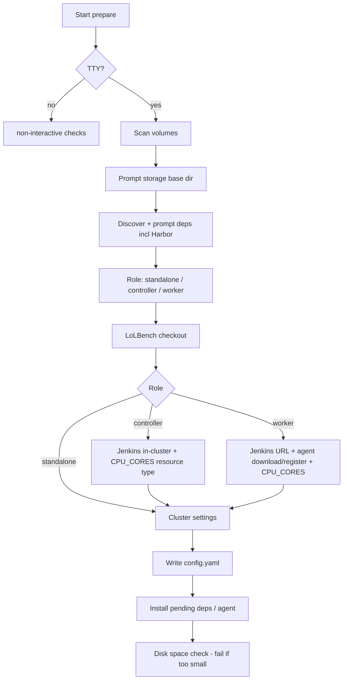

# Interactive Prepare Wizard

`mac-k3d prepare` runs an interactive questionnaire (when stdin is a TTY) to generate `config.yaml`. The wizard covers **storage**, **dependencies** (including Harbor), **LoLBench checkout**, **Jenkins role / agent registration**, and a final **disk check**.

For non-interactive/scripted use, see [commands.md](commands.md#prepare).

---

## Invocation

```bash
# Interactive wizard (default on a terminal)
mac-k3d prepare

# Write defaults without prompts (scripting)
mac-k3d prepare --init-config

# Validate only; no prompts, no config changes
mac-k3d prepare --non-interactive
```

---

## Wizard flow



---

## Part 1: Storage and cache locations

Heavy artifacts should live on a volume with enough free space. Small config/state files stay in the home directory.

### What goes where

| Artifact | Typical size | Config key | Default under `storage.base_dir` |
|----------|--------------|------------|-----------------------------------|
| Docker images & layers | 10–100+ GB | `storage.docker` | `docker/` |
| k3d cluster data / image cache | 1–10 GB | `storage.k3d` | `k3d/` |
| Jenkins Helm charts & plugins | 500 MB–2 GB | `storage.jenkins` | `jenkins/` |
| LoLBench checkout | multi-GB | `lolbench.path` | `lolbench/` or user path |
| Harbor / agent downloads | varies | `storage.downloads` | `downloads/` |
| mac-k3d config | KB | `~/.config/mac-k3d/` | *(not relocatable)* |
| Runtime state | KB–MB | `~/.local/state/mac-k3d/` | *(not relocatable)* |

### Volume selection

1. Enumerate mounted volumes (`/` plus OS extras: macOS `/Volumes/*`, Linux `/mnt`, `/media`, `/data*`).
2. Compute available space per volume.
3. **Default**: volume with the most free space.
4. Present top candidates; allow custom path.
5. Create directories after confirmation.

---

## Part 2: Dependencies

Discover first; never uninstall without consent.

### Dependencies managed

| Name | Required | Discovery / install |
|------|----------|---------------------|
| Docker Desktop / Engine | Yes | macOS: `Docker.app` / brew cask; Linux: `which docker` / `apt install docker.io` |
| k3d | Controller / standalone | `which k3d` / brew or curl install script |
| kubectl | Controller / standalone | `which kubectl` / brew or apt/curl |
| helm | Controller | `which helm` / brew or get-helm-3 |
| harbor | Worker / LoLBench | `which harbor` / `uv tool install harbor` or `pipx install harbor` |
| java | Worker (Jenkins agent) | macOS: `java_home`; Linux: `JAVA_HOME` / `which java` / Temurin or openjdk |
| uv or pipx | If installing Harbor | `which uv` / `which pipx` |

### Harbor install prompt

```text
harbor: not found

  [1] Install via uv (uv tool install harbor)   # preferred if uv present
  [2] Install via pipx (pipx install harbor)
  [3] Specify path to existing binary
  [4] Skip (LoLBench jobs will not work on this Mac)

Choice [1]:
```

If Harbor is found on PATH (or at `~/.local/bin/harbor`), offer use-existing (recommended) vs reinstall.

After `uv tool install harbor`, prepare ensures `~/.local/bin` is on **this process's** `PATH`. If it is missing from the user's shell config, prepare **prompts** before appending:

```bash
# Added by mac-k3d prepare (uv/harbor tools)
export PATH="$HOME/.local/bin:$PATH"
```

(to `~/.zshrc`, `~/.bash_profile`/`~/.bashrc`, or `fish_add_path` for fish). Decline keeps the session PATH update only.

---

## Part 3: Role

```text
What is this machine's role?   # macOS wizard may still say "Mac"

  [1] Local development only (no Jenkins)
  [2] CI controller (Jenkins in k3d)
  [3] CI worker (Jenkins agent only)

Choice [1]:
```

Stored as `role: standalone | controller | worker` and `jenkins.enabled` (true only for controller). Config may also record `platform: macos | linux`.

---

## Part 4: LoLBench checkout

Always prompted for controller and worker (optional for standalone).

1. Search common locations for an existing checkout:
   - `$HOME/github/LoLBench-Preview`
   - `$HOME/src/LoLBench-Preview`
   - `{storage.base_dir}/lolbench`
   - paths containing `LoLBench` under `$HOME` / `/Volumes` (shallow)
2. If found:

```text
LoLBench checkout found:

  [1] Use /Volumes/1TB.large/github/LoLBench-Preview  (recommended)
  [2] Enter a different path
  [3] Clone / download fresh into storage base

Choice [1]:
```

3. If not found, or user chooses fresh install, print and optionally run:

```text
Clone (recommended):

  git clone https://github.com/<org>/LoLBench-Preview.git \
    /Volumes/1TB.large/mac-k3d/lolbench

Or download latest release and unpack:

  curl -sL https://github.com/<org>/LoLBench-Preview/releases/latest/download/source.tar.gz \
    | tar -xz -C /Volumes/1TB.large/mac-k3d/lolbench --strip-components=1

  [1] Run git clone now
  [2] Run release download now
  [3] I will do it myself (record intended path only)
```

Record `lolbench.path` and `lolbench.source` (`existing` | `clone` | `release`).

> Exact clone URL / release asset names are configurable; prepare prints the commands even when the user installs manually.

---

## Part 5: Jenkins controller vs worker resources

### Shared concept: `CPU_CORES`

Jenkins **Lockable Resources** label `CPU_CORES` represents schedulable CPU capacity. LoLBench jobs lock a quantity of cores (e.g. 4) rather than a vague “large” slot. See [lolbench-jenkins.md](lolbench-jenkins.md).

Detect host cores via `sysctl -n hw.logicalcpu` (fallback `hw.ncpu`).

### Controller (`role: controller`)

After Jenkins is up (`mac-k3d start` / `config`), prepare records intent and those commands:

1. Ensure **Lockable Resources** (+ Pipeline / Git) plugins via Helm `additionalPlugins`.
2. Create / ensure a resource **type/label** `CPU_CORES` on the controller (workers create capacity; plugin is on the controller).
3. Create Pipeline job **`lolbench_one_task`** if missing (inline Jenkinsfile; see [lolbench-jenkins.md](lolbench-jenkins.md)).
4. **CI secrets + job defaults** (see [secrets.md](secrets.md)):
   - Prepare prompts for `jenkins_job.default_harness` / `default_task` / `default_model` (YAML).
   - Prepare optionally collects API keys / PATs into `~/.config/mac-k3d/credentials.pending.yaml` (mode 0600) — **not** into `config.yaml`.
   - `config` creates Jenkins Secret text credentials and binds present IDs into the job (`icode` → DeepSeek + GitCode, etc.).

Controller Mac itself usually does **not** run LoLBench agents; it hosts the queue.

### Worker (`role: worker`) — agent install and registration

```text
Jenkins controller URL [https://jenkins.example.com:9080]:
Jenkins API user [admin]:
Jenkins API token (input hidden):
Agent name [mac-$(hostname -s)]:
Labels [macos docker lolbench]:
```

Then prepare:

1. Requires **Java** (prompt install if missing).
2. Downloads `agent.jar` from `{url}/jnlpJars/agent.jar` into `{storage.downloads}/jenkins-agent/` (or `lolbench` storage).
3. **Registers the node on the controller** via Jenkins REST API (`POST /computer/createItem` with agent XML; needs API token with Computer/Configure):

   - Create node if missing: name, remote FS, labels (`macos docker lolbench`), executors, launch method **Inbound**.
   - Read connection secret from `slave-agent.jnlp`.
4. Writes a local launch script and installs a persistent agent daemon:
   - **macOS:** LaunchAgent `com.mac-k3d.jenkins-agent` with `KeepAlive`
   - **Linux:** systemd user unit `mac-k3d-jenkins-agent.service` (use `loginctl enable-linger $USER`)
5. **Creates Lockable Resources** on the controller: `{agent}-core-1` … `{agent}-core-N` with labels `CPU_CORES {agent}` (N = logical CPU count), via Jenkins Script Console API when `api_user` / `api_token` are set.

Default agent labels are OS-aware: `macos docker lolbench` or `linux docker lolbench`.

`api_user` / `api_token` are saved in config (plaintext for now; encrypt later). `mac-k3d config` on a worker re-runs agent registration **and** Lockable Resources create using those fields. The token needs permission to run `/scriptText` (admin is fine).

---

## Part 6: Cluster settings

Same as before (name, agents, ports, Jenkins host port for controller).

---

## Part 7: Summary, apply, disk check

After writing config and running installs:

### Disk space check (hard fail)

Measure free space on `storage.base_dir`’s volume (and Docker data volume if different).

| Role | Minimum free (default) | Rationale |
|------|------------------------|-----------|
| standalone | 40 GB | Docker + one k3d cluster |
| controller | 60 GB | + Jenkins images |
| worker (LoLBench) | **100 GB** | Harbor task images are multi-GB; budget headroom |

If free &lt; minimum:

```text
error: only 32 GB free on /Volumes/Data; need at least 100 GB for worker/LoLBench
```

Exit non-zero. Override with `prepare --disk-min-gb N` for labs (discouraged).

---

## Non-interactive behavior

`prepare --non-interactive`:

1. Load existing config.
2. Verify dependencies, Harbor, LoLBench path, agent files if worker.
3. Disk check against role minimum.
4. Exit 0 or 1 — **no** agent registration prompts (registration requires interactive secrets or pre-set env `MAC_K3D_JENKINS_TOKEN`).

---

## Config keys (new)

```yaml
role: worker   # standalone | controller | worker

dependencies:
  harbor:
    source: existing
    binary: /Users/you/.local/bin/harbor
  java:
    source: existing
    binary: /usr/bin/java

lolbench:
  path: /Volumes/1TB.large/github/LoLBench-Preview
  source: existing   # existing | clone | release

jenkins_agent:        # worker only
  controller_url: https://jenkins.example.com:9080
  name: mac-mini-1
  labels: ["macos", "docker", "lolbench"]
  remote_fs: /Users/you/jenkins-agent
  agent_jar: /Volumes/1TB.large/mac-k3d/downloads/jenkins-agent/agent.jar
  cpu_cores: 10       # hw.logicalcpu at prepare time

resources:
  cpu_cores_label: CPU_CORES
  # controller: ensure label exists; worker: register quantity=cpu_cores
```

---

## Implementation notes

| Module | Responsibility |
|--------|----------------|
| `src/prepare/volumes.rs` | Mounts, free space, disk minimum check |
| `src/prepare/discovery.rs` | docker/k3d/kubectl/helm/harbor/java/uv/pipx + LoLBench path search |
| `src/prepare/wizard.rs` | Prompts including role, LoLBench, worker Jenkins URL |
| `src/prepare/install.rs` | OS package install via `platform` (brew / apt+curl), Harbor via uv/pipx |
| `src/prepare/lolbench.rs` | clone / release unpack helpers |
| `src/prepare/jenkins_agent.rs` | download agent.jar, REST create node, write launch script |
| `src/prepare/jenkins_job.rs` | create Pipeline job `lolbench_one_task` on controller |
| `src/prepare/resources.rs` | CPU_CORES detection + Jenkins lockable-resource API (controller) |
| `src/prepare/agent_service.rs` | Thin wrapper → LaunchAgent (macOS) or systemd --user (Linux) |
| `src/platform/{macos,linux}.rs` | OS adapters for mounts, packages, Docker, agent daemon |

---

## Related docs

- [configuration.md](configuration.md) — schema
- [lolbench-jenkins.md](lolbench-jenkins.md) — `lolbench_one_task` job + `CPU_CORES` locks
- [setup.md](setup.md) — operations
- [commands.md](commands.md) — CLI flags
