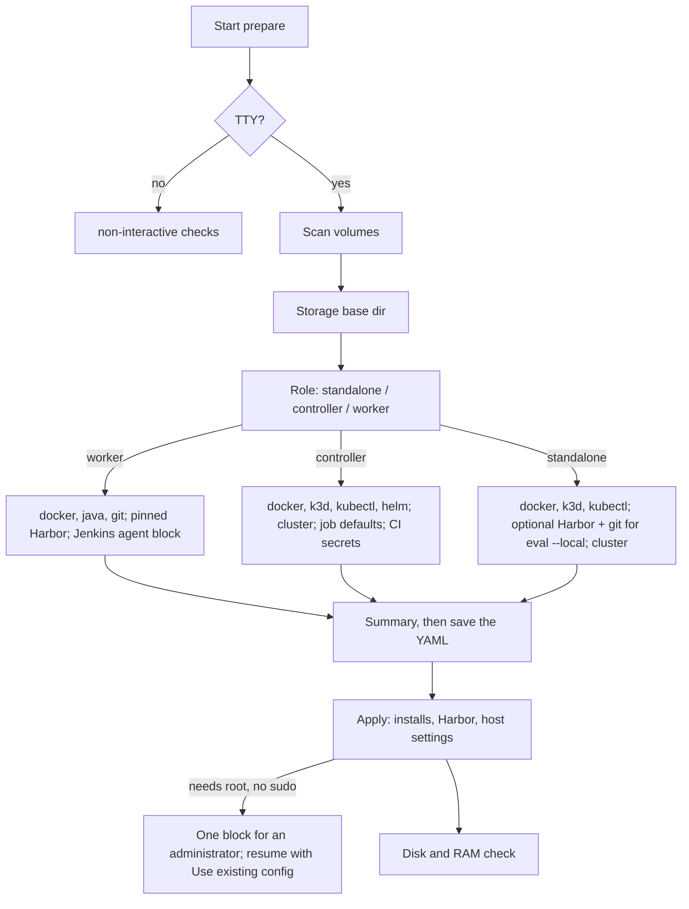

# Interactive Prepare Wizard

`mac-k3d prepare` (and `mac-k3d setup`, which runs it first) asks the questions for this machine when stdin is a TTY, **saves the YAML**, and only then applies it: storage directories, the installs you chose, the pinned Harbor, host settings, and a final disk and RAM check. The wizard itself only asks questions; nothing is installed until your answers are on disk, so a failed install never loses them.

For non-interactive/scripted use, see [commands.md](commands.md#prepare).

---

## Invocation

```bash
# Interactive wizard (default on a terminal)
mac-k3d prepare

# Write defaults without prompts (scripting)
mac-k3d prepare --init-config

# Validate only; no prompts, no config changes
mac-k3d prepare --non-interactive
```

When the file already exists, an interactive run offers:

| Choice | What happens |
|--------|--------------|
| **Use existing config (finish pending installs, then validate)** | Keeps your answers and carries on from any install that was left for root |
| **Re-run wizard (overwrite config)** | Asks every question again |
| **Cancel** | Changes nothing |

---

## Flow


```mermaid
flowchart TD
    A[Start prepare] --> B{TTY?}
    B -->|no| C[non-interactive checks]
    B -->|yes| D[Scan volumes]
    D --> E[Storage base dir]
    E --> F[Role: standalone / controller / worker]
    F -->|worker| W[docker, java, git; pinned Harbor; Jenkins agent block]
    F -->|controller| K[docker, k3d, kubectl, helm; cluster; job defaults; CI secrets]
    F -->|standalone| S[docker, k3d, kubectl; optional Harbor + git for eval --local; cluster]
    W --> M[Summary, then save the YAML]
    K --> M
    S --> M
    M --> N[Apply: installs, Harbor, host settings]
    N -->|needs root, no sudo| R[One block for an administrator; resume with Use existing config]
    N --> O[Disk and RAM check]
```

| Module | Does |
|--------|------|
| `src/prepare/wizard/mod.rs` | Storage, role, summary, the existing-config choice |
| `src/prepare/wizard/{worker,controller,standalone}.rs` | The questions for one role, and nothing else |
| `src/prepare/wizard/prompts.rs` | Shared prompts: one dependency, storage, ports, the pinned Harbor, the summary |
| `src/commands/prepare.rs` | Wizard, save, then apply and validate |
| `src/prepare/apply.rs` | Storage directories, installs in order (Harbor last), worker host settings, disk/RAM check |
| `src/prepare/root_steps.rs` | Collects what needs root into one printed block |
| `src/prepare/toolchain.rs` | The Harbor pin compiled in from `pipeline/config/toolchain.env`; installs it with `uv` |

---

## Part 1: Storage and cache locations

Heavy artifacts should live on a volume with enough free space. Small config/state files stay in the home directory.

| Artifact | Typical size | Config key | Default under `storage.base_dir` |
|----------|--------------|------------|-----------------------------------|
| Docker images & layers | 10–100+ GB | `storage.docker` | `docker/` |
| k3d cluster data / image cache | 1–10 GB | `storage.k3d` | `k3d/` |
| Jenkins Helm charts & plugins | 500 MB–2 GB | `storage.jenkins` | `jenkins/` |
| Agent downloads | varies | `storage.downloads` | `downloads/` |
| mac-k3d config | KB | `~/.config/mac-k3d/` | *(not relocatable)* |
| Runtime state | KB–MB | `~/.local/state/mac-k3d/` | *(not relocatable)* |

Volume selection: enumerate mounted volumes (`/` plus macOS `/Volumes/*`, Linux `/mnt`, `/media`, `/data*`), default to the one with the most free space, allow a custom path. Directories are created during apply.

---

## Part 2: Role

```text
What is this machine's role?   # macOS wizard may still say "Mac"

  [1] Local development only (no Jenkins)
  [2] CI controller (Jenkins in k3d)
  [3] CI worker (Jenkins agent only)
```

Stored as `role: standalone | controller | worker` and `jenkins.enabled` (true only for controller). Config also records `platform: macos | linux`.

---

## Part 3: Tools per role

Each role is asked only about the tools it uses. A tool that is not asked is recorded as `skip` (or `existing` if found).

| Role | Asked | Not asked |
|------|-------|-----------|
| worker | docker, java, git | Harbor is installed at the pin; no k3d, kubectl, helm or LoLBench (a worker hosts no cluster, and the pipeline clones each benchmark itself) |
| controller | docker, k3d, kubectl, helm | Harbor, java, git (a controller never runs an evaluation) |
| standalone | docker, k3d, kubectl; then "Run evals on this machine with `mac-k3d eval --local`?" → Harbor at the pin and git | helm, java |

For each asked tool: use what was found (recommended), install it, point at a binary, or skip where that is allowed. Docker and the Linux packages install with `apt` (Linux) or Homebrew (macOS).

### Harbor

Harbor is not a question. The pipeline's `env` phase asserts one version, `HARBOR_VERSION` in `pipeline/config/toolchain.env` (0.22.0), so setup prints what it found and installs that version with `uv tool install --force harbor==<pin>` into `~/.local/bin`, as you, no root. `uv` is installed first if missing. Any other version is replaced. Worker `config` warns when the installed Harbor or git does not match.

After installing into `~/.local/bin`, prepare puts it on **this process's** `PATH`. If it is missing from the shell config, prepare asks before appending:

```bash
# Added by mac-k3d prepare (uv/harbor tools)
export PATH="$HOME/.local/bin:$PATH"
```

(to `~/.zshrc`, `~/.bash_profile`/`~/.bashrc`, or `fish_add_path` for fish). Declining keeps the session PATH update only.

---

## Part 4: Worker — the Jenkins agent block

```text
Jenkins controller URL [http://43.107.42.252:17070]:
Jenkins API user (Enter to skip and fill in worker.yaml later):
Jenkins API token (stored plaintext in config for now):
Agent name [{os}-<hostname>]:
Agent labels (space-separated) [linux docker lolbench]:
Agent remote root directory [~/jenkins-agent]:
```

The agent-name default is the machine OS, then the short hostname: `linux-<hostname>` or `macos-<hostname>`. `MAC_K3D_JENKINS_URL` or `JENKINS_URL` changes the URL default. Pressing **Enter** at the API user skips both keys: `worker.yaml` still gets them, empty, so the user can see where they go and fill them in with an editor later:

```yaml
jenkins_agent:
  api_user: ''
  api_token: ''
```

The agent is registered by `mac-k3d config -c worker.yaml` (which `setup` runs after apply), not by the wizard:

1. Downloads `agent.jar` from `{url}/jnlpJars/agent.jar` beside the current one and swaps it in only when the bytes differ.
2. **Registers the node** via the Jenkins REST API with the API token: name, remote FS, labels, **1 executor**, launch method **Inbound**; reads the connection secret.
3. Writes `launch-agent.sh` and installs the agent service (macOS LaunchAgent `com.mac-k3d.jenkins-agent`; Linux systemd user unit `mac-k3d-jenkins-agent.service`), restarting it only when the jar, script or unit changed.
4. **Creates Lockable Resources** `{agent}-core-1` … `{agent}-core-N` labelled `CPU_CORES {agent}` (N = logical CPU count). Eval builds lock `label: env.NODE_NAME`, so a build only ever holds its own worker's cores ([architecture.md](architecture.md#one-build-per-worker-every-core)).

With the keys still empty, `config` prints which keys to fill in and the command to re-run. The token needs permission to run `/scriptText` (admin is fine). It is stored in plaintext for now; `mac-k3d export` blanks it.

---

## Part 5: Controller — cluster, job defaults, secrets

1. Cluster name, k3d agent nodes (default `0`), Jenkins UI host port (default `17070`). Busy host ports are remapped before the summary.
2. Job defaults: `ICODE_MODE` (`release` or `git`), `TASK`, `ICODE_RELEASE`, `ICODE_GIT_URL`, `ICODE_GIT_REF`, `ICODE_ARGS`, saved under `jenkins_job`.
3. CI secrets (DeepSeek key, GitCode/GitHub PAT) go to `~/.config/mac-k3d/credentials.pending.yaml` (mode 0600), **not** into `config.yaml`. `config` turns them into Jenkins Secret text credentials ([secrets.md](secrets.md)).

`mac-k3d start` installs Jenkins with the extra plugins (`lockable-resources`, `plain-credentials`, `file-parameters`, `copyartifact`, `pipeline-utility-steps`, `hidden-parameter`); `config` writes the nine eval jobs ([lolbench-jenkins.md](lolbench-jenkins.md)). Do not add plugins in the UI.

---

## Part 6: Apply, root steps, disk check

Apply installs in the order docker, git, java, k3d, kubectl, helm, harbor. A tool that appeared since the wizard ran (root installed it) is recorded instead of installed. On a Linux worker it also checks that Docker runs, that you are in the `docker` group, and that `loginctl enable-linger` is on, so the agent survives logout.

`sudo` is asked at most once, and only when something needs it. When you cannot use `sudo`, apply does not stop half-way: it saves what it did install and prints one block for an administrator, listing only what is missing, for example:

```text
Ask an administrator to run these as root on this machine:

  apt-get install -y openjdk-21-jre-headless   # install java
  usermod -aG docker <you>                     # let <you> use Docker without sudo (then log out and back in)
  loginctl enable-linger <you>                 # keep the Jenkins agent running after you log out

Your answers are saved in ~/.config/mac-k3d/worker.yaml. Afterwards log out and back in (so a new
docker group applies), then run:
  mac-k3d setup -c ~/.config/mac-k3d/worker.yaml
and choose "Use existing config"; setup carries on from the installs.
```

Harbor never appears there: it installs per user with `uv`.

On a worker, Java is pinned like Harbor and is not a question. The wizard uses a Java at or above `JAVA_MAJOR` (21) if it finds one (`JAVA_HOME`, PATH, `/usr/lib/jvm/*`, macOS `java_home -v 21+`); otherwise it marks Java for install (`openjdk-21-jre-headless` on Linux, `temurin@21` on macOS). Apply re-checks a config written earlier: if the recorded Java is older than the pin it switches to a newer one on the machine, or installs one. A worker apply also downloads a missing `docker compose` / `docker buildx` plugin at the pinned version into `~/.docker/cli-plugins` (a warning only if that fails; the env phase retries), and on macOS runs `brew install bash` / `brew install python` when the agent PATH has bash < 4.4 or python3 < 3.11. See [dependencies.md](dependencies.md).

### Disk space check (hard fail)

Free space on `storage.base_dir`'s volume (on a worker also at `jenkins_agent.remote_fs`, where builds clone and run), and at least `MIN_RAM_GB` (8) GB RAM:

| Role | Minimum free (default) |
|------|------------------------|
| standalone | `WORKER_MIN_DISK_GB` (40 GB) |
| controller | 60 GB |
| worker | `WORKER_MIN_DISK_GB` (40 GB; plan on about 100 GB: Harbor task images are multi-GB) |

`MIN_RAM_GB` and `WORKER_MIN_DISK_GB` are in `pipeline/config/toolchain.env`, which each build's `env` phase reads too, so both checks use the same numbers. Override with `prepare --disk-min-gb N` for labs (discouraged), or per build with `MAC_K3D_MIN_RAM_GB` / `MAC_K3D_MIN_DISK_GB`.

Validation of a worker also fails when the agent's Java is older than `JAVA_MAJOR`: the controller would refuse that agent. An old bash or python3 on the agent PATH is a **warning** here and in `mac-k3d config`, so setup still finishes and the agent comes up; each build's `env` phase then refuses to run until it is fixed.

---

## Non-interactive behavior

`prepare --non-interactive` loads the existing config, checks that every tool the role needs is present (a tool still marked `install` fails with "run `mac-k3d setup` and choose \"Use existing config\""), runs the disk check, and exits 0 or 1. It registers nothing.

---

## Config keys

```yaml
role: worker   # standalone | controller | worker

dependencies:
  harbor:
    source: existing
    binary: /home/you/.local/bin/harbor
  java:
    source: existing
    binary: /usr/bin/java
  git:
    source: existing
    binary: /usr/bin/git

jenkins_agent:        # worker only
  controller_url: http://43.107.42.252:17070
  api_user: ''        # always present; empty until you fill it in
  api_token: ''
  name: mac-worker-1
  labels: ["linux", "docker", "lolbench"]
  remote_fs: /home/you/jenkins-agent
  agent_jar: /data/mac-k3d/downloads/jenkins-agent/agent.jar
  cpu_cores: 16       # logical CPUs at prepare time

resources:
  cpu_cores_label: CPU_CORES
```

---

## Related docs

- [configuration.md](configuration.md) — schema
- [new-machine.md](new-machine.md) — the step-by-step for a new controller or worker
- [lolbench-jenkins.md](lolbench-jenkins.md) — the eval jobs and `CPU_CORES` locks
- [setup.md](setup.md) — operations
- [commands.md](commands.md) — CLI flags
