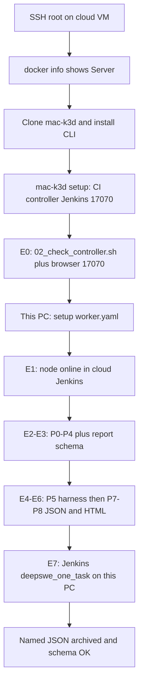
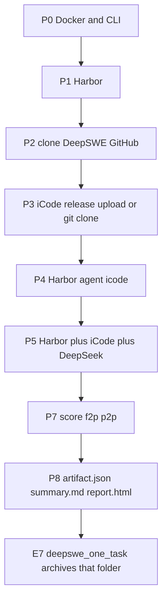

# Cloud controller + local worker eval runbook

Lab runbook (this team), not the user start-here. **Users:** [user-guide.md](../user-guide.md).

Operator path for **this lab**: Alibaba Cloud VM hosts Jenkins; this PC runs the jobs and writes the JSON.

Pass/fail table and stage detail stay in [testing-eval-pipeline.md](testing-eval-pipeline.md). Product story: [workflow.md](../workflow.md). User bootstrap: [new-machine.md](../new-machine.md).

**Users:** copy-paste commands in [user-guide.md](../user-guide.md). This file is the **lab** runbook (this cloud IP + this PC).

**Sign-off:** DeepSWE **E0–E7** with `--n-tasks 1` (this runbook). LoLBench and SWE-bench Pro use the same Harbor P0–P5 in [testing-eval-pipeline.md](testing-eval-pipeline.md). After each phase, paste the checkpoint output before starting the next.

---

## Topology

Jobs must **not** run inside the controller’s k3d nodes. Cloud Jenkins only queues. This PC (Docker + Harbor + iCode) executes.

```text
Cloud VM (SSH as root): k3d + Jenkins :17070
    └── queue deepswe_one_task (label lolbench)
This PC (Toby): Jenkins agent + Docker + iCode
    ├── api.deepseek.com  (catalog: deepseek-v4-pro default, or deepseek-flash)
    └── archive JSON back to cloud Jenkins
```

Do **not** continue the leftover `y84462643` session (no docker group, k3d missing). Cloud paths are under **root’s home**: `/root/src/mac-k3d`, `/root/.config/mac-k3d/config.yaml`, `/root/.local/bin/mac-k3d`.

Never `mac-k3d start -c worker.yaml`. Worker YAML must use `http://<CLOUD_IP>:17070`, not localhost.

---

## High-level flow





**iCode for E0–E7** is either a downloaded `*-full-*` drop (`ICODE_MODE=release`) or a GitHub/GitCode clone (`ICODE_MODE=git`). The worker does not keep a developer checkout. The controller wizard `EVAL_MODE=binary` default is unused by this checklist.

---

## Facts for this lab

| Item | Value |
|------|--------|
| `<CLOUD_IP>` | `43.107.42.252` |
| SSH (controller) | `ssh root@43.107.42.252` |
| Jenkins UI | `http://43.107.42.252:17070` |
| Jenkins port | **17070** (open this in the Alibaba security group to this PC) |
| Cloud checkout | `/root/src/mac-k3d` branch `feat/icode-tag-commit-release` (or `main` after merge) |
| This PC checkout | `/home/Toby/Documents/Toby/mac-k3d` |
| iCode on this PC | `/home/Toby/Documents/Toby/iCode-main` |
| Model | `deepseek-v4-pro` (catalog default) or `deepseek-flash` (`DEEPSEEK_MODEL` or `--model`) |
| N | **1** until E7 is green |
| Credential on controller | `deepseek-api-key` |

Do not commit API keys, Jenkins passwords, or API tokens.

---

## Phase 0 — Cloud as root (clone + CLI)

**Where:** new SSH session as **root**.  
**Pass:** `docker info` shows a Server section; `mac-k3d` 0.4.x on PATH; `--help` lists `setup` and `eval`.

```bash
ssh root@43.107.42.252
```

```bash
# Docker must already talk to the daemon (root can use the socket)
docker info | head -20
# expect a "Server:" section, not "permission denied"
```

```bash
mkdir -p ~/.local/bin ~/src
cd ~/src
git clone --branch feat/icode-tag-commit-release --single-branch https://github.com/Toby-Yu/mac-k3d.git
cd mac-k3d
# After this branch is merged, use: git clone https://github.com/Toby-Yu/mac-k3d.git
git status -sb
git log -1 --oneline
```

Build the binary that matches this tree (or skip rustup if you `scp` a known-good `target/release/mac-k3d`):

```bash
curl --proto '=https' --tlsv1.2 -sSf https://sh.rustup.rs | sh -s -- -y
source "$HOME/.cargo/env"

unset CARGO_TARGET_DIR
export CARGO_TARGET_DIR="$PWD/target"
cargo build --release

cp -f target/release/mac-k3d ~/.local/bin/mac-k3d
export PATH="$HOME/.local/bin:$PATH"
hash -r

which mac-k3d
mac-k3d --version
mac-k3d --help
```

Keep PATH in this shell. Optional persist:

```bash
grep -q '.local/bin' ~/.bashrc || echo 'export PATH="$HOME/.local/bin:$PATH"' >> ~/.bashrc
grep -q '.cargo/env' ~/.bashrc || echo 'source "$HOME/.cargo/env"' >> ~/.bashrc
```

**Checkpoint — paste:** `docker info` Server lines, `git log -1`, `which mac-k3d`, `--version`, and that `--help` lists `setup` and `eval`.

---

## Phase 1 — E0 cloud controller

**Where:** same root session.  
**Pass:** `=== mac-k3d setup complete ===` Role `controller`; `02_check_controller.sh` OK; browser `http://43.107.42.252:17070` HTTP 200.

Alibaba security group: allow **TCP 17070** from this PC’s public IP (and optionally 18080 if the wizard remaps cluster HTTP).

```bash
export PATH="$HOME/.local/bin:$PATH"
cd /root/src/mac-k3d
mac-k3d setup -c ~/.config/mac-k3d/config.yaml
```

If this is root’s first run there is no live `config.yaml`. If you see **Config already exists**, choose **Re-run wizard (overwrite)** only if that file is leftover/wrong.

| Prompt | Choose |
|--------|--------|
| Base directory | Recommended path with enough disk |
| Role | **CI controller (Jenkins in k3d)** |
| Docker | **Use this installation** |
| k3d / kubectl / helm | **Install** if missing (OK as root) or **Use this installation** |
| Harbor / LoLBench | **Skip** |
| Cluster name | Default (`ci-controller`) |
| k3d agent nodes | `0` |
| Jenkins UI host port | **17070** |
| Default EVAL_MODE | **binary** (unused by E0–E7) |
| TASK / ICODE_* | Enter / leave empty |
| Enter CI secrets now? | **yes** — paste **DeepSeek** (`deepseek-api-key`). Other keys optional. |
| Write + apply | **yes** |

`Host port 8080 in use → using 18080` or `Host port 8443 in use → using 18443` is **OK**. Keep Jenkins on **17070**.

After setup:

```bash
export PATH="$HOME/.local/bin:$PATH"
cd /root/src/mac-k3d

mac-k3d config -c ~/.config/mac-k3d/config.yaml --skip-secrets
mac-k3d config -c ~/.config/mac-k3d/config.yaml --show-jenkins
# note admin password — do not commit it

JENKINS_URL=http://127.0.0.1:17070 ./scripts/env_set_up/02_check_controller.sh
```

**Expected:** `OK Jenkins UI … HTTP 200`, `OK job lolbench_one_task present`, `OK job deepswe_one_task present`, `OK job swebenchpro_one_task present`, `OK 02_check_controller complete`.

From this PC: open `http://43.107.42.252:17070` (user **admin** + printed password).

**Checkpoint — paste:** setup complete summary, `--show-jenkins` URL (redact password), and the full `02_check_controller.sh` output.

---

## Phase 2 — E1 this PC as worker

**Where:** this PC (`Toby@Michael-Ubuntu`), **not** the cloud VM.  
**Pass:** `e1_reach_jenkins.sh` HTTP 200; worker `start` rejected; agent unit active; node **online** in cloud Jenkins → Nodes.

If a **local** lab controller still binds `:17070`, teardown it or leave it unused. Worker URL is the **cloud** IP.

### 2a. Reach Jenkins from this PC

```bash
export PATH="$HOME/.local/bin:$PATH"
cd ~/Documents/Toby/mac-k3d
JENKINS_URL=http://43.107.42.252:17070 ./pipeline/stages/e1_reach_jenkins.sh
```

**Expected:** `HTTP 200` and `OK Jenkins reachable`. If this fails, fix the security group before the wizard.

### 2b. Jenkins API token (not the login password)

On `http://43.107.42.252:17070`: log in as **admin** → **admin** (top right) → **Configure** → **API Token** → **Add new Token** → generate. Copy the **secret** once. `api_user` is `admin`.

### 2c. Worker wizard

```bash
export PATH="$HOME/.local/bin:$PATH"
mac-k3d setup -c ~/.config/mac-k3d/worker.yaml
```

| Prompt | Choose |
|--------|--------|
| Role | **CI worker (Jenkins agent only)** |
| Docker / Java | Use existing or **Install** |
| k3d / kubectl | **Skip** |
| Harbor / LoLBench | **No** |
| Jenkins controller URL | type `http://43.107.42.252:17070` (or export `JENKINS_URL` first). Wizard default is localhost. |
| API user / token | `admin` + the **token secret** |
| Agent name | Distinct default (hostname) is fine |
| Write + apply | **yes** |

If the token was empty, edit `~/.config/mac-k3d/worker.yaml` (`api_user` / `api_token` / `controller_url`) then:

```bash
mac-k3d config -c ~/.config/mac-k3d/worker.yaml
```

### 2d. Prove worker

```bash
export PATH="$HOME/.local/bin:$PATH"
cd ~/Documents/Toby/mac-k3d

mac-k3d start -c ~/.config/mac-k3d/worker.yaml ; echo "exit=$?"
# expect Error about start-is-for-controller and exit=1

systemctl --user status mac-k3d-jenkins-agent.service
# Active: active (running) — press q to leave

REQUIRE_WORKER=1 JENKINS_URL=http://43.107.42.252:17070 \
  ./scripts/env_set_up/03_check_worker.sh
```

In cloud Jenkins: **Manage Jenkins → Nodes** — this PC’s agent is **online**.

**Checkpoint — paste:** `e1` HTTP 200, worker `start` error + `exit=1`, unit active, `03_check_worker.sh` OK.

---

## Phase 3 — E2 / E3 (no LLM)

**Where:** this PC, mac-k3d checkout.

```bash
export PATH="$HOME/.local/bin:$PATH"
export DEEPSEEK_MODEL=deepseek-v4-pro
cd ~/Documents/Toby/mac-k3d

mac-k3d eval --stage p0
mac-k3d eval --stage p1
mac-k3d eval --stage p2
mac-k3d eval --stage p3
mac-k3d eval --stage p4

./pipeline/stages/check_report.sh pipeline/lib/testdata/report-min.json
# optional: python3 pipeline/lib/test_report.py
```

| Stage | Expected |
|-------|----------|
| P0 | Docker Server; CLI lists `eval` |
| P1 | `harbor --help` works |
| P2 | `$WORKDIR/deep-swe/tasks` (clone `https://github.com/datacurve-ai/deep-swe`) |
| P3 | `icode --help` from the discovered iCode tree |
| P4 | Harbor agent `icode` imports (`icode_harbor_agent:ICodeAgent`) |
| E3 | `OK report schema` |

**Checkpoint — paste:** last OK line from each stage and `OK report schema`.

---

## Phase 4 — E4–E6 (paid, N=1)

**Where:** this PC. Needs a gitignored `.env` (copy `.env.example`) for `--local` stages, **or** the controller credential when you later run E7. Do not `export` the API key.

```bash
export PATH="$HOME/.local/bin:$PATH"
cd ~/Documents/Toby/mac-k3d
# .env already has DEEPSEEK_API_KEY + DEEPSEEK_MODEL (chmod 600)

mac-k3d eval --stage p5 --n-tasks 1
mac-k3d eval --stage p7
mac-k3d eval --stage p8 --n-tasks 1
./pipeline/stages/check_report.sh
```

**Expected:**

- P5: `PROGRESS` lines; Harbor/Docker/LLM work (minutes, not 4s); `reward.json` under `harness/`. CLI usage errors and a missing `reward.json` **fail** the stage. P0 installs `docker compose` if missing.
- P8: `eval-runs/output/<benchmark>/<run>/artifact.json`, `summary.md`, and `report.html`. The harness arm is `icode`.
- `check_report.sh` prints `OK report schema`

**Checkpoint — paste:** P5 OK or error tail, JSON path, `OK report schema`.

---

## Phase 5 — E7 Jenkins `deepswe_one_task`

**Where:** this PC (or cloud) with the **controller** URL. **No** `--local`. Build must run on **this** node.

Product path: Jenkins UI, job `deepswe_one_task` → **Build with Parameters** (`ICODE_MODE=release`, upload `ICODE_RELEASE_FILE`, `DEEPSEEK_MODEL=deepseek-v4-pro` or `deepseek-flash`, `AGENT_LABEL=lolbench`). `mac-k3d eval --icode-mode release --yes` cannot attach a file.

Git (optional): same UI with `ICODE_MODE=git`, or `mac-k3d eval --n-tasks 1 --icode-mode git --icode-git-url … --icode-git-ref … --icode-git-ref-kind branch --model deepseek-v4-pro --yes` (no `--local`).

**Expected:** build on this worker; archived JSON; same schema as E6. Confirm with `check_report.sh` on the downloaded artifact if needed.

If the job still uses `deepseek-chat`, on the **cloud root** session after `git pull`:

```bash
export PATH="$HOME/.local/bin:$PATH"
mac-k3d config -c ~/.config/mac-k3d/config.yaml --skip-secrets
```

**Checkpoint — paste:** Jenkins build URL / console tail, artifact name, schema OK.

E8 (N>1) is optional after E7.

---

## LoLBench (optional, not this DeepSWE checklist)

LoLBench and SWE-bench Pro use the same Harbor stages as DeepSWE, with their own jobs. Copy-paste L2–L7 or S2–S7: [testing-eval-pipeline.md](testing-eval-pipeline.md). Jenkins SUCCESS with Harbor F2P 0.368 and Resolved 0.0 is a **score**, not a pipeline fail. To test git `pipeline/` changes, set job `MAC_K3D_ROOT` to this checkout (default is `~/.local/share/mac-k3d`). After changing the Harbor agent, also `cargo build --release` and `cp -f target/release/mac-k3d ~/.local/bin/mac-k3d` so the next Jenkins build embeds it.

---

## Progress checklist

| Phase | Command / UI | Pass (y/n) | Notes |
|-------|----------------|------------|-------|
| 0 | root `docker info` + `mac-k3d --help` | | |
| 1 | `02_check_controller.sh` + browser `:17070` | | |
| 2 | `e1` + `03_check_worker.sh` + Nodes online | | |
| 3 | P0–P4 + `check_report.sh` testdata | | |
| 4 | P5–P8 n=1 + named JSON | | |
| 5 | `deepswe_one_task` on this node | | |

---

## Troubleshooting

| Message | What to do |
|---------|------------|
| `permission denied` on `docker.sock` as `y84462643` | Expected. Use **root** on the cloud VM for E0. Do not continue that user. |
| k3d install script writes `/usr/local/bin` | As root this succeeds. As a normal user it fails; this runbook does not use that user. |
| `Host port 8080/8443 in use → using 18xxx` | Pass. Keep Jenkins on **17070**. |
| Jenkins UI not 200 from this PC | Security group **17070**; confirm `02_check` on the VM first. |
| Worker URL is localhost | This lab: set `controller_url: http://43.107.42.252:17070` or export `JENKINS_URL` before setup. Restart the agent unit if it was already running. |
| `start is for controller/standalone` | Correct for `worker.yaml`. Use `config`, not `start`. |
| `DEEPSEEK_API_KEY missing` | E4–E6: copy `.env.example` → `.env` (chmod 600). Do not export the key. E7: store `deepseek-api-key` on the **cloud** controller. |
| `No such option: --agent-dir` | Old Pier flags. This tree runs `harbor run -a icode_harbor_agent:ICodeAgent`. |
| Job still `deepseek-chat` | On cloud root: `mac-k3d config --skip-secrets` after pulling this tree. |
| P3 iCode missing | Jenkins: upload `ICODE_RELEASE_FILE` (`ICODE_MODE=release`) or fill git URL/ref/kind. Local `--stage`: `*-full-*` in `~/.local/share/mac-k3d/` or `mac-k3d set --icode-release`, or `ICODE_MODE=git`. |
| harbor not found | Re-run P1 (`uv tool install harbor`) |
| Docker OOM / disk | DeepSWE images are large; free disk; keep N=1. |
