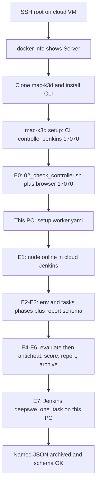
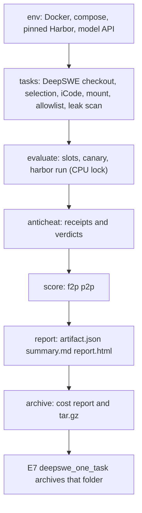

# Cloud controller + local worker eval runbook

Lab runbook (this team), not the user start-here. **Users:** [user-guide.md](../user-guide.md).

Operator path for **this lab**: Alibaba Cloud VM hosts Jenkins; this PC runs the jobs and writes the JSON.

Pass/fail table and stage detail stay in [testing-eval-pipeline.md](testing-eval-pipeline.md). Product story: [workflow.md](../workflow.md). User bootstrap: [new-machine.md](../new-machine.md).

**Users:** copy-paste commands in [user-guide.md](../user-guide.md). This file is the **lab** runbook (this cloud IP + this PC).

**Sign-off:** DeepSWE **E0–E7** with `--n-tasks 1` (this runbook). LoLBench and SWE-bench Pro use the same pipeline phases in [testing-eval-pipeline.md](testing-eval-pipeline.md) (phase map: [pipeline.md](../pipeline.md)). After each phase, paste the checkpoint output before starting the next.

---

## Topology

Jobs must **not** run inside the controller’s k3d nodes. Cloud Jenkins only queues. This PC (Docker + Harbor + iCode) executes.

```text
Cloud VM (SSH as root): k3d + Jenkins :17070
    └── queue deepswe_one_task (label lolbench)
This PC (Toby): Jenkins agent + Docker + iCode
    ├── api.deepseek.com  (catalog: deepseek-flash default, or deepseek-v4-pro)
    └── archive JSON back to cloud Jenkins
```

Do **not** continue the leftover `y84462643` session (no docker group, k3d missing). Cloud paths are under **root’s home**: `/root/src/mac-k3d`, `/root/.config/mac-k3d/config.yaml`, `/root/.local/bin/mac-k3d`.

Never `mac-k3d start -c worker.yaml`. Worker YAML must use `http://<CLOUD_IP>:17070`, not localhost.

---

## High-level flow


```mermaid
flowchart TD
  sshRoot["SSH root on cloud VM"]
  dockerOk["docker info shows Server"]
  cloneBuild["Clone mac-k3d and install CLI"]
  setupCtrl["mac-k3d setup: CI controller Jenkins 17070"]
  e0check["E0: 02_check_controller.sh plus browser 17070"]
  workerSetup["This PC: setup worker.yaml"]
  e1check["E1: node online in cloud Jenkins"]
  cheap["E2-E3: env and tasks phases plus report schema"]
  paid["E4-E6: evaluate then anticheat, score, report, archive"]
  e7job["E7: Jenkins deepswe_one_task on this PC"]
  jsonOut["Named JSON archived and schema OK"]

  sshRoot --> dockerOk --> cloneBuild --> setupCtrl --> e0check
  e0check --> workerSetup --> e1check
  e1check --> cheap --> paid --> e7job --> jsonOut
```


```mermaid
flowchart TD
  env["env: Docker, compose, pinned Harbor, model API"]
  tasks["tasks: DeepSWE checkout, selection, iCode, mount, allowlist, leak scan"]
  evaluate["evaluate: slots, canary, harbor run (CPU lock)"]
  anticheat["anticheat: receipts and verdicts"]
  score["score: f2p p2p"]
  report["report: artifact.json summary.md report.html"]
  archive["archive: cost report and tar.gz"]
  jenkins["E7 deepswe_one_task archives that folder"]

  env --> tasks --> evaluate --> anticheat
  anticheat --> score --> report --> archive --> jenkins
```

**iCode for E0–E7** is either a downloaded `*-full-*` drop (`ICODE_MODE=release`) or a GitHub/GitCode clone (`ICODE_MODE=git`). The worker does not keep a developer checkout. The controller wizard `EVAL_MODE=binary` default is unused by this checklist.

---

## Facts for this lab

| Item | Value |
|------|--------|
| `<CLOUD_IP>` | `43.107.42.252` |
| SSH (controller) | `ssh root@43.107.42.252` |
| Jenkins UI | `http://43.107.42.252:17070` |
| Jenkins port | **17070** (open this in the Alibaba security group to this PC) |
| Cloud checkout | `/root/src/mac-k3d` branch `feat/icode-tag-commit-release` (or `main` after merge) |
| This PC checkout | `/home/Toby/Documents/Toby/mac-k3d` |
| iCode on this PC | `/home/Toby/Documents/Toby/iCode-main` |
| Model | `deepseek-flash` (catalog default) or `deepseek-v4-pro` (`DEEPSEEK_MODEL` or `--model`) |
| N | **1** until E7 is green |
| Credential on controller | `deepseek-api-key` |

Do not commit API keys, Jenkins passwords, or API tokens.

---

## Phase 0 — Cloud as root (clone + CLI)

**Where:** new SSH session as **root**.  
**Pass:** `docker info` shows a Server section; `mac-k3d` 0.4.x on PATH; `--help` lists `setup` and `eval`.

```bash
ssh root@43.107.42.252
```

```bash
# Docker must already talk to the daemon (root can use the socket)
docker info | head -20
# expect a "Server:" section, not "permission denied"
```

```bash
mkdir -p ~/.local/bin ~/src
cd ~/src
git clone --branch feat/icode-tag-commit-release --single-branch https://github.com/Toby-Yu/mac-k3d.git
cd mac-k3d
# After this branch is merged, use: git clone https://github.com/Toby-Yu/mac-k3d.git
git status -sb
git log -1 --oneline
```

Build the binary that matches this tree (or skip rustup if you `scp` a known-good `target/release/mac-k3d`):

```bash
curl --proto '=https' --tlsv1.2 -sSf https://sh.rustup.rs | sh -s -- -y
source "$HOME/.cargo/env"

unset CARGO_TARGET_DIR
export CARGO_TARGET_DIR="$PWD/target"
cargo build --release

cp -f target/release/mac-k3d ~/.local/bin/mac-k3d
export PATH="$HOME/.local/bin:$PATH"
hash -r

which mac-k3d
mac-k3d --version
mac-k3d --help
```

Keep PATH in this shell. Optional persist:

```bash
grep -q '.local/bin' ~/.bashrc || echo 'export PATH="$HOME/.local/bin:$PATH"' >> ~/.bashrc
grep -q '.cargo/env' ~/.bashrc || echo 'source "$HOME/.cargo/env"' >> ~/.bashrc
```

**Checkpoint — paste:** `docker info` Server lines, `git log -1`, `which mac-k3d`, `--version`, and that `--help` lists `setup` and `eval`.

---

## Phase 1 — E0 cloud controller

**Where:** same root session.  
**Pass:** `=== mac-k3d setup complete ===` Role `controller`; `02_check_controller.sh` OK; browser `http://43.107.42.252:17070` HTTP 200.

Alibaba security group: allow **TCP 17070** from this PC’s public IP (and optionally 18080 if the wizard remaps cluster HTTP).

```bash
export PATH="$HOME/.local/bin:$PATH"
cd /root/src/mac-k3d
mac-k3d setup -c ~/.config/mac-k3d/config.yaml
```

If this is root’s first run there is no live `config.yaml`. If you see **Config already exists**, choose **Re-run wizard (overwrite)** only if that file is leftover/wrong.

| Prompt | Choose |
|--------|--------|
| Base directory | Recommended path with enough disk |
| Role | **CI controller (Jenkins in k3d)** |
| Docker | **Use this installation** |
| k3d / kubectl / helm | **Install** if missing (OK as root) or **Use this installation** |
| Cluster name | Default (`ci-controller`) |
| k3d agent nodes | `0` |
| Jenkins UI host port | **17070** |
| Default ICODE_MODE | **release** (E0–E7 set it per build) |
| TASK / ICODE_* | Enter / leave empty |
| Enter CI secrets now? | **yes** — paste **DeepSeek** (`deepseek-api-key`). Other keys optional. |
| Write + apply | **yes** |

`Host port 8080 in use → using 18080` or `Host port 8443 in use → using 18443` is **OK**. Keep Jenkins on **17070**.

After setup:

```bash
export PATH="$HOME/.local/bin:$PATH"
cd /root/src/mac-k3d

mac-k3d config -c ~/.config/mac-k3d/config.yaml --skip-secrets
mac-k3d config -c ~/.config/mac-k3d/config.yaml --show-jenkins
# note admin password — do not commit it

JENKINS_URL=http://127.0.0.1:17070 ./scripts/env_set_up/02_check_controller.sh
```

**Expected:** `OK Jenkins UI … HTTP 200`, `OK job lolbench_one_task present`, `OK job deepswe_one_task present`, `OK job swebenchpro_one_task present`, `OK 02_check_controller complete`.

From this PC: open `http://43.107.42.252:17070` (user **admin** + printed password).

**Checkpoint — paste:** setup complete summary, `--show-jenkins` URL (redact password), and the full `02_check_controller.sh` output.

---

## Phase 2 — E1 this PC as worker

**Where:** this PC (`Toby@Michael-Ubuntu`), **not** the cloud VM.  
**Pass:** `e1_reach_jenkins.sh` HTTP 200; worker `start` rejected; agent unit active; node **online** in cloud Jenkins → Nodes.

If a **local** lab controller still binds `:17070`, teardown it or leave it unused. Worker URL is the **cloud** IP.

### 2a. Reach Jenkins from this PC

```bash
export PATH="$HOME/.local/bin:$PATH"
cd ~/Documents/Toby/mac-k3d
JENKINS_URL=http://43.107.42.252:17070 ./pipeline/tools/e1_reach_jenkins.sh
```

**Expected:** `HTTP 200` and `OK Jenkins reachable`. If this fails, fix the security group before the wizard.

### 2b. Jenkins API token (not the login password)

On `http://43.107.42.252:17070`: log in as **admin** → **admin** (top right) → **Configure** → **API Token** → **Add new Token** → generate. Copy the **secret** once. `api_user` is `admin`.

### 2c. Worker wizard

```bash
export PATH="$HOME/.local/bin:$PATH"
mac-k3d setup -c ~/.config/mac-k3d/worker.yaml
```

| Prompt | Choose |
|--------|--------|
| Role | **CI worker (Jenkins agent only)** |
| Docker / Java / git | Use existing or **Install** |
| Harbor | Not asked: setup installs the pinned 0.22.0 with `uv` (no root) |
| Jenkins controller URL | type `http://43.107.42.252:17070` (or export `JENKINS_URL` first). Wizard default is localhost. |
| API user / token | `admin` + the **token secret** (or Enter to skip; the YAML keeps both keys empty) |
| Agent name | Distinct default (hostname) is fine |
| Write + apply | **yes** |

If the token was empty, edit `~/.config/mac-k3d/worker.yaml` (`api_user` / `api_token` / `controller_url`) then:

```bash
mac-k3d config -c ~/.config/mac-k3d/worker.yaml
```

### 2d. Prove worker

```bash
export PATH="$HOME/.local/bin:$PATH"
cd ~/Documents/Toby/mac-k3d

mac-k3d start -c ~/.config/mac-k3d/worker.yaml ; echo "exit=$?"
# expect Error about start-is-for-controller and exit=1

systemctl --user status mac-k3d-jenkins-agent.service
# Active: active (running) — press q to leave

REQUIRE_WORKER=1 JENKINS_URL=http://43.107.42.252:17070 \
  ./scripts/env_set_up/03_check_worker.sh
```

In cloud Jenkins: **Manage Jenkins → Nodes** — this PC’s agent is **online**.

**Checkpoint — paste:** `e1` HTTP 200, worker `start` error + `exit=1`, unit active, `03_check_worker.sh` OK.

---

## Phase 3 — E2 / E3 (no LLM)

**Where:** this PC, mac-k3d checkout.

```bash
export PATH="$HOME/.local/bin:$PATH"
export DEEPSEEK_MODEL=deepseek-v4-pro
cd ~/Documents/Toby/mac-k3d

mac-k3d eval --stage env
mac-k3d eval --stage tasks --n-tasks 1

./pipeline/tools/check_report.sh pipeline/lib/testdata/report-min.json
# optional: python3 pipeline/lib/test_report.py
```

| Phase | Expected |
|-------|----------|
| `env` | Docker Server; CLI lists `eval`; `docker compose` and `buildx`; `OK harbor=… version=0.22.0` |
| `tasks` | `$WORKDIR/deep-swe/tasks` (`https://github.com/datacurve-ai/deep-swe` at its pin, 113 task dirs); `OK icode helps` from the discovered iCode tree; `icode_harbor_agent:ICodeAgent` imports; `OK isolation: … agent hosts api.deepseek.com api.deepseek.ai`; `OK leak scan` |
| E3 | `OK report schema` |

**Checkpoint — paste:** the last OK line from each phase and `OK report schema`.

---

## Phase 4 — E4–E6 (paid, N=1)

**Where:** this PC. Needs a gitignored `.env` (copy `.env.example`) for `--local` stages, **or** the controller credential when you later run E7. Do not `export` the API key.

```bash
export PATH="$HOME/.local/bin:$PATH"
cd ~/Documents/Toby/mac-k3d
# .env already has DEEPSEEK_API_KEY + DEEPSEEK_MODEL (chmod 600)

mac-k3d eval --stage evaluate --n-tasks 1
mac-k3d eval --stage anticheat
mac-k3d eval --stage score
mac-k3d eval --stage report --n-tasks 1
mac-k3d eval --stage archive
./pipeline/tools/check_report.sh
```

**Expected:**

- `evaluate`: `OK slots`, then `PROGRESS n% evaluate` lines; Harbor/Docker/LLM work (minutes, not 4s); `reward.json` under `harness/`. CLI usage errors and a missing `reward.json` **fail** the phase. The `env` phase installs `docker compose` if missing.
- `report`: `eval-runs/output/<benchmark>/<run>/artifact.json`, `summary.md`, and `report.html`. The harness arm is `icode`.
- `archive`: `cost-token-report.md` in that folder and `OK backup …/output/<benchmark>/<run>.tar.gz`.
- `check_report.sh` prints `OK report schema`

**Checkpoint — paste:** the `evaluate` OK or error tail, JSON path, `OK report schema`.

---

## Phase 5 — E7 Jenkins `deepswe_one_task`

**Where:** this PC (or cloud) with the **controller** URL. **No** `--local`. Build must run on **this** node.

Product path: Jenkins UI, job `deepswe_one_task` → **Build with Parameters** (`ICODE_MODE=release`, upload `ICODE_RELEASE_FILE`, `DEEPSEEK_MODEL=deepseek-v4-pro` or `deepseek-flash`, `AGENT_LABEL=lolbench`). There is no pipeline field: the build runs the pipeline inside this worker's installed `mac-k3d` and prints `mac-k3d pipeline <sha>` in the Environment stage. `mac-k3d eval --icode-mode release --yes` cannot attach a file.

Git (optional): same UI with `ICODE_MODE=git`, or `mac-k3d eval --n-tasks 1 --icode-mode git --icode-git-url … --icode-git-ref … --icode-git-ref-kind branch --model deepseek-v4-pro --yes` (no `--local`).

**Expected:** build on this worker; seven stages (Environment, Tasks, Evaluate, Anti-cheat, Score, Report, Archive) with the lock only around Evaluate; archived JSON; same schema as E6. The console shows one `harbor run`, a `PROGRESS 45% evaluate: … holding N cores on <this node>` line, and `eval_protocol.pipeline.commit` in the artifact equal to the SHA `mac-k3d --version` prints on this worker. Confirm with `check_report.sh` on the downloaded artifact if needed.

### Phase 5b — multi-worker (needs a second worker)

Only after Phase 5 passes on one node. Register the second worker (`mac-k3d setup -c worker.yaml` on it; nothing to change on the controller), then run `deepswe_full_suite_task` with `N_TASKS=10` and `SHARD_SIZE=2` (`SHARD_SIZE` shows when the controller has `ui_profile: developer`).

**Expected:** five `deepswe_one_task` shard builds, one running on each worker at a time and the rest queued until a worker frees up; **Lockable Resources** shows each build holding all of `<its own node>-core-*` and nothing else; the five `selected_tasks.txt` files are disjoint; and the dispatcher build's `Aggregate` stage archives one `aggregate/artifact.json` with `shards: 5`, `n_tasks: 10`, `pipeline_status: same` and `10 x N_ROLLOUTS` rollout records. `pipeline_status: mixed` means a worker missed the last redeploy. Checklist: [../harbor-delegation-multiworker/testing.md](../harbor-delegation-multiworker/testing.md).

If the job still uses `deepseek-chat`, on the **cloud root** session after `git pull`:

```bash
export PATH="$HOME/.local/bin:$PATH"
mac-k3d config -c ~/.config/mac-k3d/config.yaml --skip-secrets
```

**Checkpoint — paste:** Jenkins build URL / console tail, artifact name, schema OK.

E8 (N>1) is optional after E7.

---

## LoLBench (optional, not this DeepSWE checklist)

LoLBench and SWE-bench Pro use the same Harbor stages as DeepSWE, with their own jobs. Copy-paste L2–L7 or S2–S7: [testing-eval-pipeline.md](testing-eval-pipeline.md). Jenkins SUCCESS with Harbor F2P 0.368 and Resolved 0.0 is a **score**, not a pipeline fail. To test any change (`pipeline/` or the Rust side: job XML, agent registration, the Harbor agent wrapper), commit, push and run `bash scripts/redeploy.sh --controller <user>@<controller> --worker <user>@<worker>`; it builds once, installs the binary on every host and refreshes the controller jobs and each worker's registration.

---

## Progress checklist

| Phase | Command / UI | Pass (y/n) | Notes |
|-------|----------------|------------|-------|
| 0 | root `docker info` + `mac-k3d --help` | | |
| 1 | `02_check_controller.sh` + browser `:17070` | | |
| 2 | `e1` + `03_check_worker.sh` + Nodes online | | |
| 3 | `env` + `tasks` + `check_report.sh` testdata | | |
| 4 | `evaluate` … `archive` n=1 + named JSON | | |
| 5 | `deepswe_one_task` on this node | | |
| 5b | `deepswe_full_suite_task` `N_TASKS=10` `SHARD_SIZE=2` across two workers | | needs a second worker |

---

## Docker networks in one page

- **A network is a private LAN inside the worker.** Containers on the same Docker network can reach each other; each network owns a **subnet**, a block of IPv4 addresses such as `10.213.0.16/28`. The number after `/` says how many leading bits are fixed: `/28` leaves 4 bits, so 16 addresses (network, gateway, broadcast and 13 for containers). `/16` is 65 536 addresses, `/20` is 4096.
- **Every Harbor trial is one `docker compose` project** named after its trial folder (for example `ytt-jsonpath-query-api__jbz7ufr`). Compose creates one network for it, `<project>_default`. The egress sidecar sits on it and the task container `main` shares the sidecar's network, so a trial needs only a few addresses.
- **Who picks the subnet.** When a compose file names none, Docker takes the next free block from its built-in pools: the 15 blocks `172.17.0.0/16` to `172.31.0.0/16`, then `192.168.0.0/16` cut into 16 `/20`s. That is 31 networks for the whole host, every user together. When they are taken, every new network fails with `all predefined address pools have been fully subnetted`. A network goes back to the pool only when it is removed, and a stopped container still holds its network.
- **mac-k3d names its own subnet.** Each trial asks for a free `/28` from `10.213.0.0/16` (4096 of them), and the other evaluations on the cloud worker do the same in their own ranges (`10.231`, `10.241`–`10.246`, `10.252`). Docker accepts any subnet that overlaps no other network; that needs no root. A `/28` already used by any network, route or address on the host is skipped.
- **Looking, read only:** `docker network ls`, `docker network inspect <name> --format '{{range .IPAM.Config}}{{.Subnet}} {{end}}'`, `ip -4 route`. The build console prints `OK trial networks: F of 4096 /28 subnets free in 10.213.0.0/16 (need N)`.
- **What mac-k3d removes.** `env/network` removes this worker's own stopped trials (a project whose name is a trial folder under this agent's Jenkins workspaces) and unused compose networks in `10.213.0.0/16` that no live trial holds, and prints each one. When an evaluate step exits, finished or aborted, it removes the trials of that build. A project with a running container is left alone. mac-k3d never runs `docker network prune` or `docker container prune`, and never touches another user's projects (`tddhost-*`, `rsi-coverage-*`, `instance_*`, `*__verifier__trial_default`, `cpython_*`, `fastapi_1`, `pier-egress-uplink`, `cg-verified-internal`).

**Root's changes (optional, for root to decide; mac-k3d needs none of them):**

- **Snapshot repair** (`ctr -n moby snapshots --snapshotter overlayfs rm <id>`, then pull the image again). No restart; it only touches layer records that are already broken. Do not remove a snapshot a container still uses, which would break that container.
- **Larger default pools** (`default-address-pools` in `/etc/docker/daemon.json`). Needs a Docker daemon restart, and `live-restore` is false on the cloud worker, so every running container on the host stops, other users' evaluations included. Existing networks keep their ranges. The new base must avoid `47.84.0.0/16` (the cloud private network), the ranges in use (`10.63.255.0/24`, `10.231`, `10.241`–`10.246`, `10.252`) and `10.213.0.0/16`. Schedule it when nobody is running.
- **Pruning other users' leftovers** (`docker container prune`, `docker network prune`) deletes their stopped containers and data. Only with the owners' agreement.

---

## Troubleshooting

| Message | What to do |
|---------|------------|
| `permission denied` on `docker.sock` as `y84462643` | Expected. Use **root** on the cloud VM for E0. Do not continue that user. |
| k3d install script writes `/usr/local/bin` | As root this succeeds. As a normal user it fails; this runbook does not use that user. |
| `Host port 8080/8443 in use → using 18xxx` | Pass. Keep Jenkins on **17070**. |
| Jenkins UI not 200 from this PC | Security group **17070**; confirm `02_check` on the VM first. |
| Worker URL is localhost | This lab: set `controller_url: http://43.107.42.252:17070` or export `JENKINS_URL` before setup. Restart the agent unit if it was already running. |
| `start is for controller/standalone` | Correct for `worker.yaml`. Use `config`, not `start`. |
| `DEEPSEEK_API_KEY missing` | E4–E6: copy `.env.example` → `.env` (chmod 600). Do not export the key. E7: store `deepseek-api-key` on the **cloud** controller. |
| `No such option: --agent-dir` | Old Pier flags. This tree runs `harbor run -a icode_harbor_agent:ICodeAgent`. |
| Job still `deepseek-chat` | On cloud root: `mac-k3d config --skip-secrets` after pulling this tree. |
| iCode missing (`tasks` phase) | Jenkins: upload `ICODE_RELEASE_FILE` (`ICODE_MODE=release`) or fill git URL/ref/kind. Local `--stage`: `*-full-*` in `~/.local/share/mac-k3d/` or `mac-k3d set --icode-release`, or `ICODE_MODE=git`. |
| harbor not found | Re-run `--stage env` (installs the pinned Harbor) |
| Docker OOM / disk | DeepSWE images are large; free disk; keep N=1. |
| `ValueError: network_mode='allowlist' is not supported`, or `WARNING: Harbor's probe image alpine:3.23.4@… cannot run on this host (… unable to prepare extraction snapshot: AlreadyExists …)` | The worker's Docker image store has a stale snapshot record for the probe image's only layer (`sha256:29df493b…`; build #53 on the cloud worker), so Harbor's egress probe cannot run and Harbor refuses isolation. `env/egress` then runs the same kernel check in Harbor's egress sidecar image (`harbor-prebuilt:harbor-docker-egress-control-sidecar--…`, already on the worker and needed by every isolated trial anyway), then in `alpine:3.19@sha256:6baf4358…`, and the run carries on fully isolated with the first that works; `summary.md` says `Egress probe: substituted …`, and Harbor's own processes reuse that answer instead of starting their own probe container. Nothing to do for the run. Build #61 stopped here because the only fallback then, `alpine:3.19`, did not finish `docker container run` within 60 s on the busy shared daemon; each probe now has `--network none`, is removed with `docker rm -f` on a timeout and retried once with 180 s, and the sidecar comes first. `alpine:3.20@sha256:d9e853…` is broken on the cloud worker too (`failed to create snapshot: missing parent …/sha256:08bc4e…`, exit 125), which is why the last fallback is 3.19. The real repair is root's, and it has to cover every stale snapshot record, not only `sha256:29df493b…`: remove each one (`ctr -n moby snapshots --snapshotter overlayfs rm <id>`, no daemon restart), then pull the image again. Every check tries Harbor's image first, so after the repair `env/egress` and both evaluate re-checks use it again by themselves, with no code change. If every image fails, the step stops with one `<image>: <docker error>` line per image tried. |
| `failed to create network …: all predefined address pools have been fully subnetted` (in `summary.md`: `infra: Docker network pool exhausted`, anti-cheat `not run`) | Docker's built-in pools are full on the worker (`deepswe_some_task` #6: 51 networks on the cloud worker, all `172.17`–`172.31` and most `192.168` `/20`s; 8 of 20 rollouts never started, see [Docker networks in one page](#docker-networks-in-one-page)). Trials no longer use those pools: each names its own `/28` in `10.213.0.0/16`. If it still appears, read the build console. `OK trial networks: …` means every trial got a subnet; `WARNING: <trial>: … Docker's default address pools apply` or `MAC_K3D_TRIAL_SUBNETS=off` means that trial fell back to Docker's pools. `ERROR: only F of T /28 subnets in 10.213.0.0/16 are free …` lists what overlaps; set `MAC_K3D_TRIAL_SUBNET_POOL` in the Jenkins agent's environment to a private range nobody uses (not `10.63.255.0/24`, `10.231`, `10.241`–`10.246`, `10.252`, `47.84.0.0/16`, `172.16.0.0/12` or `192.168.0.0/16`). Do not prune other users' networks. The build is UNSTABLE and `summary.md` shows `unscored rollouts: N` for the rollouts that were lost; rerun them. |
| `egress sidecar harbor-prebuilt:harbor-docker-egress-control-sidecar--… is not on this host` | Only after a probe substitution: Harbor would have to build the sidecar from `gogost/gost`, which needs the same broken alpine layer. Root repairs the store as above, or copies the sidecar image from a healthy worker (`docker save` / `docker load`). |

After every Jenkins build, record what each question did: `mac-k3d eval record --job <job> --build <n>` from this repo writes [question-log.md](question-log.md) (the open problems at the top, your notes in `fix`). Local `mac-k3d eval --local` runs record themselves.
