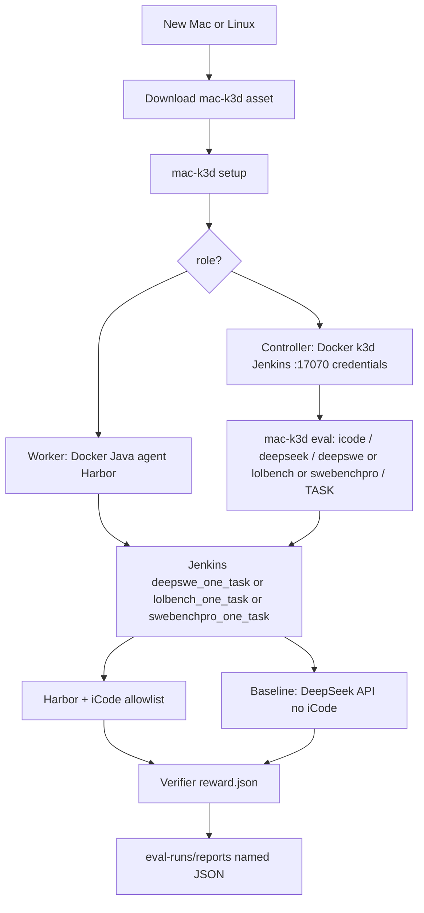

# Binary-initializer workflow

Full path from a **new Mac or Linux** machine through Jenkins roles to an **iCode vs DeepSeek** evaluation and named JSON output.

This is the **binary-initializer** story. Older `cargo install` / `prepare` steps are listed under **Historical** in [README.md](README.md), not this page.

## Project goal

The product is a CI path for AI harness evaluation: many short jobs, each in its own sandbox, so one agent cannot read answers online or touch another run.

| Piece | What it does now | Why it matches the goal |
|-------|------------------|-------------------------|
| **Jenkins** | One task per build on `deepswe_one_task`, `lolbench_one_task`, or `swebenchpro_one_task`. A `CPU_CORES` lock caps the worker. The workspace dies with the build. | Parallelism across agents, and a short lifetime: nothing from the last trial is the next trial's machine. |
| **Harbor** | P5 is `harbor run` + `icode_harbor_agent:ICodeAgent` for all three benchmarks. `--allow-agent-host` is only `api.deepseek.com` and `api.deepseek.ai`. | One runner. The allowlist is the isolation that ships today: the agent can call the model and cannot browse the answer online. |
| **k3d** | The controller uses k3d to host Jenkins. Eval sandboxes still run as Harbor containers on the worker's Docker. | A later job will `k3d cluster create` per build, apply a default-deny NetworkPolicy (DeepSeek API only), pull images through a Harbor registry proxy cache, run Harbor, then delete the cluster. That cluster, the NetworkPolicy, and the registry cache are **not** implemented yet. |

Pier is not used. It left a long-lived Docker Compose sandbox on the host, with no Kubernetes NetworkPolicy and no registry cache, and it was a second runner beside Harbor.

## Why two processes

| Process | Goal | Why |
|---------|------|-----|
| **1. Machine bootstrap** | Download one `mac-k3d` binary; become a Jenkins **controller** or **worker** | A blank PC has no Rust. The binary installs Docker and the rest. |
| **2. Eval pipeline** | Run DeepSWE, LoLBench, or SWE-bench Pro with harness=iCode and LLM=DeepSeek; compare to raw DeepSeek API; write JSON | Measure whether iCode improves patches (f2p / p2p) vs calling the model without a harness. |

```text
New Mac/Linux
  → download mac-k3d Release asset
  → setup: controller (k3d+Jenkins :17070) or worker (agent.jar)
  → mac-k3d eval (harness=icode, llm=deepseek, benchmark=deepswe|lolbench|swebenchpro, N)
  → Jenkins job deepswe_one_task, lolbench_one_task, or swebenchpro_one_task (all Harbor)
       install harbor; bind-mount the worker iCode drop at /opt/icode-host
       arm A: harbor run + icode_harbor_agent:ICodeAgent (DeepSeek allowlist)
       arm B: DeepSeek chat API only (no iCode)
       grade Harbor reward.json
  → eval-runs/reports/eval-icode-deepseek-{deepswe|lolbench|swebenchpro}-n{N}-{utc}.json
```



---

## Process 1 — prepare the machine

**User steps:** [new-machine.md](new-machine.md) · clean-machine walkthrough: [clean-machine-binary-test.md](testing/clean-machine-binary-test.md)  
**Pass/fail:** [testing-binary-initializer.md](testing/testing-binary-initializer.md) (Task 0–5 + Task 7 on Linux; Task 6 macOS later) · automated checks: [`scripts/env_set_up/`](../scripts/env_set_up/README.md)

| Step | What | Why |
|------|------|-----|
| Download `mac-k3d-{os}-{arch}` | Prebuilt CLI from a GitHub **pre-release** (or Latest after a final tag) | No Rust on a new laptop |
| `chmod +x` / quarantine strip | Make the asset executable | Unsigned downloads are blocked on macOS |
| `mac-k3d setup` | Wizard: role, Install Docker / k3d / Java | One entry point for controller or worker |
| Controller: `start` + `config` | k3d cluster + Jenkins UI `:17070` + credentials | Job queue and `deepseek-api-key` live here |
| Worker: token + `config` | Inbound agent + `CPU_CORES` locks | Workloads run on the worker’s Docker, not inside the controller’s k3d nodes |

Honest leftovers: Linux **logout** after docker group; macOS first **Docker Desktop** window; worker **API token**; DeepSeek key on the **controller** credentials store.

Workers must **not** run `mac-k3d start -c worker.yaml` (rejected on purpose).

---

## Process 2 — evaluation pipeline

**Pass/fail per stage:** [testing-eval-pipeline.md](testing/testing-eval-pipeline.md) (E0–E8 tracking; P0–P8 stage detail)

| Stage | What | Why |
|-------|------|-----|
| Choose harness / LLM / model / benchmark | v1: **icode** / **deepseek** / **deepseek-v4-pro** (or **deepseek-flash**) / **deepswe**, **lolbench**, or **swebenchpro** | Catalog ids; unknown `--model` is rejected |
| Choose N and iCode binary vs source | Limit cost; users drop a binary at `~/.local/share/mac-k3d/icode` | The worker that runs Harbor must see iCode |
| Install Harbor | `uv tool install harbor` | One runner for all three benchmarks |
| Clone the suite | DeepSWE, LoLBench-Preview, or SWE-bench_Pro-os | Not vendored in this repo. SWE-bench Pro P2 writes a Harbor `task.toml` whose image is `jefzda/sweap-images:…` |
| Harbor agent `icode` | `icode_harbor_agent:ICodeAgent` bind-mounts the worker drop at `/opt/icode-host` | Same iCode binary in every suite. LoLBench also calls `lolbench-submit` |
| Arm A | `harbor run -a icode_harbor_agent:ICodeAgent --allow-agent-host api.deepseek.com` | Harness under test. Allowlist is the isolation that ships today |
| Arm B | Baseline DeepSeek chat (`$DEEPSEEK_MODEL`, default `deepseek-v4-pro`) on the same `instruction.md` | Compare without iCode scaffolding |
| Grade | Harbor `reward.json` → f2p / p2p / `resolved` / pass@1, tokens, time, model | Held-out tests plus API usage |
| JSON | `eval-runs/reports/eval-icode-deepseek-{suite}-n{N}-{utc}.json` | Clear naming for which eval ran |

Trigger:

```bash
mac-k3d eval                  # interactive → Jenkins deepswe_one_task (or --local)
mac-k3d eval --stage p5 --n-tasks 1   # isolated stage test
```

Jenkins job names: **`deepswe_one_task`**, **`lolbench_one_task`**, and **`swebenchpro_one_task`**. All three run Harbor. Shared `run_all.sh`; each job pins `BENCHMARK`. One `TASK` per build. Logs print `PROGRESS n% …`. Agent label `lolbench`; builds take a `CPU_CORES` lock.

---

## Where output lives

Workdir is **`eval-runs/`** (`MAC_K3D_EVAL_WORKDIR`). Jenkins sets it to `$WORKSPACE/eval-runs`.

| What | Path |
|------|------|
| Official report (P8) | `eval-runs/reports/eval-icode-deepseek-deepswe-n{N}-{utc}.json` |
| On the worker (Jenkins) | `$HOME/jenkins-agent/workspace/deepswe_one_task/eval-runs/reports/` |
| Jenkins artifact | same glob on the build |
| P7 scratch | `eval-runs/results/score-temp.json` |
| Last report path | `eval-runs/last_output.txt` |
| Arm A logs/patches | `eval-runs/harness/` |
| Arm B logs/patches | `eval-runs/baseline/` |
| DeepSWE clone | `eval-runs/deep-swe/` |
| Copied iCode for the run | `eval-runs/icode-bin/icode` |

If `jenkins_agent.remote_fs` in `worker.yaml` is not the default, reports are at `{remote_fs}/workspace/deepswe_one_task/eval-runs/reports/`. Repo-root `output/` and `eval-work/` are leftovers (removed); do not look there. Share `~/.local/share/mac-k3d/eval-runs` is not the Jenkins report dir.

---

## Release assets (all machines)

One tag publishes **four** assets (see [`.github/workflows/release-binaries.yml`](../.github/workflows/release-binaries.yml)):

| Asset | Runner | How it is built |
|-------|--------|-----------------|
| `mac-k3d-linux-x86_64` | `ubuntu-latest` | native |
| `mac-k3d-linux-aarch64` | `ubuntu-24.04-arm` | native |
| `mac-k3d-darwin-aarch64` | `macos-latest` (Apple Silicon) | native |
| `mac-k3d-darwin-x86_64` | `macos-latest` (Apple Silicon) | **cross-compile** `--target x86_64-apple-darwin` |

CI checks `file` + `lipo -info` so the Intel asset is **x86_64**, not arm64. There is no `macos-13` job.

---

## Related docs

| Doc | Role |
|-----|------|
| [new-machine.md](new-machine.md) | User bootstrap commands |
| [clean-machine-binary-test.md](testing/clean-machine-binary-test.md) | Clean PC → binary → controller/worker → eval-ready |
| [`scripts/env_set_up/`](../scripts/env_set_up/README.md) | Automated controller/worker/eval-ready checks |
| [testing-binary-initializer.md](testing/testing-binary-initializer.md) | Bootstrap sign-off |
| [cloud-eval-runbook.md](testing/cloud-eval-runbook.md) | Operator runbook: cloud root controller → local worker → JSON |
| [testing-eval-pipeline.md](testing/testing-eval-pipeline.md) | Pipeline stage CLI tests |
| [secrets.md](secrets.md) | Controller credentials (`deepseek-api-key`) |
| [lolbench-jenkins.md](lolbench-jenkins.md) | All three jobs are Harbor + iCode |
