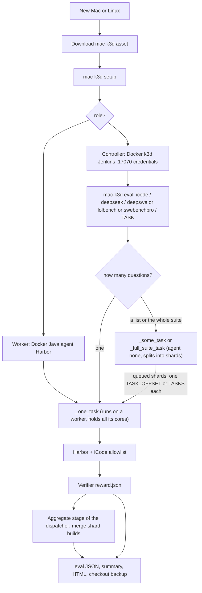

# Binary-initializer workflow

Full path from a **new Mac or Linux** machine through Jenkins roles to an iCode harness evaluation, with JSON, summary, and HTML output.

This is the **binary-initializer** story. Older `cargo install` / `prepare` steps are listed under **Historical** in [README.md](README.md), not this page.

## Project goal

The product is a CI path for AI harness evaluation: many short jobs, each in its own sandbox, so one agent cannot read answers online or touch another run.

| Piece | What it does now | Why it matches the goal |
|-------|------------------|-------------------------|
| **Jenkins** | Three jobs per benchmark (`_one_task`, `_some_task`, `_full_suite_task`), nine in total. `_one_task` evaluates; the other two split their questions into `_one_task` shard builds and merge the results in the same build. One executor per worker; a build locks every core of **its own node** (`lock(label: env.NODE_NAME)`) and only for the rollouts. The workspace dies with the build. | Parallelism across agents, and a short lifetime: nothing from the last trial is the next trial's machine. |
| **Harbor** | P5 is one `harbor run` + `icode_harbor_agent:ICodeAgent` for all three benchmarks. Harbor expands rollouts, applies each task's declared limits, retries and grades. `--allow-agent-host` is only `api.deepseek.com` and `api.deepseek.ai`. | One runner, used as a runner. mac-k3d no longer schedules containers. The allowlist is the isolation that ships today: the agent can call the model and cannot browse the answer online. |
| **k3d** | The controller uses k3d to host Jenkins. Eval sandboxes still run as Harbor containers on the worker's Docker. | A later job will `k3d cluster create` per build, apply a default-deny NetworkPolicy (DeepSeek API only), pull images through a Harbor registry proxy cache, run Harbor, then delete the cluster. That cluster, the NetworkPolicy, and the registry cache are **not** implemented yet. |

Pier is not used. It left a long-lived Docker Compose sandbox on the host, with no Kubernetes NetworkPolicy and no registry cache, and it was a second runner beside Harbor.

## Why two processes

| Process | Goal | Why |
|---------|------|-----|
| **1. Machine bootstrap** | Download one `mac-k3d` binary; become a Jenkins **controller** or **worker** | A blank PC has no Rust. The binary installs Docker and the rest. |
| **2. Eval pipeline** | Run DeepSWE, LoLBench, or SWE-bench Pro with harness=iCode and LLM=DeepSeek; write JSON and HTML | Score the iCode harness (f2p / p2p, pass@k, tokens, time). |

```text
New Mac/Linux
  → download mac-k3d Release asset
  → setup: controller (k3d+Jenkins :17070) or worker (agent.jar)
  → mac-k3d eval (harness=icode, llm=deepseek, benchmark=deepswe|lolbench|swebenchpro, N)
  → Jenkins job <benchmark>_one_task | _some_task | _full_suite_task (all Harbor)
       mac-k3d pipeline --extract-to: the worker binary's pipeline/, commit recorded
       install harbor; bind-mount the worker iCode drop at /opt/icode-host
       one harbor run + icode_harbor_agent:ICodeAgent (DeepSeek allowlist)
       grade Harbor reward.json
  → eval-runs/output/{benchmark}/jenkins-<build>-<UTC>/{artifact.json,summary.md,report.html}
  → output/{benchmark}/jenkins-<build>-<UTC>.tar.gz under the pipeline root
```

Several questions add one hop: `_some_task` or `_full_suite_task` splits them into shards of `SHARD_SIZE`, queues each as a `_one_task` build (each worker takes the next shard when it frees up), then merges the shards into one report in its own `Aggregate` stage.


```mermaid
flowchart TD
  newHost["New Mac or Linux"]
  bin["Download mac-k3d asset"]
  setup["mac-k3d setup"]
  role{"role?"}
  ctrl["Controller: Docker k3d Jenkins :17070 credentials"]
  work["Worker: Docker Java agent Harbor"]
  evalCli["mac-k3d eval: icode / deepseek / deepswe or lolbench or swebenchpro / TASK"]
  shape{"how many questions?"}
  job["<benchmark>_one_task (runs on a worker, holds all its cores)"]
  disp["<benchmark>_some_task or _full_suite_task (agent none, splits into shards)"]
  harborA["Harbor + iCode allowlist"]
  grade["Verifier reward.json"]
  agg["Aggregate stage of the dispatcher: merge shard builds"]
  json["eval JSON, summary, HTML, checkout backup"]

  newHost --> bin --> setup --> role
  role --> ctrl
  role --> work
  ctrl --> evalCli
  work --> job
  evalCli --> shape
  shape -->|one| job
  shape -->|a list or the whole suite| disp
  disp -->|queued shards, one TASK_OFFSET or TASKS each| job
  job --> harborA
  harborA --> grade
  grade --> agg
  agg --> json
  grade --> json
```

---

## Process 1 — prepare the machine

**User steps:** [new-machine.md](new-machine.md) · clean-machine walkthrough: [clean-machine-binary-test.md](testing/clean-machine-binary-test.md)  
**Pass/fail:** [testing-binary-initializer.md](testing/testing-binary-initializer.md) (Task 0–5 + Task 7 on Linux; Task 6 macOS later) · automated checks: [`scripts/env_set_up/`](../scripts/env_set_up/README.md)

| Step | What | Why |
|------|------|-----|
| Download `mac-k3d-{os}-{arch}` | Prebuilt CLI from a GitHub **pre-release** (or Latest after a final tag) | No Rust on a new laptop |
| `chmod +x` / quarantine strip | Make the asset executable | Unsigned downloads are blocked on macOS |
| `mac-k3d setup` | Wizard: role, Install Docker / k3d / Java | One entry point for controller or worker |
| Controller: `start` + `config` | k3d cluster + Jenkins UI `:17070` + credentials | Job queue and `deepseek-api-key` live here |
| Worker: token + `config` | Inbound agent with one executor + `<agent>-core-N` locks | Workloads run on the worker’s Docker, not inside the controller’s k3d nodes. Adding the Nth worker needs no pipeline edit |

Honest leftovers: Linux **logout** after docker group; macOS first **Docker Desktop** window; worker **API token**; DeepSeek key on the **controller** credentials store.

Workers must **not** run `mac-k3d start -c worker.yaml` (rejected on purpose).

---

## Process 2 — evaluation pipeline

**Pass/fail per stage:** [testing-eval-pipeline.md](testing/testing-eval-pipeline.md) (E0–E8 tracking; P0–P8 stage detail)

| Stage | What | Why |
|-------|------|-----|
| Choose harness / LLM / model / benchmark | v1: **icode** / **deepseek** / **deepseek-v4-pro** (or **deepseek-flash**) / **deepswe**, **lolbench**, or **swebenchpro** | Catalog ids; unknown `--model` is rejected |
| Choose N and iCode binary vs source | Limit cost; users drop a binary at `~/.local/share/mac-k3d/icode` | The worker that runs Harbor must see iCode |
| Install Harbor | `uv tool install harbor` | One runner for all three benchmarks |
| Clone the suite | DeepSWE, LoLBench-Preview, or SWE-bench_Pro-os | Not vendored in this repo. SWE-bench Pro P2 writes a Harbor `task.toml` whose image is `jefzda/sweap-images:…` |
| Harbor agent `icode` | `icode_harbor_agent:ICodeAgent` bind-mounts the worker drop at `/opt/icode-host` | Same iCode binary in every suite. LoLBench also calls `lolbench-submit` |
| Harness run | one `harbor run -a icode_harbor_agent:ICodeAgent -p <dataset> -i <ids> -k <rollouts> -n <slots> --allow-agent-host api.deepseek.com` | iCode under test. Harbor owns the fan-out, the per-task limits and the retries. Allowlist is the isolation that ships today. A full eval does not run the no-harness P6 stage |
| Grade | Harbor `reward.json` → f2p / p2p / `resolved` / pass@1, tokens, time, model | Held-out tests plus API usage |
| JSON | `eval-runs/output/{suite}/jenkins-<build>-<UTC>/artifact.json` plus `summary.md` and `report.html` | One folder per run |

Trigger:

```bash
mac-k3d eval                  # interactive → Jenkins <benchmark>_one_task (or --local)
mac-k3d eval --stage p5 --n-tasks 1   # isolated stage test
```

Nine Jenkins jobs — `one_task`, `some_task` and `full_suite_task` for each of **deepswe**, **lolbench** and **swebenchpro**. Every evaluation runs as a `one_task` build from the same `run_all.sh`; each job pins `HARNESS`, `LLM` and `BENCHMARK` and shows them first. Logs print `PROGRESS n% …`. Agent label `lolbench`; a build locks every core of its own node for the `Evaluate` stage only. Which shape to pick is in [evaluation.md](evaluation.md#which-job-to-run); how the lock becomes Harbor slots is in [optimization.md](optimization.md).

---

## Development loop: commit, push, redeploy

A Jenkins build runs the `pipeline/` embedded in the `mac-k3d` binary installed on its worker. `build.rs` bakes the commit the binary was built from into it, so every result still names the code that produced it, and one command moves a change everywhere:

```bash
git commit -am "fix: <what>"
git push
bash scripts/redeploy.sh --controller <user>@<controller> --worker <user>@<worker>
```

`redeploy.sh` builds `target/release/mac-k3d` once, then:

| Host | What it does |
|---|---|
| Controller | installs `~/.local/bin/mac-k3d`, then `config --skip-secrets` (rewrites the nine jobs). With `--start` it runs `start` instead, which is only needed when the Jenkins plugin list changed |
| Each `--worker` | installs `~/.local/bin/mac-k3d`, then `config -c worker.yaml` (node, core locks, agent) |
| This PC | the same as a worker, unless `--no-local-worker` |

It asks each host's SSH password once and copies the binary to every remote host as `mac-k3d.new` first. If the copy fails `--version` on any host (another OS, or an older glibc than the build machine's), it stops before switching any host. It ends by comparing `mac-k3d --version` everywhere. The command is the same whatever changed (pipeline script, job XML, agent registration), so there is no table of which binary has to move.

`--version` prints `mac-k3d 0.5.2 (<commit>)`, plus `, dirty` when `src/` or `pipeline/` had uncommitted changes at build time. The `Prepare` stage runs `mac-k3d pipeline --extract-to $WORKSPACE/mac-k3d-pipeline`, prints `mac-k3d pipeline <commit> (mac-k3d <version>, <binary>)`, and `artifact.json` records `eval_protocol.pipeline` as `{source: binary, version, commit, dirty, pipeline_hash}`. `Evaluate` and `Report` reuse that extract, so a redeploy during a build does not change the scripts under it. That gives the loop:

- **Did my fix work?** Redeploy, rebuild, compare `pipeline.commit` with the previous build's.
- **Did that commit break it?** Check out the known-good commit, redeploy, rebuild.
- **Reproduce an old number?** Redeploy its `pipeline.commit`. An `OFFICIAL=1` build runs `mac-k3d pipeline --require-clean`, which refuses a dirty build or an unknown commit, so an official number always names one commit.

A sharded run merges builds from several workers. If they report different `pipeline.commit` or `pipeline_hash` (a worker missed a redeploy), the aggregate `artifact.json` says `pipeline_status: mixed` and lists each one; `OFFICIAL=1` rejects it.

Worker `config` downloads `agent.jar` next to the running one and swaps it in only when the bytes differ. The agent is restarted only when the jar, `launch-agent.sh` or the systemd unit / LaunchAgent changed; otherwise it prints `Jenkins agent unchanged, left running`, so a redeploy does not drop a connected worker.

Developer parameters (pins, canary, `AGENT_LABEL`, `SHARD_SIZE`) show only in the `developer` profile. Switch while developing and back for handover:

```bash
mac-k3d set --ui-profile developer && mac-k3d config --skip-secrets   # on the controller
mac-k3d set --ui-profile user && mac-k3d config --skip-secrets        # handover
```

Lab copy-paste with this lab's hosts filled in lives in the gitignored `LOCAL_DEPLOY_CHEATSHEET.md` in the checkout, not in this repo.

---

## Where output lives

Workdir is **`eval-runs/`** (`MAC_K3D_EVAL_WORKDIR`). Jenkins sets it to `$WORKSPACE/eval-runs`.

| What | Path |
|------|------|
| Official report (P8) | `eval-runs/output/deepswe/jenkins-<build>-<UTC>/artifact.json` |
| Summary and HTML | `summary.md` and `report.html` in that same run folder |
| Backup | `output/<benchmark>/jenkins-<build>-<UTC>.tar.gz` under the pipeline root: `$WORKSPACE/mac-k3d-pipeline/output/` on Jenkins (kept across builds; `Prepare` clears only `pipeline/`), the checkout's `output/` for a local run. `MAC_K3D_OUTPUT_ROOT` overrides it |
| On the worker (Jenkins workspace) | `$HOME/jenkins-agent/workspace/deepswe_one_task/eval-runs/output/` |
| Jenkins artifact | that run folder only (`eval-runs/last_output.txt`) |
| P7 scratch | `eval-runs/results/score-temp.json` |
| Last report path | `eval-runs/last_output.txt` |
| Harness logs/patches | `eval-runs/harness/` |
| DeepSWE clone | `eval-runs/deep-swe/` |
| Copied iCode for the run | `eval-runs/icode-bin/icode` |

If `jenkins_agent.remote_fs` in `worker.yaml` is not the default, the workspace copy is at `{remote_fs}/workspace/deepswe_one_task/eval-runs/output/`. The copy to keep for investigation is the backup under `mac-k3d-pipeline/output/`. Share `~/.local/share/mac-k3d/eval-runs` is not the Jenkins report dir.

---

## Release assets (all machines)

One tag publishes **four** assets (see [`.github/workflows/release-binaries.yml`](../.github/workflows/release-binaries.yml)):

| Asset | Runner | How it is built |
|-------|--------|-----------------|
| `mac-k3d-linux-x86_64` | `ubuntu-latest` | native |
| `mac-k3d-linux-aarch64` | `ubuntu-24.04-arm` | native |
| `mac-k3d-darwin-aarch64` | `macos-latest` (Apple Silicon) | native |
| `mac-k3d-darwin-x86_64` | `macos-latest` (Apple Silicon) | **cross-compile** `--target x86_64-apple-darwin` |

CI checks `file` + `lipo -info` so the Intel asset is **x86_64**, not arm64. There is no `macos-13` job.

---

## Related docs

| Doc | Role |
|-----|------|
| [new-machine.md](new-machine.md) | User bootstrap commands |
| [clean-machine-binary-test.md](testing/clean-machine-binary-test.md) | Clean PC → binary → controller/worker → eval-ready |
| [`scripts/env_set_up/`](../scripts/env_set_up/README.md) | Automated controller/worker/eval-ready checks |
| [testing-binary-initializer.md](testing/testing-binary-initializer.md) | Bootstrap sign-off |
| [cloud-eval-runbook.md](testing/cloud-eval-runbook.md) | Operator runbook: cloud root controller → local worker → JSON |
| [testing-eval-pipeline.md](testing/testing-eval-pipeline.md) | Pipeline stage CLI tests |
| [secrets.md](secrets.md) | Controller credentials (`deepseek-api-key`) |
| [lolbench-jenkins.md](lolbench-jenkins.md) | All three jobs are Harbor + iCode |
| [harbor-delegation-multiworker/README.md](harbor-delegation-multiworker/README.md) | Harbor/mac-k3d responsibility split, job topology, multi-worker scaling |
